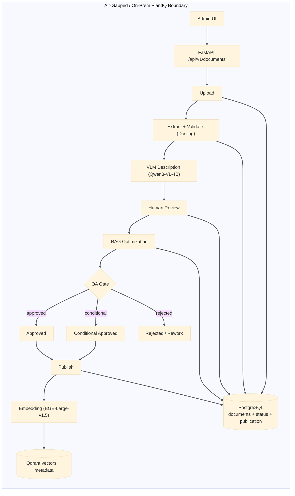
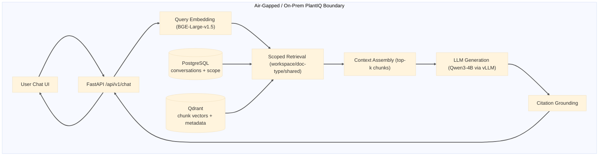

# PlantIQ Capstone — Alpha Checkpoint Report

**Project:** PlantIQ (Air-Gapped RAG System for Industrial OT Environments)  
**Checkpoint:** Alpha (Phase 1)  
**Date:** March 28, 2026  
**Prepared by:** PlantIQ Capstone Team

## Table of Contents

- [1) In-Progress Capstone Report (Work Completed at Alpha)](#1-in-progress-capstone-report-work-completed-at-alpha)
- [2) Sponsor Feedback and Review](#2-sponsor-feedback-and-review)
- [3) Functions and Features Implemented in this Checkpoint](#3-functions-and-features-implemented-in-this-checkpoint)
- [4) Source Code Archive (ZIP Export)](#4-source-code-archive-zip-export)
- [5) Instructions to Compile, Build, and Deploy](#5-instructions-to-compile-build-and-deploy)
- [6) Code Statistics](#6-code-statistics)
- [7) Code Repository Link](#7-code-repository-link)
- [8) Public Prototype / VM Link](#8-public-prototype--vm-link)
- [9) Video: Compile, Build, and Deploy (<=5 minutes)](#9-video-compile-build-and-deploy-5-minutes)
- [10) Video: Design, Architecture, and Main Modules (<=5 minutes)](#10-video-design-architecture-and-main-modules-5-minutes)
- [11) Video: Prototype Functionality Demonstration (<=5 minutes)](#11-video-prototype-functionality-demonstration-5-minutes)
- [12) Known Problems, Gaps, Defects, and Next-Checkpoint Plan](#12-known-problems-gaps-defects-and-next-checkpoint-plan)
- [13) Differences from Previous Checkpoint](#13-differences-from-previous-checkpoint)
- [Alpha Quality Criteria Assessment (Checkpoint Self-Evaluation)](#alpha-quality-criteria-assessment-checkpoint-self-evaluation)
- [Guideline Compliance Matrix](#guideline-compliance-matrix)
- [Notes](#notes)

---

## 1) In-Progress Capstone Report (Work Completed at Alpha)

PlantIQ is currently in an advanced alpha state focused on two critical product paths:

1. **Document ingestion pipeline** (PDF upload, extraction, validation, review workflow, optimization, QA, publish/indexing)
2. **RAG chat workflow** (retrieval, citations, streaming responses, conversation lifecycle)

The project has completed substantial integration work across backend orchestration, frontend workflows, and pipeline processing. The implementation has moved beyond prototype-only behavior into a stable non-production build suitable for controlled testing and stakeholder review.

### Current Alpha Readiness Summary

- **Estimated overall product functionality implemented:** **69.2% fully implemented (73.1% weighted, including partial completion)**
- **Estimated critical functionality implemented:** **~80%**
- **Known defects/gaps still present:** **23.1% deferred/pending scope** plus ongoing non-blocking hardening tasks
- **Quality target achieved for alpha:** Functional, testable, and usable in non-production conditions with identified limitations under ongoing remediation

---

## 2) Sponsor Feedback and Review

**Sponsor:** Randy Holt (BHE GT&S)  
**Review Date:** March 27, 2026  

---

The system works end-to-end: upload documents → review content for accuracy → optimize for search → publish to the chat engine. Everything runs locally (no cloud), content is human-reviewed before going live, and answers are tied to specific pages in the source documents.

Two features are pending:

1. **User login system** — Needs Active Directory integration
2. **Admin role controls** — Access governance framework exists but needs full implementation.

---

### Recommendation

The system is ready to move forward with priority on login and admin controls, schedule on-site testing, and plan June rollout.

---

## 3) Functions and Features Implemented in this Checkpoint

### How PlantIQ Differentiates Its RAG Approach

Unlike conventional RAG systems that treat documents as raw inputs directly vectorized for retrieval, **PlantIQ implements a human-curated, quality-gated RAG pipeline** where documents undergo rigorous validation, human review, optimization, and QA gates before vectors are indexed. This approach ensures that only verified, high-quality content reaches the retrieval layer—reducing hallucinations, improving citation accuracy, and maintaining operational trust.

**Architecture Overview (Alpha): Quality-Gated RAG in an Air-Gapped Environment**

- **Diagram 1 (Ingest/QA/Publish)** shows the quality-gated document flow through upload, validation, review, optimization, QA decisions, and publication.
- **Diagram 2 (Chat/Retrieval/Response)** shows query embedding, scoped retrieval, context assembly, local generation, and citation grounding.
- **QA outcomes**: Approved and Conditional Approved proceed to publish; rejected artifacts are routed for rework.
- **Model references are explicit**: Qwen3-VL-4B (VLM), BGE-Large-v1.5 (embeddings), and Qwen3-4B via vLLM (generation).
- **Air-gapped runtime**: no content leaves the facility; all retrieval and generation run on local infrastructure.

**The Five-Stage RAG Preparation Pipeline:**

1. **Extraction & Vision-Assisted Validation** — PDFs are converted to structured markdown using Docling, with vision language models (Qwen3-VL-4B) generating descriptions for tables and figures. Validation artifacts categorize potential issues and ambiguities for operator attention.

2. **Human-in-the-Loop Review** — Document admins review page-by-page evidence, verify extracted content against source PDF, mark ambiguities and inaccuracies, and approve validated content. This ensures source material accuracy before optimization.

3. **RAG Optimization Stage** — Approved reviewed content is reformatted specifically for RAG use: sections restructured with semantic boundaries, complex tables converted to structured facts, figures described in operational context, and heading hierarchies optimized for relevance scoring during retrieval. Optimization outputs are stored as `*_rag_optimized.json` and `*_rag_optimized.md` artifacts.

4. **Semantic Chunking & Content Structuring** — Optimized markdown is analyzed for semantic boundaries (section headings, tables, facts) and chunked with configurable size (default 512 tokens) and overlap (default 50 tokens) to preserve context while keeping vectors focused. Each chunk retains source page references and metadata (table facts, ambiguity flags) for downstream citation grounding.

5. **QA Gate & Publication Control** — Before indexing, QA gates compute confidence metrics from validation artifacts and optimized content. Admins approve QA decisions and explicitly trigger publication to the vector database—maintaining full operational control over when content becomes retrieval-active.

**Retrieval with Scoped Filtering:**

- **Document-type weighting** — Boosts similarity scores for preferred content categories (Standard Operating Procedures vs. Reference Manuals)
- **Relaxed threshold strategy** — If initial high-threshold retrieval yields sparse results, the system incrementally lowers the similarity score floor (from configurable threshold down to 0.45 minimum) to ensure usable context without sacrificing quality
- **Workspace-level scope persistence** — Users can pin conversation scope (e.g., "Power Block + Maintenance docs only") and persist the setting across multi-turn sessions

**Vector Database & Embedding Infrastructure:**

PlantIQ uses **BAAI/bge-large-en-v1.5** (BGE Large) sentence-transformer embeddings—a production-grade model optimized for semantic similarity. Each chunk is embedded once during publication and stored in **Qdrant** with rich payloads (document ID, page numbers, heading hierarchy, table facts, ambiguity flags) enabling complex metadata filtering without full collection scans. Cosine distance provides numeric similarity scores (0–1), and on-demand re-ranking via FlashRank is planned for future phases.

**Data Layer & Schema Design Decisions (Alpha Scope):**

PlantIQ’s data architecture intentionally separates **transactional workflow state** from **semantic retrieval state**:

- **PostgreSQL (transactional/operational state):** stores workflow and chat lifecycle records required for auditability and control.
   - `documents` table persists ingestion metadata and lifecycle controls (e.g., `id`, `title`, `version`, `system`, `document_type`, `file_path`, `status`, `publication_status`, `approved_by`, `approved_at`, `indexed_chunk_count`, `qdrant_collection`).
   - `conversations` table persists user thread scope and retrieval policy (`workspace`, `document_type_filters`, `preferred_document_types`, `include_shared_documents`) to keep multi-turn behavior stable.
   - `chat_messages` table persists user/assistant turns and grounded citations (`citations` stored as JSONB), preserving answer traceability.
   - Access is aligned with role-based enforcement patterns (`plantig_admin`, `plantig_user`) through request-scoped database role context in the backend session layer.

- **Qdrant (vector retrieval state):** stores chunk embeddings plus retrieval-critical payload metadata.
   - Collection configuration is explicit: vector size = `EMBEDDING_DIM` (1024 for BGE-Large) and distance metric = **cosine**.
   - Payload schema includes: `chunk_id`, `document_id`, `document_title`, `system`, `workspace`, `document_type`, `is_shared`, `content`, `section_heading`, `page_number`, `source_pages`, `table_facts`, `ambiguity_flags`.
   - Query-time filters (`workspace`, `system`, `document_type`, `is_shared`, and `document_id`) are applied directly against payload fields before ranking, reducing irrelevant context and avoiding broad scans.

This split-schema approach is a key differentiator for PlantIQ: the relational side governs **state integrity and auditability**, while the vector side is optimized for **fast, scoped semantic retrieval** in air-gapped OT operations.

**QA Gates: Scoring Model and Acceptance Criteria (How Documents Are Scored Before Publish):**

PlantIQ applies explicit QA scoring gates prior to final publication, so retrieval readiness is based on measurable quality criteria rather than manual judgment alone.

- **Acceptance thresholds (default Alpha configuration):**
   - Citation coverage: **>= 90%**
   - Question-heading compliance: **>= 85%**
   - Table-facts extraction ratio: **>= 95%**
   - Overall confidence score: **>= 80%**
   - Critical issues allowed: **0**
   - Figure description coverage: **100% required**

- **Scoring model (overall confidence, 0-100):**
   - Citation coverage contributes **30%**
   - Question-heading compliance contributes **15%**
   - Table-to-bullets quality contributes **25%**
   - Figure description coverage contributes **30%**
   - A hallucination-risk penalty is subtracted (bounded at 0-10 points)

- **Decision policy:**
   - **Approved**: all criteria pass (0 failed)
   - **Conditional approval**: 1–2 failed criteria with zero critical issues (approved but admin must address noted deficiencies)
   - **Rejected**: 3+ failed criteria OR any critical issue threshold violation

- **Risk-based sampling policy during QA review:**
   - Critical / High-risk sections: **100% sampling**
   - Medium-risk sections: **50% sampling**
   - Low-risk sections: **15% sampling**

By documenting these gate criteria explicitly, PlantIQ demonstrates that publish decisions are reproducible, auditable, and aligned with safety-focused OT knowledge standards.

**What Makes This Different:**

- **Quality gates, not raw text** — Unlike systems that immediately vectorize user PDFs, every document passes validation, human review, optimization, and QA before reaching the vector database
- **Human-curated content structure** — Chunks are shaped by domain experts (human reviewers + optimization pipeline), not by blind automated splitting
- **Metadata-rich indexing** — Each vector carries operational metadata (source pages, table facts, detected ambiguities, workspace tags) enabling sophisticated retrieval controls
- **Operational trust over speed** — The multi-stage pipeline takes longer but ensures operators trust the sources and accuracy, critical for OT environments where incorrect guidance can have safety implications
- **Air-gapped independence** — All processing (extraction, vectorization, retrieval, generation) happens entirely on-site; no content leaves the facility

---

The Alpha implementation is organized below as **functions** (core operational capabilities delivered by the product runtime) and **features** (user-facing controls and experience enhancements built on top of those functions).

### A) Functions Implemented at Alpha (Core Product Behavior)

1. **Document ingestion and orchestration lifecycle**
   - The system accepts PDF uploads with metadata, persists a document record, and starts asynchronous processing through the HITL pipeline entrypoint.
   - It supports lifecycle progression from upload through extraction, validation, review readiness, optimization, QA, and publication states, including guarded transitions for rerun and deletion operations.
   - **Code references:** `backend/app/api/pipeline.py` (`POST /api/v1/documents/upload`, `POST /api/v1/documents/{id}/reprocess`, `DELETE /api/v1/documents/{id}`), `backend/app/services/pipeline_service.py` (`PipelineService.trigger_pipeline`, status/stage mappings), `pipeline/src/cli/hitl_pipeline.py` (pipeline entrypoint invoked by backend).

2. **Real-time and persisted pipeline state management**
   - Each document exposes persisted status snapshots and live event streaming for operational visibility.
   - The implementation combines status polling and SSE event streams to represent progression, terminal completion, and failure conditions.
   - **Code references:** `backend/app/api/pipeline.py` (`GET /api/v1/documents/{id}/status`, `GET /api/v1/documents/{id}/events`), `backend/app/services/pipeline_service.py` (`get_pipeline_status`, `stream_events`, `_event_history`, `_event_subscribers`), `backend/app/core/sse.py` (SSE response/event encoding helpers).

3. **Human-in-the-loop review and optimization workflow**
   - The platform provides page-based review units, editable content updates, checklist-driven review progression, and controlled approval to optimization.
   - Post-review optimization runs as a managed long-running stage with explicit state transitions and log/event handling.
   - **Code references:** `backend/app/api/pipeline.py` (`GET /api/v1/documents/{id}/pages`, `PATCH /api/v1/documents/{id}/pages/{page_id}/content`, `POST /api/v1/documents/{id}/approve-for-optimization`, `GET /api/v1/documents/{id}/optimization/logs`), `backend/app/core/optimization_log.py` (optimization log manager/handler).

4. **QA gate and publication readiness flow**
   - Optimized outputs are rescored, evaluated, and moved through explicit QA decisions before final approval.
   - Publication status is tracked independently from human approval to preserve operational control over release-to-retrieval timing.
   - **Code references:** `backend/app/api/pipeline.py` (`POST /api/v1/documents/{id}/qa-rescore`, `POST /api/v1/documents/{id}/qa-decision`, `POST /api/v1/documents/{id}/final-approve`), `pipeline/src/qa/qa_gates.py` (QA metric computation/gate evaluation).

5. **Vector indexing and retrieval data publication**
   - Approved optimized chunks are transformed into semantic vectors via batch embedding (BAAI/bge-large-en-v1.5), previous vectors for the same document are deleted, and updated payloads are upserted into Qdrant's configured collection with cosine distance metrics.
   - Each vector is stored with rich metadata: document ID, chunk ID, page reference, workspace tag, document type, section heading, table facts, and detected ambiguity flags. This metadata enables post-retrieval filtering and source verification without requiring full vector rescans.
   - Publication is explicitly controlled—only documents approved through the QA gate can be published, preventing drafts or failed transformations from entering the retrieval index.
   - **Code references:** `backend/app/api/pipeline.py` (`POST /api/v1/documents/{id}/publish`, `_publish_document_to_rag`), `backend/app/services/embedding_service.py` (`embed_batch`), `backend/app/services/qdrant_service.py` (`ensure_collection`, `delete_document_chunks`, `upsert_chunks`).

6. **RAG chat generation (synchronous and streaming)**
   - The chat runtime supports both complete-response and token-streaming query paths, enabling real-time UI feedback for long responses.
   - Query handling integrates: (1) scoped retrieval to fetch top-k relevant vectors constrained by workspace/document-type filters, (2) prompt assembly combining user query + retrieved context + system guidelines, (3) response generation via local LLM (Qwen3-4B via vLLM), and (4) structured citation extraction linking response text back to source documents and page numbers.
   - Citation grounding is extracted from retrieval metadata: user sees "[Document Name, Page X]" where X is the source_pages field from the retrieved chunk payload. Failures to find cited sources are logged for QA analysis.
   - **Code references:** `backend/app/api/chat.py` (`POST /api/v1/chat/query`, `POST /api/v1/chat/stream`), `backend/app/services/chat_service.py` (`process_query`, `process_query_stream`, `_build_rag_prompt`, `_create_citations`, `_save_message`), `backend/app/services/llm_service.py` (`generate`, `generate_stream`).

7. **Scoped retrieval enforcement for chat relevance**
   - Retrieval behavior applies configurable workspace, document-type, and shared-document controls to reduce irrelevant context and improve signal-to-noise ratio.
   - Workspace filtering enforces aliases (e.g., "pretreatment" → "Pre Treatment") and excludes globally-shared documents unless explicitly included. Document-type filtering boosts relevance scores by 8% for preferred categories, allowing soft prioritization without hard exclusion.
   - When initial retrieval at high thresholds yields insufficient context, the system applies a **relaxed threshold strategy**: similarity floor is incrementally lowered (from configured threshold down to minimum 0.45) until usable context emerges. This prevents "no answer" responses while preserving quality control.
   - Scope decisions are resolved from conversation-level settings and explicit request parameters, then propagated into Qdrant's payload filters and similarity computation, maintaining retrieval coherence across multi-turn sessions.
   - **Code references:** `backend/app/services/chat_service.py` (conversation/request scope resolution, `_RELAXED_SCORE_THRESHOLD_FLOOR`, `_RELAXED_SCORE_THRESHOLD_DELTA`), `backend/app/services/qdrant_service.py` (`search_similar` with `workspace_filter`, `document_type_filter`, `include_shared_documents`), `backend/app/models/chat.py` (scope and retrieval control models).

8. **Artifact production and retrieval for operations**
   - Validation, manifest, optimization, QA, and review artifacts are generated and retrievable through backend endpoints.
   - Artifact access is lifecycle-aware and supports operational inspection, review continuation, and audit traceability.
   - **Code references:** `backend/app/api/pipeline.py` (`GET /api/v1/documents/{id}/artifacts/{type}`, artifact path resolution/load helpers such as `_find_validation_report`, `_resolve_qa_report_path`, `_find_optimized_artifact_paths`), `backend/app/core/config.py` (`get_artifacts_path`).

### B) Features Implemented at Alpha (User Experience and Operational Controls)

1. **Admin upload experience with live stage visualization**
   - The frontend provides a guided upload flow, stage-by-stage progress display, and terminal success/failure handling tied to backend ingestion signals.
   - **Code references:** `frontend/app/admin/documents/upload/page.tsx` (upload form, stage mapping, live status rendering), `frontend/lib/api/pipeline.ts` (`uploadDocument`, `streamIngestionEvents`, `parseIngestionSSEBlock`).

2. **Resilient long-running ingestion UX**
   - If live event streams are interrupted, the UI falls back to status polling and continues tracking until a terminal pipeline state is reached.
   - **Code references:** `frontend/app/admin/documents/upload/page.tsx` (`monitorPipelineUntilTerminal`, SSE disconnect handling), `frontend/lib/api/pipeline.ts` (typed ingestion stream handling and terminal event semantics).

3. **Document review workspace features**
   - Admin users can inspect page-level evidence, edit review content, follow checklist progress, and continue workflow actions toward optimization and QA.
   - **Code references:** `backend/app/api/pipeline.py` (review page/content/checklist endpoints and models), `frontend/lib/api/pipeline.ts` (artifact/review API helpers), `frontend/app/admin/documents/upload/page.tsx` (handoff into review flow).

4. **Interactive citation-aware chat interface**
   - Users receive citation-linked responses, can inspect source snippets in a dedicated source panel, and navigate from citations back to document context.
   - **Code references:** `frontend/app/chat/page.tsx` (`SourceDrawer`, citation list rendering/toggles, citation-driven navigation), `frontend/lib/api/chat.ts` (`streamChatQuery`, citation event parsing), `backend/app/services/chat_service.py` (`_create_citations`).

5. **Conversation management controls**
   - The chat workspace supports thread continuity and operator productivity controls including search, filtering, pin/unpin, rename, delete, and bookmark actions.
   - **Code references:** `frontend/app/chat/page.tsx` (conversation list/search/filter/pin/rename/delete/bookmark interactions), `frontend/lib/api/index.ts` (conversation/bookmark API methods), `backend/app/services/chat_service.py` (conversation/message persistence).

6. **Conversation-level scope controls**
   - Users can set and persist per-conversation scope (workspace, document type, shared content), improving repeatability of retrieval behavior across sessions.
   - **Code references:** `frontend/app/chat/page.tsx` (`persistConversationScope`, scope selectors and save controls), `backend/app/services/chat_service.py` (scope persistence and retrieval application), `backend/app/services/qdrant_service.py` (scope-aware vector filtering).

7. **Frontend API contract normalization**
   - Shared client modules centralize endpoint and stream handling, reducing integration drift between frontend flows and backend contracts.
   - **Code references:** `frontend/lib/api/client.ts` (base URL/auth token/fetch wrapper), `frontend/lib/api/pipeline.ts` (pipeline + SSE contracts), `frontend/lib/api/chat.ts` (chat + SSE contracts), `frontend/lib/api/auth.ts` (auth request helpers used by UI).

#### Coverage Summary (Alpha)

- **Fully implemented at Alpha:** **9 / 13** user stories (**69.2%**)
- **Partially implemented at Alpha:** **1 / 13** user stories (**7.7%**)
- **Pending / deferred beyond Alpha:** **3 / 13** user stories (**23.1%**)
- **Weighted completion estimate (full + half-credit for partial):** **9.5 / 13 = 73.1%**

#### User-Story Status Matrix

| User Story | Alpha Status | Implementation Status |
|---|---|---|
| **US-1.1** Upload document with metadata | **Implemented** | Delivered through upload API + admin upload UI with metadata capture and pipeline kickoff. |
| **US-1.2** VLM validation report with categorized issues | **Implemented** | Validation artifacts and categorized issue surfaces are available in the review workflow and backend artifact contracts. |
| **US-1.3** Web-based review with checklist and inline evidence | **Implemented** | Page-based review units, checklist handling, evidence thumbnails, and edit persistence are operational. |
| **US-1.4** Approve and lock reviewed version | **Implemented** | Approval/transition controls and status guards are implemented, with lifecycle progression into optimization/QA/final approval. |
| **US-1.5** Keep current + last approved version only | **Partially Implemented** | Versioning and artifact lineage exist, but strict enforcement/reporting of a hard two-version retention contract is not fully completed in Alpha. |
| **US-1.6** QA gate metrics with recommendation | **Implemented** | QA rescoring, recommendation output, and QA decision workflow are delivered and integrated with lifecycle status transitions. |
| **US-2.1** Plain-English troubleshooting chat | **Implemented** | RAG chat query path is operational in sync + streaming modes. |
| **US-2.2** Answers with citations and page numbers | **Implemented** | Citation payloads are emitted and rendered with document/page references. |
| **US-2.3** Open cited source in context | **Implemented** | Frontend source drawer and citation-linked navigation are implemented. |
| **US-2.4** Multi-turn contextual conversation | **Implemented** | Conversation persistence and scoped follow-up interactions are operational. |
| **US-2.5** Bookmark useful answers | **Implemented** | Save/remove bookmark controls and persisted bookmark workflows are available. |
| **US-3.1** Login with facility Active Directory credentials | **Pending (Beta-targeted)** | Authentication modules exist, but production AD-integrated delivery is intentionally deferred from Alpha scope. |
| **US-3.2** Admin role assignment and user-role governance | **Pending (Beta-targeted)** | Core runtime focus prioritized ingestion/chat; full production role-governance administration remains post-Alpha. |

#### Client Expectation View: What Is Delivered vs Pending

**Delivered in Alpha (core client value):**
- End-to-end ingestion and review pipeline (upload → validation → review → optimization → QA → publish)
- Citation-grounded chat with multi-turn conversations and bookmark support
- Operational visibility through status APIs, SSE streams, and lifecycle controls

**Pending after Alpha (expected for Beta/hardening):**
- Production-grade identity integration and enterprise access governance (US-3.1, US-3.2)
- Strict policy-level retention enforcement for version-history constraints (US-1.5 completion)

Overall, Alpha implementation is aligned with the proposal’s primary operational objective (faster, cited, air-gapped knowledge access) while deferring identity-governance hardening and selected policy constraints to the next checkpoint phase.

---

## 4) Source Code Archive (ZIP Export)

- **Archive filename:** `[PLACEHOLDER: source-code-archive-filename.zip]`
- **Export date:** `[PLACEHOLDER: YYYY-MM-DD]`
- **Commit / tag reference:** `[PLACEHOLDER: commit SHA or release tag]`
- **Submission packaging note:** The ZIP archive accompanies the checkpoint submission package as the source snapshot for this Alpha deliverable.

---

## 5) Instructions to Compile, Build, and Deploy

### Local Development Setup

1. Clone repository and configure environment:
   - Copy `.env.example` to `.env`
   - Set required runtime values for the local environment.
2. Install dependencies:
   - `make install`
3. Start local services:
   - `make docker-up`
4. Run tests:
   - `make test`

### Backend Run (Development)

- Start backend app server (development mode) via Uvicorn from `backend`.
- API docs are available at `/api/docs` when backend is running.

### Frontend Run (Development)

- Start frontend dev server from `frontend`.
- Build for production via frontend build script.

### Containerized Deployment (Development/Staging Style)

- Build app containers: `make docker-build`
- Start stack: `make docker-up`
- View logs: `make docker-logs`
- Stop stack: `make docker-down`

> Note: Current instructions target local/development/staging usage for checkpoint validation and demonstration.

---

## 6) Code Statistics

### Section 6 Quick Links

- [6.1 Measurement Method (cloc)](#61-measurement-method-cloc)
- [6.2 Size and Composition (from cloc)](#62-size-and-composition-from-cloc)
- [6.3 Programming Languages Used (from cloc)](#63-programming-languages-used-from-cloc)
- [6.4 Complexity, Cohesion, Coupling, and Structural Counts](#64-complexity-cohesion-coupling-and-structural-counts)
- [6.5 Libraries, External Components, and Dependency Tree (High-Level)](#65-libraries-external-components-and-dependency-tree-high-level)

The following statistics were generated using **cloc v1.98** on March 28, 2026, on **Git-tracked files only**.

### 6.1 Measurement Method (cloc)

Command used:

`cloc --vcs=git .`

Scope note:
- Counts include only files tracked by Git at analysis time (text/code files recognized by `cloc`; binary files are skipped).

### 6.2 Size and Composition (from cloc)

- **Number of source files (modules):** **170**
- **Total LOC (blank + comment + code):** **55,719**
- **CLOC / code lines:** **44,385**
- **Comment lines:** **4,713**
- **Blank lines:** **6,621**
- **Comment-to-code ratio:** **0.1062** (≈ **10.62%**)

### 6.3 Programming Languages Used (from cloc)

- **Python:** 52 files, 15,559 code lines
- **TypeScript:** 67 files, 11,345 code lines
- **JSON:** 4 files, 10,578 code lines
- **Markdown:** 25 files, 5,393 code lines
- **SQL:** 9 files, 607 code lines
- **make:** 1 file, 254 code lines
- **YAML:** 2 files, 253 code lines
- **Bourne Shell:** 1 file, 146 code lines
- **CSS:** 1 file, 106 code lines
- **TOML:** 3 files, 80 code lines
- **Dockerfile:** 2 files, 31 code lines
- **Text:** 1 file, 21 code lines
- **INI:** 1 file, 6 code lines
- **JavaScript:** 1 file, 6 code lines

### 6.4 Complexity, Cohesion, Coupling, and Structural Counts

Additional metrics were generated for the codebase using installed static-analysis tools in a local isolated environment (`.metrics-venv`):
- `lizard` for cyclomatic complexity and function-level structural metrics
- `radon` (installed for Python static analysis support)

**Analysis scope for these metrics:** `backend/app`, `pipeline/src`, `frontend/app`, `frontend/lib`.

#### Cyclomatic Complexity (lizard)

- **Total analyzed NLOC:** **17,879**
- **Function count:** **763**
- **Average cyclomatic complexity (AvgCCN):** **4.0**
- **Warning count:** **34** functions over the default warning threshold

Interpretation: overall complexity is in a maintainable range for an Alpha system, with a limited set of high-complexity hotspots suitable for targeted refactoring.

#### Structural Counts

- **Python classes:** **111**
- **Python methods:** **137**
- **Python top-level functions:** **263**
- **TypeScript classes:** **5**
- **TypeScript methods (static-analysis approximation):** **234**

#### Coupling Metrics (import-dependency based)

Coupling was measured as internal module import relationships:
- **Efferent coupling (Ce):** outgoing dependencies per module
- **Afferent coupling (Ca):** incoming dependencies per module

**Python modules (50 analyzed):**
- **Average Ce:** **2.86**
- **Average Ca:** **2.86**
- **Highest Ce module:** `backend.app.api.pipeline` (**22** internal dependencies)
- **Highest Ca module:** `backend.app` (**15** incoming dependencies)

**TypeScript modules (42 analyzed):**
- **Average Ce:** **0.33**
- **Average Ca:** **0.33**
- **Highest Ce module:** `frontend/lib/api/documents` (**2** internal dependencies)
- **Highest Ca module:** `frontend/lib/api/client` (**7** incoming dependencies)

#### Cohesion (module-focus proxy)

Cohesion has been measured as the percentage of modules with low dependency spread (<=2 internal dependencies), indicating tighter module focus:

- **Python low-coupled modules:** **56.0%**
- **TypeScript low-coupled modules:** **100.0%**

These cohesion-proxy results indicate strong functional focus in frontend modules and generally acceptable backend/pipeline modular focus, with expected orchestration concentration in pipeline/API modules.

### 6.5 Libraries, External Components, and Dependency Tree (High-Level)

- **Direct runtime dependencies (declared):**
  - Backend (`backend/pyproject.toml`): **16**
  - Pipeline (`pipeline/pyproject.toml`): **11**
  - Frontend (`frontend/package.json`): **23**
- **Direct dev dependencies (declared):**
  - Frontend (`frontend/package.json`): **9**

External components used:
- PostgreSQL
- Qdrant
- Docling service
- Local LLM inference service (Ollama/vLLM-compatible path)
- FastAPI backend
- Next.js frontend
- Docker / Docker Compose
- LDAP/AD integration path (mock-enabled in development)

---

## 7) Code Repository Link

- **Repository URL:** https://github.com/abedhossainn/PlantIQ
- **Git workflow note:** Commit history is preserved and used as continuous progress evidence.

---

## 8) Public Prototype / VM Link

**Public Prototype URL (Cloudflare Tunnel):**  
https://plantiq.sahossain.com/PlantIQ/

**Deployment Details:**
- **Frontend:** Accessible via Cloudflare Tunnel at the URL above
- **Backend API:** Available at `https://plantiqapi.sahossain.com/` (called by frontend)
- **Tunnel Status:** Active with 4 redundant Cloudflare edge connections
- **Authentication:** Development mode (auth disabled) — full AD integration pending Beta phase
- **Data State:** Development/test data only; no production content
- **Access Scope:** Temporary reviewer access for checkpoint demonstration and stakeholder feedback

**How to Access:**
1. Open the public URL in a modern web browser (Chrome, Firefox, Safari, or Edge).
2. Navigate through document upload, review, optimization, and QA workflows.
3. Test chat functionality with published documents.
4. All endpoints are protected by CORS on the public domain to help prevent unauthorized API abuse.

---

## Alpha Quality Criteria Assessment (Checkpoint Self-Evaluation)

- **Percentage of product functionality implemented:** 69.2% fully implemented (73.1% weighted, including partial completion)
- **Percentage of critical functionality implemented:** ~80%
- **Percentage of features pending/deferred beyond Alpha scope:** 23.1%
- **Non-production quality level:** Suitable for controlled demonstrations and functional validation; ongoing hardening continues for long-run stability and scale reliability

---

### Additional Non-Production Quality Metrics (Required by Guideline)

The following non-production quality metrics are tracked with explicit measurement methodology, acceptance targets, and evidence locations. Final numeric results are recorded only after controlled validation runs complete.

| Metric | Current Status | Evidence/Source | Notes |
|---|---|---|---|
| Runtime stability (extended run) | **Interim evidence available; final soak run pending** | `backend/tests/test_performance_benchmarks.py` (test harness), `backend/tests/evidence/runtime_stability_evidence.md` (reviewer-accessible summary) | Includes summarized results from repeated monitor runs (durations/sample counts/terminal statuses). **Target:** zero unhandled crashes and no sustained degradation trend during extended run window. |
| Concurrent-user capacity (controlled load) | **Protocol documented; controlled-load execution pending** | `backend/tests/test_performance_benchmarks.py` (harness), `backend/tests/evidence/concurrency_capacity_evidence.md` (reviewer-accessible protocol + acceptance framing) | Captures planned throughput, p95/p99 latency, and error-rate measurements for the next benchmark pass. **Target:** acceptable latency under planned checkpoint concurrency with bounded error rate. |

Measurement scope note: all quality metrics are executed in development/staging-equivalent environments only (non-production). Reviewer-facing evidence is published under `backend/tests/evidence/`; raw operational artifacts remain in local runtime logs.

---

## 9) Video: Compile, Build, and Deploy (<=5 minutes)

- **Video link:** `https://drive.google.com/file/d/1KpleYXrY3HfY7c79RcZ0l7C6pw7RXsN4/view?usp=drive_link`

---

## 10) Video: Design, Architecture, and Main Modules (<=5 minutes)

- **Video link:** `https://drive.google.com/file/d/1TT3j7E33TZBUP02Dw0VYWLbFQhJQv01o/view?usp=drive_link`

---

## 11) Video: Prototype Functionality Demonstration (<=5 minutes)

- **Video link:** `https://drive.google.com/file/d/1FNQFH7GxOZKNpTipc5I4ONsekBrCqMke/view?usp=drive_link`

---

## 12) Known Problems, Gaps, Defects, and Next-Checkpoint Plan

| Area | Current Gap/Defect | Impact | Planned Action | Target Checkpoint | Verification |
|---|---|---|---|---|---|
| Authentication (AD integration) | Active Directory integration is not finalized for production login flow | Prevents sponsor-ready enterprise auth validation and full RBAC path in target environment | Complete AD bind/config hardening, integration testing with facility-aligned test accounts, and fallback/error-path handling | **Beta** | Auth integration test evidence, login trace logs, stakeholder UAT sign-off |
| Role governance and admin controls | Full admin role assignment/governance workflow is pending completion | Access-control administration remains partially manual and not fully demonstrable | Finalize role governance endpoints/UI flows and enforce policy checks across admin surfaces | **Beta** | Role-policy test matrix, permission regression suite, reviewer acceptance |
| Version retention policy (US-1.5) | Strict two-version retention enforcement/reporting is only partially implemented | Risk of policy drift in retained document history artifacts | Implement strict retention guardrails and automated pruning/reporting to enforce current + last approved only | **Beta** | Retention policy tests, artifact inventory evidence before/after enforcement |
| Demo reliability hardening | Long-running demo scenarios still require resilience hardening for transient stream/runtime disruptions | Live demo confidence and reviewer experience can degrade under transient conditions | Continue SSE/retry hardening, stale-state recovery, and end-to-end demo rehearsal runbook updates | **Beta** | Rehearsal logs, deterministic demo checklist pass, incident-free dry runs |
| Stability and concurrency validation evidence | Formal extended-runtime stability and concurrent-user capacity evidence is not yet finalized in report form | Checkpoint quality evidence is incomplete for performance/reliability criteria | Execute final non-production stability/concurrency validation run and attach measured evidence | **Beta** | Archived test reports, run logs, and summarized benchmark evidence |

---
