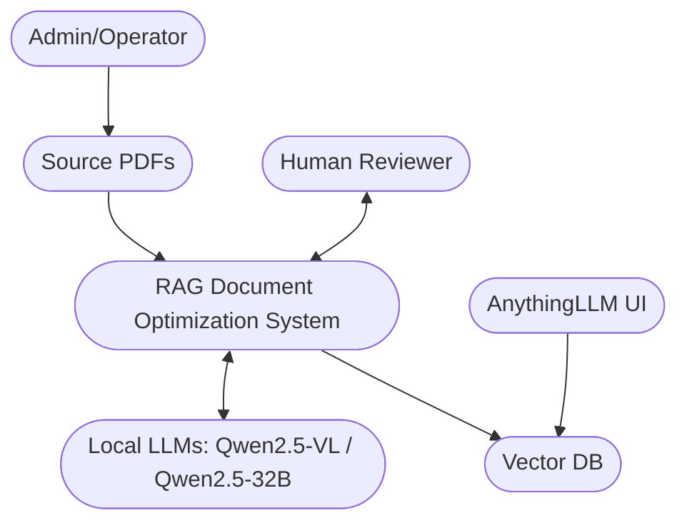
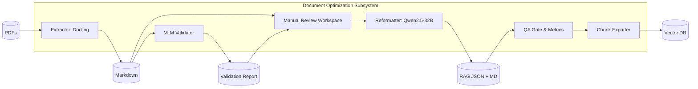
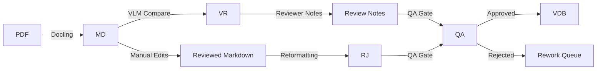
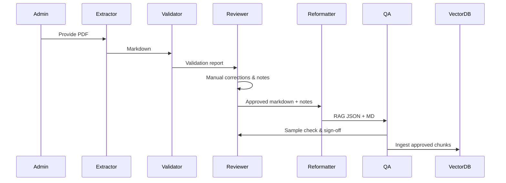
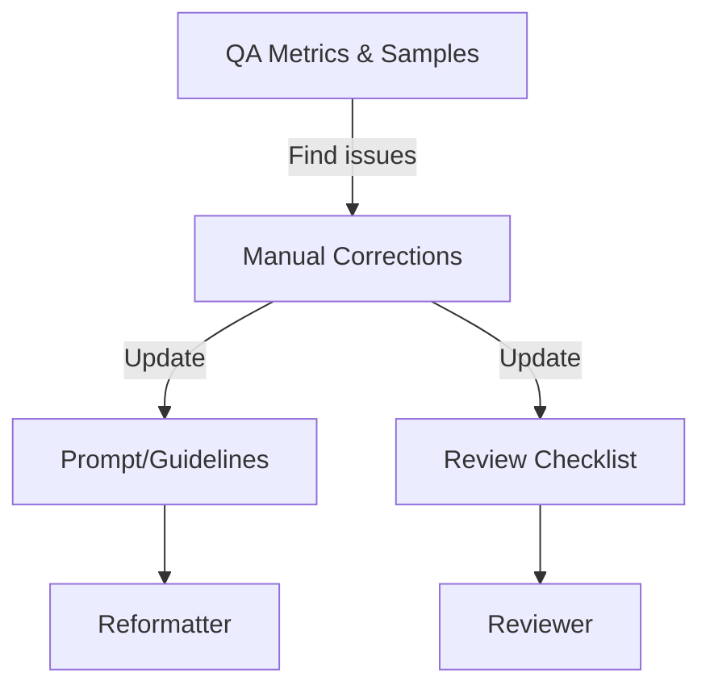

# LLM RAG Chatbot - Architecture Plan

## Executive Summary
This architecture focuses on the document optimization subsystem for a human‑in‑the‑loop (HITL) RAG pipeline. The goal is to maximize retrieval quality and auditability by introducing explicit validation gates, structured metadata, and traceable lineage from PDF pages to RAG chunks. The proposed design keeps the current three‑stage pipeline but adds manual review checkpoints, QA artifacts, and lightweight governance to reduce hallucinations and regression risk.

## System Context


**Overview:** Shows the human reviewer’s role around the document optimization system, which sits between raw PDFs and the vector database.

**Key Components:** Human reviewer, document optimization system, local LLMs, vector database, and chat UI.

**Relationships:** PDFs flow into the system; human reviewer validates and corrects outputs; LLMs assist with validation and reformatting; optimized chunks are stored in the vector DB.

**Design Decisions:** Keep LLMs local and decouple review from ingestion to ensure auditability and reduce runtime coupling.

**NFR Considerations:**
- **Scalability:** Review gates can be parallelized by document or section.
- **Performance:** Heavy model steps are isolated; review doesn’t block ingestion of other docs.
- **Security:** Local processing avoids external data leakage.
- **Reliability:** Human review gate reduces propagation of errors.
- **Maintainability:** Clear stage outputs simplify rework and rollback.

**Trade-offs:** Adds manual effort but improves correctness and trust.

**Risks and Mitigations:** Bottlenecks in review → mitigate by sampling rules and reviewer workload balancing.

## Architecture Overview
The document optimization pipeline is staged and artifact‑driven:
1. **Extraction** (Docling → Markdown)
2. **Validation** (VLM comparison + manual review)
3. **Reformatting** (RAG‑optimized JSON + markdown)
4. **QA & Sign‑off** (human gate)
5. **Ingestion** (vector DB)

This plan emphasizes traceability: every chunk is tied to source pages and validation notes.

## Component Architecture


**Overview:** Major components for document optimization and manual review.

**Key Components:** Extractor, VLM validator, manual review workspace, reformatter, QA gate, exporter.

**Relationships:** Validation report and markdown feed the manual review; reformatter consumes reviewed inputs; QA gate produces release/hold decision.

**Design Decisions:** Manual review is a first‑class component, not an afterthought.

**NFR Considerations:**
- **Scalability:** Components are separable and can be parallelized by document.
- **Performance:** QA checks are lightweight vs. model inference.
- **Security:** No external services required for sensitive documents.
- **Reliability:** QA gate prevents low‑confidence output ingestion.
- **Maintainability:** Artifacts per stage simplify debugging.

**Trade-offs:** Additional storage for artifacts and review notes.

**Risks and Mitigations:** Review fatigue → define sampling rules and objective QA metrics.

## Deployment Architecture
```mermaid
flowchart TB
  subgraph LocalHost[On-Prem Host]
    GPU[GPU Node
(Qwen2.5-VL/32B)]
    CPU[CPU Services
(Extractor/QA)]
    FS[(Artifact Storage)]
    VDB[(Vector DB)]
  end

  Reviewer[Human Reviewer Workstation] --> FS
  PDFSrc[PDF Sources] --> FS
  FS --> CPU
  FS --> GPU
  CPU --> VDB
```

**Overview:** Local deployment with separate GPU and CPU responsibilities.

**Key Components:** GPU node for inference, CPU services for extraction/QA, shared artifact storage.

**Relationships:** Artifacts are central; GPU and CPU workers read/write to shared storage.

**Design Decisions:** Artifact storage enables pausing, re‑reviewing, and rollbacks.

**NFR Considerations:**
- **Scalability:** Add GPU nodes if needed; keep CPU extraction parallel.
- **Performance:** Avoids GPU contention by sequencing model steps.
- **Security:** On‑prem storage and processing.
- **Reliability:** Artifacts survive crashes; reprocessing possible.
- **Maintainability:** Clear boundaries between services.

**Trade-offs:** Requires shared storage management.

**Risks and Mitigations:** Storage sprawl → define retention policy for intermediates.

## Data Flow


**Overview:** End‑to‑end data flow with manual review and QA gate.

**Key Components:** Markdown, validation report, reviewer notes, optimized JSON.

**Relationships:** QA gate depends on both content and review notes.

**Design Decisions:** Rework queue prevents bad data entering the vector store.

**NFR Considerations:**
- **Scalability:** Multiple reviewers can act on the same document in parallel.
- **Performance:** Human review is the pacing item; use sampling.
- **Security:** No external data exposure.
- **Reliability:** QA gate ensures only approved chunks are indexed.
- **Maintainability:** Clear data lineage.

**Trade-offs:** Longer end‑to‑end time in exchange for quality.

**Risks and Mitigations:** Reviewer inconsistency → standardize checklists.

## Key Workflows


**Overview:** HITL sequence with explicit reviewer checkpoints.

**Key Components:** Reviewer validates discrepancies and approves before ingestion.

**Relationships:** QA is the final gate before vector DB ingestion.

**Design Decisions:** Manual sign‑off prevents silent drift in quality.

**NFR Considerations:**
- **Scalability:** Sampling reduces reviewer load.
- **Performance:** Reviewer and QA operate on artifacts asynchronously.
- **Security:** Review data remains local.
- **Reliability:** Sign‑off ensures high trust.
- **Maintainability:** Documented notes improve future corrections.

**Trade-offs:** Human time investment vs. higher trust.

**Risks and Mitigations:** Review backlog → define “fast lane” for low‑risk docs.

## Additional Diagram: QA Feedback Loop


**Overview:** Continuous improvement loop from QA findings to prompts and checklists.

**Key Components:** QA metrics, correction notes, prompt tuning, reviewer checklist.

**Relationships:** QA feedback drives prompt and checklist updates.

**Design Decisions:** Treat prompt/checklist as controlled assets.

**NFR Considerations:**
- **Scalability:** Improves quality without adding reviewers.
- **Performance:** Reduces rework.
- **Security:** No external dependencies.
- **Reliability:** Consistent quality over time.
- **Maintainability:** Clear process for improvements.

**Trade-offs:** Requires small governance overhead.

**Risks and Mitigations:** Drift in guidelines → version and document changes.

## Phased Development (if applicable)

### Phase 1: Initial Implementation (Manual HITL)
- Manual validation after VLM report
- Manual correction and sign‑off
- Basic QA sampling (e.g., 10–20% chunks)

### Phase 2+: Final Architecture (Hybrid HITL)
- Partial automation for low‑risk sections
- Reviewer focuses on exceptions and high‑risk content
- Metrics‑driven gating and automated regression checks

### Migration Path
Start with full manual review for correctness. Introduce automated checks and selective review as confidence increases, driven by QA metrics.

## Non‑Functional Requirements Analysis

### Scalability
- Parallelize review per document and per section.
- Use sampling and risk‑based review to manage reviewer load.

### Performance
- Keep GPU inference in isolated stages.
- Use artifacts to avoid re‑running previous steps.

### Security
- Local processing; no external APIs required for sensitive PDFs.
- Maintain auditable logs for compliance.

### Reliability
- QA gate prevents low‑confidence data from entering the vector DB.
- Use versioned outputs for rollbacks.

### Maintainability
- Clear stage boundaries and artifacts.
- Standardized metadata enables future tooling.

## Risks and Mitigations
- **Reviewer bottleneck:** Use sampling, prioritize critical sections.
- **Inconsistent review:** Use standardized checklist and training.
- **Prompt drift:** Version prompt and link changes to QA findings.
- **Table fidelity issues:** Use explicit bullet extraction rules and table serializers.
- **Image loss:** Require text descriptions for all figures.

## Technology Stack Recommendations
- **Docling** for extraction and markdown generation.
- **Qwen2.5‑VL** for validation guidance.
- **Qwen2.5‑32B** for RAG reformatting.
- **Vector DB**: ChromaDB/FAISS/Milvus (as planned).
- **Artifact storage**: filesystem + structured naming/versions.

## Next Steps
1. Formalize manual review checklist and QA sampling rules.
2. Define artifact naming/versioning to support traceability.
3. Add a reviewer sign‑off record per document.
4. Implement metrics for chunk quality (coverage, confidence, citation completeness).
5. Integrate Docling’s table serializer to standardize tables before manual review.
