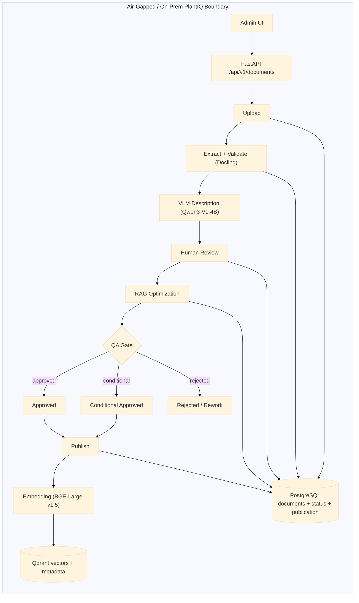
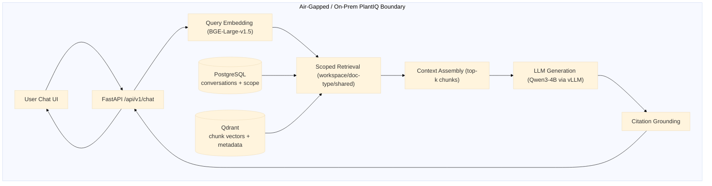
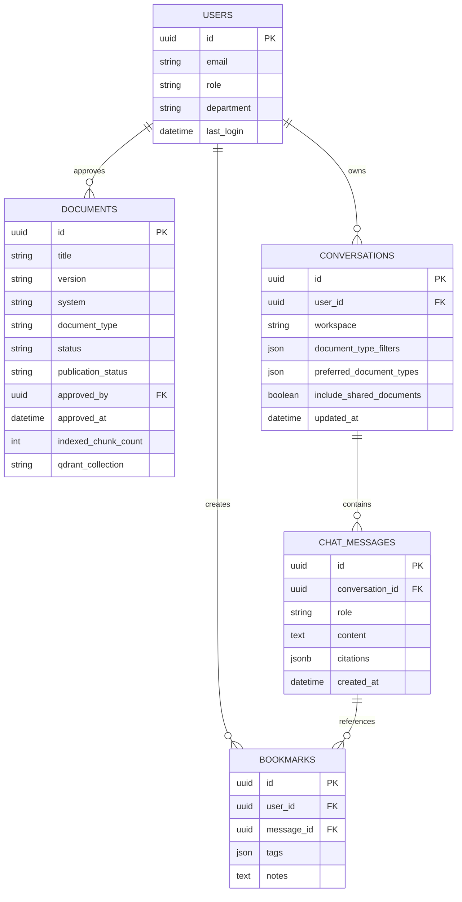
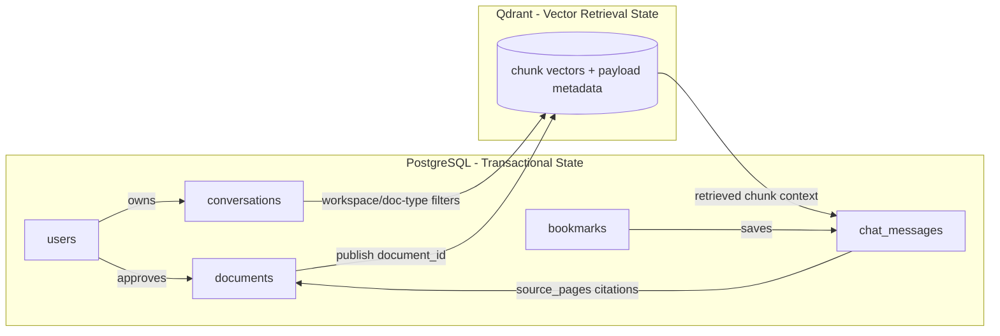

# PlantIQ — Air-Gapped RAG System for Industrial OT Environments

PlantIQ is a local-first, citation-grounded Retrieval-Augmented Generation (RAG) platform for industrial operations teams.
It is designed for safety-critical, proprietary-document environments where cloud AI is not allowed.

## What makes PlantIQ different

Unlike conventional RAG systems that directly vectorize raw documents, PlantIQ uses a **quality-gated pipeline** before anything is indexed:

1. Upload + metadata capture
2. VLM-assisted extraction and validation
3. Human review and correction
4. RAG optimization
5. QA-gated publication to vector retrieval

This architecture improves answer trustworthiness by ensuring only reviewed and quality-scored content is retrievable.

## Alpha status (as of March 30, 2026)

- **User stories fully implemented:** 10 / 13 (76.9%)
- **Partially implemented:** 1 / 13 (7.7%)
- **Deferred to Beta:** 2 / 13 (15.4%)
- **Weighted completion:** 10.5 / 13 = 80.8%

### Delivered in Alpha

- End-to-end ingestion and review pipeline
- Citation-grounded RAG chat (sync + streaming)
- Scoped retrieval (workspace/document-type/shared)
- Conversation persistence and bookmarks
- Artifact evidence retrieval (validation/optimization/QA)

### Pending for Beta hardening

- Active Directory / LDAP production authentication
- Full role-governance administration
- Strict two-version retention policy enforcement
- Formal concurrent-user benchmarking

## Architecture overview

PlantIQ uses a layered architecture and intentionally separates **transactional workflow state** (PostgreSQL) from **semantic retrieval state** (Qdrant) to preserve auditability, governance, and retrieval performance.

### Figure 6.2a — Document Ingestion, QA Gate, and Publication Flow (Air-Gapped)



### Figure 6.2b — Chat Query, Scoped Retrieval, and Citation Grounding Flow (Air-Gapped)



### Figure 7.1 — High-Level Layered Architecture

```mermaid
flowchart TB
    subgraph PL[Presentation Layer]
        UIA[Admin UI\n(Upload/Review/QA/Publish)]
        UIO[Operator UI\n(Chat/Citations/Bookmarks)]
    end

    subgraph API[API Gateway Layer]
        FASTAPI[FastAPI\nREST + SSE]
    end

    subgraph SRV[Service Layer]
        PIPE[PipelineService\nLifecycle Orchestration]
        CHAT[ChatService\nRAG Orchestration]
        EMB[EmbeddingService\nBGE-Large-v1.5]
        QDS[QdrantService\nScoped Retrieval/Indexing]
        LLM[LLMService\nQwen3-4B via vLLM]
    end

    subgraph DATA[Data & Infrastructure Layer]
        PG[(PostgreSQL\nWorkflow + Chat State)]
        QD[(Qdrant\nVector Index + Payloads)]
        ART[(Artifact Store\nValidation/Review/QA Outputs)]
    end

    UIA --> FASTAPI
    UIO --> FASTAPI

    FASTAPI --> PIPE
    FASTAPI --> CHAT

    PIPE --> EMB
    PIPE --> QDS
    PIPE --> PG
    PIPE --> ART

    CHAT --> EMB
    CHAT --> QDS
    CHAT --> LLM
    CHAT --> PG

    EMB --> QD
    QDS --> QD

    style PL fill:#eaf3ff,stroke:#5b8def
    style API fill:#fff7e6,stroke:#d4a017
    style SRV fill:#eefaf0,stroke:#4f9d69
    style DATA fill:#f7f0ff,stroke:#8a63d2
```

### Core low-level runtime architecture details

#### Ingestion pipeline

1. Upload + metadata persistence
2. VLM-assisted extraction/validation
3. Human review and correction
4. RAG optimization
5. Semantic chunking, QA scoring, and controlled publication

#### Chat runtime

1. Query embedding
2. Scoped Qdrant retrieval
3. Context assembly
4. Prompt generation with citation guidance
5. Local LLM generation and citation mapping

### Data layer and schema design (Alpha)

PlantIQ intentionally separates **transactional workflow state** (PostgreSQL) from **semantic retrieval state** (Qdrant).

#### PostgreSQL schema (transactional / operational)

| Table | Purpose | Representative Fields |
|---|---|---|
| `documents` | Document lifecycle + publication state | `id`, `title`, `version`, `system`, `document_type`, `status`, `publication_status`, `approved_by`, `approved_at`, `indexed_chunk_count`, `qdrant_collection` |
| `conversations` | Conversation scope persistence | `id`, `workspace`, `document_type_filters`, `preferred_document_types`, `include_shared_documents`, `updated_at` |
| `chat_messages` | User/assistant turn history with grounding | `id`, `conversation_id`, `role`, `content`, `citations (JSONB)`, `created_at` |
| `users` | Identity and role mapping | `id`, `email`, `role`, `department`, `last_login` |
| `bookmarks` | Saved answer references | `id`, `user_id`, `message_id`, `tags`, `notes` |

#### Qdrant payload schema (vector / retrieval)

| Payload Field | Role in Retrieval |
|---|---|
| `chunk_id` | Unique chunk identity |
| `document_id` | Source document linkage |
| `document_title` | Citation and display metadata |
| `workspace` | Scope filtering |
| `document_type` | Hard/soft relevance filtering |
| `is_shared` | Shared-content inclusion toggle |
| `section_heading` | Context structuring |
| `page_number` / `source_pages` | Citation grounding |
| `table_facts` | Structured retrieval support for tabular facts |
| `ambiguity_flags` | QA/reliability metadata |

### Figure 7.4a — Logical Database Schema (Entity-Relationship)

This diagram shows the five core PostgreSQL entities and their cardinality relationships. `USERS` owns `CONVERSATIONS`, approves `DOCUMENTS`, and creates `BOOKMARKS`. `CONVERSATIONS` contain `CHAT_MESSAGES`, and `BOOKMARKS` reference `CHAT_MESSAGES`.



### Figure 7.4b — PostgreSQL ↔ Qdrant Logical Data Flow

This diagram represents the two-way bridge between stores: on write, approved documents publish vectors into Qdrant with `document_id` linkage; on read, conversation scope filters constrain retrieval, and retrieved chunks ground `chat_messages.citations` back to source documents.



A relaxed-threshold retrieval fallback is used to reduce empty responses on sparse but valid queries while preserving retrieval scope controls.

## Technology stack

| Layer | Technologies |
|---|---|
| Frontend | Next.js 15, React, TypeScript, Tailwind CSS, shadcn/ui |
| Backend | Python 3.10+, FastAPI, Pydantic, SQLAlchemy |
| AI/ML | Qwen3-VL-4B, Qwen3-4B via vLLM, BAAI/bge-large-en-v1.5 |
| Data | PostgreSQL 15, Qdrant 1.x |
| Docs Processing | Docling |
| Deployment | Docker, Docker Compose |

## Repository structure

```text
llm-rag-chatbot/
├── backend/          # FastAPI APIs, services, models
├── frontend/         # Next.js UI (admin + operator chat)
├── pipeline/         # HITL ingestion, QA, optimization
├── docs/             # Architecture, API, ops, security docs
├── tests/            # Integration and performance tests
├── tools/            # Utility scripts
├── docker-compose.yml
├── Makefile
└── .env.example
```

## Local setup

### Prerequisites

- Python 3.10+
- Node.js 18+
- Docker + Docker Compose
- NVIDIA GPU recommended for local model inference

### Install

```bash
git clone https://github.com/abedhossainn/PlantIQ.git
cd PlantIQ
make install
```

### Configure environment

```bash
cp .env.example .env
# edit .env with local values
```

### Run locally

```bash
make docker-build
make docker-up
```

### Run tests

```bash
make test
make validate
```

## Build/deploy notes (Alpha)

The checkpoint-validated local flow is:

1. Configure `.env`
2. Install dependencies (`make install`)
3. Build/start containers (`make docker-build`, `make docker-up`)
4. Run tests (`make test`)
5. Inspect logs (`make docker-logs`)

## Public prototype and evidence

- Prototype: https://plantiq.sahossain.com/PlantIQ/
- Backend API: https://plantiqapi.sahossain.com/
- Source archive (ZIP): https://drive.google.com/file/d/1jt5cB5uhI1U7ms2icpRUrvbs6SZeB9uH/view?usp=drive_link

## Known limitations at Alpha

1. AD/RBAC not fully production-ready
2. Formal multi-user load testing pending
3. Two-version retention enforcement partial
4. Complex visual extraction still needs reviewer correction
5. Single-reviewer workflow bottleneck
6. Backup/DR automation not implemented yet

## Next priorities (Beta)

- Complete AD + RBAC hardening
- Run controlled concurrency/performance benchmarks
- Complete retention-policy enforcement
- Add operational monitoring and backup/recovery automation

---

For full checkpoint evidence and detailed tables, see:
`Documents/Alpha_Checkpoint_Report_v2.md`
