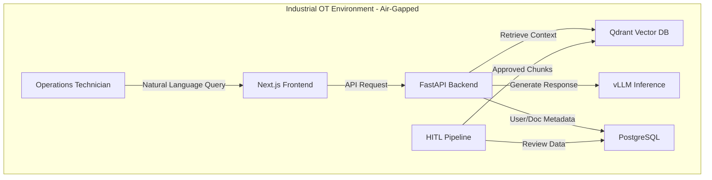

# PlantIQ - Air-Gapped RAG System

**AI-Powered Technical Documentation Retrieval for Industrial OT Environments**

PlantIQ is an enterprise-grade, air-gapped Retrieval-Augmented Generation (RAG) system designed specifically for critical infrastructure facilities. It enables operations technicians to query proprietary equipment manuals using natural language while maintaining strict cybersecurity requirements and ensuring safety-critical accuracy through human-in-the-loop validation.

---

## Project Overview

**Client:** BHE GT&S (Berkshire Hathaway Energy) - Cove Point LNG Facility  
**Timeline:** Spring 2026 (11-week MVP development)  
**Status:** In Development - Backend and Frontend Integration in Progress  
**Capstone:** UMBC Master's in Information Systems

### Problem Statement

Industrial facilities cannot use cloud-based AI tools due to cybersecurity policies and proprietary data restrictions. Technicians waste 30+ minutes manually searching through hundreds of pages of vendor manuals during time-sensitive troubleshooting scenarios, increasing operational downtime and safety risks.

### Solution

PlantIQ provides instant access to accurate, cited technical information through:
- **Human-in-the-Loop Pipeline:** VLM-powered validation ensures engineering manuals (with complex tables, diagrams, schematics) are accurately digitized
- **Natural Language Interface:** Technicians ask questions in plain English and receive cited answers with source verification
- **Air-Gapped Architecture:** Complete offline operation on local infrastructure with no external network connectivity
- **Role-Based Access Control:** Integration with facility Active Directory for secure user management

---

## Repository Structure

```
PlantIQ/
├── frontend/                    # Next.js/React TypeScript UI
├── backend/                     # FastAPI middleware + RAG orchestration (Beta+)
├── pipeline/                    # HITL document processing modules
│   ├── src/
│   │   ├── ingestion/          # PDF conversion (Docling)
│   │   ├── validation/         # VLM validation & image description
│   │   ├── review/             # Section-based review workspace
│   │   ├── qa/                 # QA gates & metrics
│   │   ├── lineage/            # Audit trail & versioning
│   │   ├── utils/              # VLM options, parsers, progress tracking
│   │   └── cli/                # Pipeline orchestration & reformatting
│   ├── configs/                # Configuration files (VLM, Docling)
│   └── tests/                  # Pipeline test suite
├── infra/                      # Docker, K8s, deployment scripts
├── data/                       # Runtime data (git-ignored)
│   ├── raw/                    # Source PDFs
│   ├── processed/              # Intermediate outputs
│   ├── artifacts/              # Validation evidence, review workspaces
│   └── indexes/                # Vector database persistence
├── docs/                       # Technical documentation
│   ├── architecture/           # Architecture plans & diagrams
│   ├── api/                    # API specifications
│   ├── operations/             # Runbooks & troubleshooting
│   ├── security/               # Threat model & compliance
│   └── capstone/               # Proposal, deliverables, checklists
├── tests/                      # Cross-system integration tests
├── tools/                      # Developer utilities
├── docker-compose.yml          # Unified service orchestration
├── Makefile                    # Development task automation
└── .env.example                # Environment configuration template
```

---

## Development Setup

### Prerequisites

- **Python 3.10+** with pip
- **Node.js 18+** with npm
- **Docker & Docker Compose**
- **GPU** (NVIDIA, 24GB+ VRAM for VLM models)

### Installation

```bash
# Clone repository
git clone https://github.com/abedhossainn/PlantIQ.git
cd PlantIQ

# Install all dependencies
make install

# Or install individually
make install-pipeline   # Pipeline HITL modules
make install-backend    # FastAPI backend
make install-frontend   # Next.js frontend
```

### Container Stack

The repository now uses a **single** root `docker-compose.yml` as the authoritative local stack definition.

- Run all required services from the repo root
- Keep the local stack focused on core services only
- Core supporting services such as `docling-serve`, `vector-db`, `postgres`, `backend`, and `frontend` are defined in the root compose file

### Environment Configuration

```bash
# Copy environment template
cp .env.example .env

# Edit .env with your settings
nano .env
```

---

## Testing

```bash
# Run all tests
make test

# Run specific test suites
make test-pipeline      # Pipeline module tests
make test-backend       # Backend API tests
make test-frontend      # Frontend component tests
make test-integration   # End-to-end integration tests

# Check code quality
make lint               # Linting
make format             # Code formatting
make validate           # Lint + test combined
```

---


## Work Completed

### Document Ingestion Pipeline
- Docling PDF to Markdown conversion with automatic table/figure handling
- VLM-powered page-by-page validation using the env-configured local vision model
- Evidence generation for validation artifacts
- Section-based review workspace for manual QA
- QA gates with quantitative metrics
- Document lineage and audit tracking
- Complete test suite with 5/5 passing tests

### Backend Infrastructure
- FastAPI application structure with modular architecture
- RESTful API endpoints for document management
- PostgreSQL integration with SQLAlchemy ORM
- Authentication and authorization middleware
- Observability and logging infrastructure
- Comprehensive test coverage for API endpoints

### Frontend Application
- Next.js 14 TypeScript application with modern React patterns
- Component library using shadcn/ui and Tailwind CSS
- Document management interface with upload, validation, and review workflows
- Chat interface with markdown rendering and citation support
- User management and role-based access control UI
- Responsive design for desktop and tablet devices
- Complete user story coverage (13/13 requirements)

### Integration & Testing
- Docker Compose configuration for local development
- End-to-end integration tests across backend and frontend
- Performance testing framework setup
- CI/CD workflow structure
- Makefile for common development tasks

---

## RAG Optimization
```bash
# After manual review, reformat for RAG optimization
python pipeline/src/cli/text_reformatter.py \
  --markdown reviewed_output.md \
  --validation validation_report.json \
  --output rag_optimized
```

### Testing Pipeline Integration

```bash
# Run VLM integration tests
pytest pipeline/tests/test_vlm_integration.py -v

# Verify HITL setup
python pipeline/tests/verify_hitl_setup.py

# Validate import structure
python pipeline/tests/validate_imports.py
```

### Pipeline Package Structure

The pipeline is organized as a proper Python package with relative imports:

```python
# Import utility modules
from pipeline.src.utils.vlm_options import VLMOptions
from pipeline.src.utils.progress_tracker import ProgressBar

# Import validation modules  
from pipeline.src.validation.vlm_comparison import compare_with_vlm

# Import orchestration
from pipeline.src.cli.hitl_pipeline import HITLPipeline
```

**Installing as Editable Package:**
```bash
# Install pipeline in development mode
pip install -e pipeline/

# Now imports work from anywhere
python -c "from pipeline.src.utils.vlm_options import VLMOptions; print('Pipeline installed')"
```

---

## Architecture

### System Components



### Technology Stack

| Layer | Technologies |
|-------|-------------|
| **Frontend** | React 18, Next.js 14, TypeScript, Tailwind CSS, shadcn/ui |
| **Backend** | Python 3.10+, FastAPI, LangChain, Pydantic, SQLAlchemy |
| **AI/ML** | vLLM, env-configured Qwen3 text + vision models, Sentence Transformers |
| **Data** | PostgreSQL, Qdrant, Docling, pdfplumber |Pipeline installed')"
```