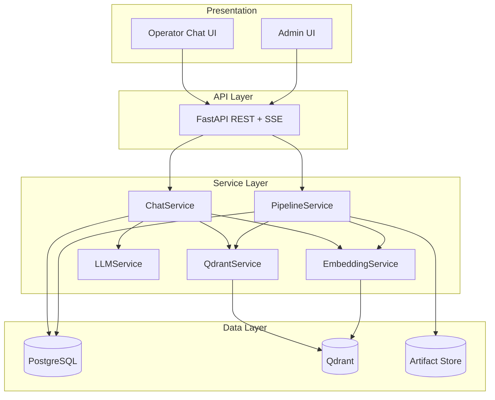

# PlantIQ — Air-Gapped RAG System for Industrial OT Environments

PlantIQ is a local-first, citation-grounded Retrieval-Augmented Generation (RAG) platform for industrial operations teams.
It is designed for safety-critical, proprietary-document environments where cloud AI is not allowed.

## What makes PlantIQ different

Unlike conventional RAG systems that directly vectorize raw documents, PlantIQ uses a **quality-gated pipeline** before anything is indexed:

1. Upload + metadata capture
2. VLM-assisted extraction and validation
3. Human review and correction
4. RAG optimization
5. QA-gated publication to vector retrieval

This architecture improves answer trustworthiness by ensuring only reviewed and quality-scored content is retrievable.

## Alpha status (as of March 30, 2026)

- **User stories fully implemented:** 10 / 13 (76.9%)
- **Partially implemented:** 1 / 13 (7.7%)
- **Deferred to Beta:** 2 / 13 (15.4%)
- **Weighted completion:** 10.5 / 13 = 80.8%

### Delivered in Alpha

- End-to-end ingestion and review pipeline
- Citation-grounded RAG chat (sync + streaming)
- Scoped retrieval (workspace/document-type/shared)
- Conversation persistence and bookmarks
- Artifact evidence retrieval (validation/optimization/QA)

### Pending for Beta hardening

- Active Directory / LDAP production authentication
- Full role-governance administration
- Strict two-version retention policy enforcement
- Formal concurrent-user benchmarking

## Architecture overview

PlantIQ separates **transactional workflow state** from **semantic retrieval state**:

- **PostgreSQL**: document lifecycle, review/approval, conversations, messages, bookmarks, audit-relevant state
- **Qdrant**: chunk vectors + payload metadata for scoped semantic retrieval

This separation preserves auditability and operational governance while keeping vector retrieval fast.



## Core pipeline and retrieval approach

### Ingestion (quality-gated)

- PDF extraction with Docling
- VLM (Qwen3-VL-4B) support for figure/table-rich engineering content
- Human-in-the-loop page-level review
- QA gate scoring before publication
- Chunk embedding with BAAI/bge-large-en-v1.5 and upsert to Qdrant

### Chat runtime

1. Query embedding
2. Scoped vector retrieval in Qdrant
3. Context assembly (top-k chunks)
4. Prompt assembly with citation instructions
5. Local generation via Qwen3-4B (vLLM)
6. Citation grounding to document/page metadata

A relaxed-threshold retrieval fallback is used to reduce empty responses on sparse but valid queries.

## Technology stack

| Layer | Technologies |
|---|---|
| Frontend | Next.js 15, React, TypeScript, Tailwind CSS, shadcn/ui |
| Backend | Python 3.10+, FastAPI, Pydantic, SQLAlchemy |
| AI/ML | Qwen3-VL-4B, Qwen3-4B via vLLM, BAAI/bge-large-en-v1.5 |
| Data | PostgreSQL 15, Qdrant 1.x |
| Docs Processing | Docling |
| Deployment | Docker, Docker Compose |

## Repository structure

```text
llm-rag-chatbot/
├── backend/          # FastAPI APIs, services, models
├── frontend/         # Next.js UI (admin + operator chat)
├── pipeline/         # HITL ingestion, QA, optimization
├── docs/             # Architecture, API, ops, security docs
├── tests/            # Integration and performance tests
├── tools/            # Utility scripts
├── docker-compose.yml
├── Makefile
└── .env.example
```

## Local setup

### Prerequisites

- Python 3.10+
- Node.js 18+
- Docker + Docker Compose
- NVIDIA GPU recommended for local model inference

### Install

```bash
git clone https://github.com/abedhossainn/PlantIQ.git
cd PlantIQ
make install
```

### Configure environment

```bash
cp .env.example .env
# edit .env with local values
```

### Run locally

```bash
make docker-build
make docker-up
```

### Run tests

```bash
make test
make validate
```

## Build/deploy notes (Alpha)

The checkpoint-validated local flow is:

1. Configure `.env`
2. Install dependencies (`make install`)
3. Build/start containers (`make docker-build`, `make docker-up`)
4. Run tests (`make test`)
5. Inspect logs (`make docker-logs`)

## Public prototype and evidence

- Prototype: https://plantiq.sahossain.com/PlantIQ/
- Backend API: https://plantiqapi.sahossain.com/
- Source archive (ZIP): https://drive.google.com/file/d/1jt5cB5uhI1U7ms2icpRUrvbs6SZeB9uH/view?usp=drive_link

## Known limitations at Alpha

1. AD/RBAC not fully production-ready
2. Formal multi-user load testing pending
3. Two-version retention enforcement partial
4. Complex visual extraction still needs reviewer correction
5. Single-reviewer workflow bottleneck
6. Backup/DR automation not implemented yet

## Next priorities (Beta)

- Complete AD + RBAC hardening
- Run controlled concurrency/performance benchmarks
- Complete retention-policy enforcement
- Add operational monitoring and backup/recovery automation

---

For full checkpoint evidence and detailed tables, see:
`Documents/Alpha_Checkpoint_Report_v2.md`
