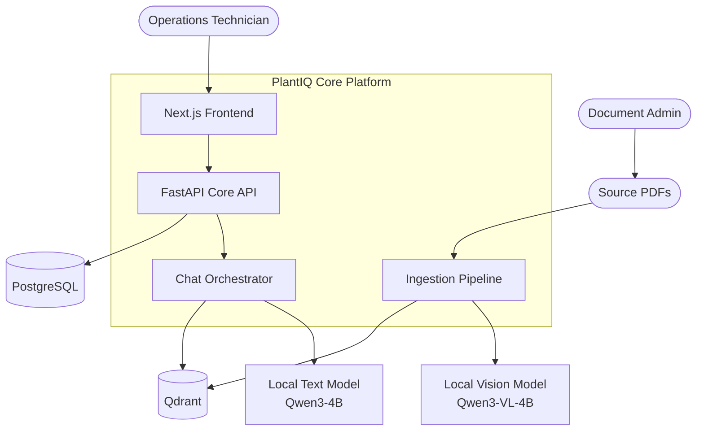
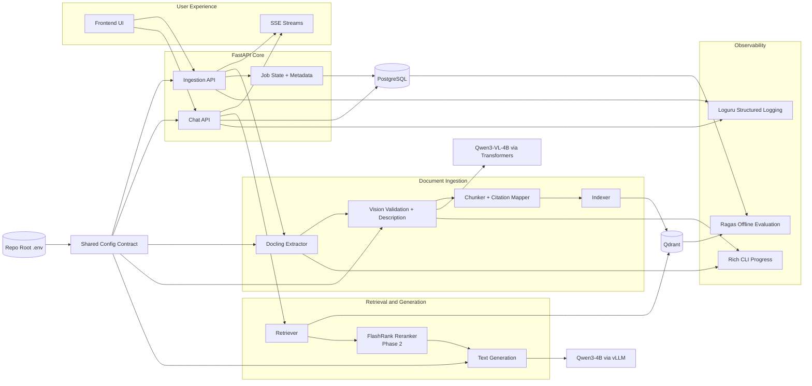
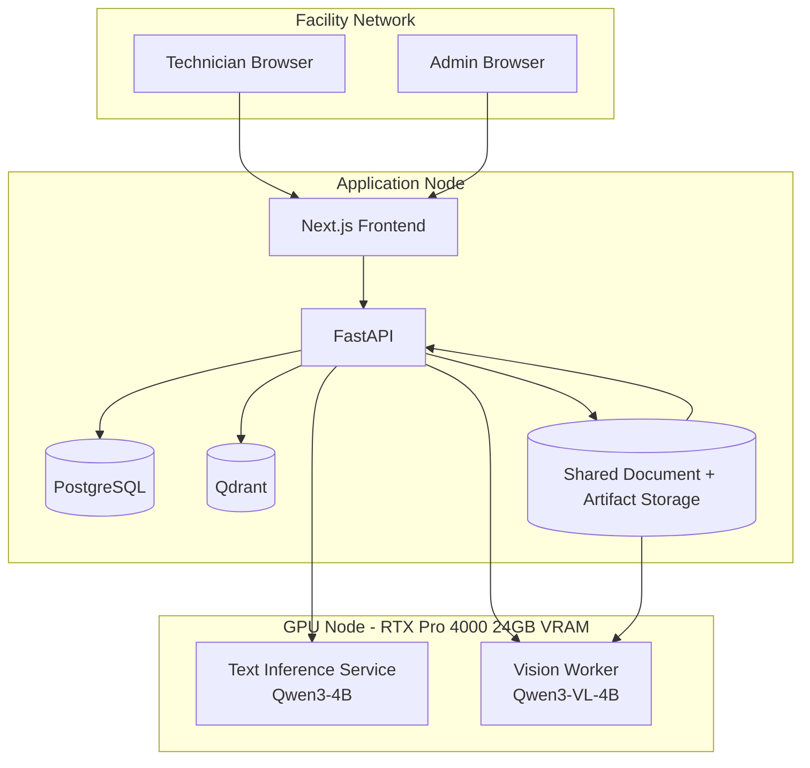
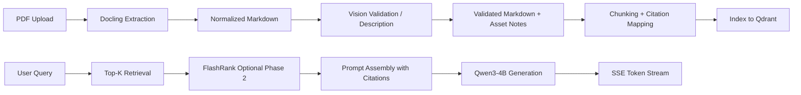
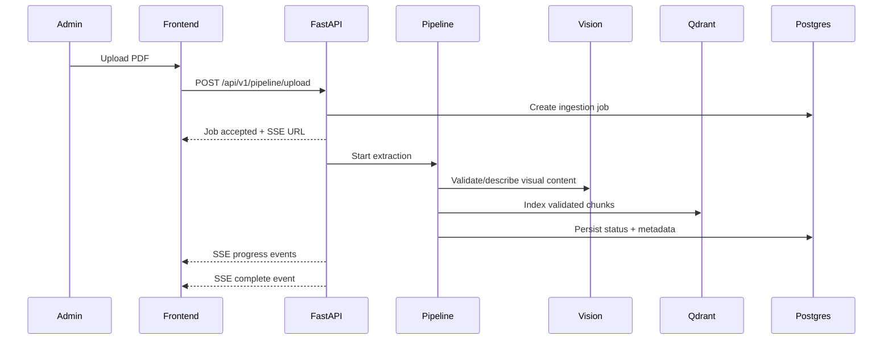
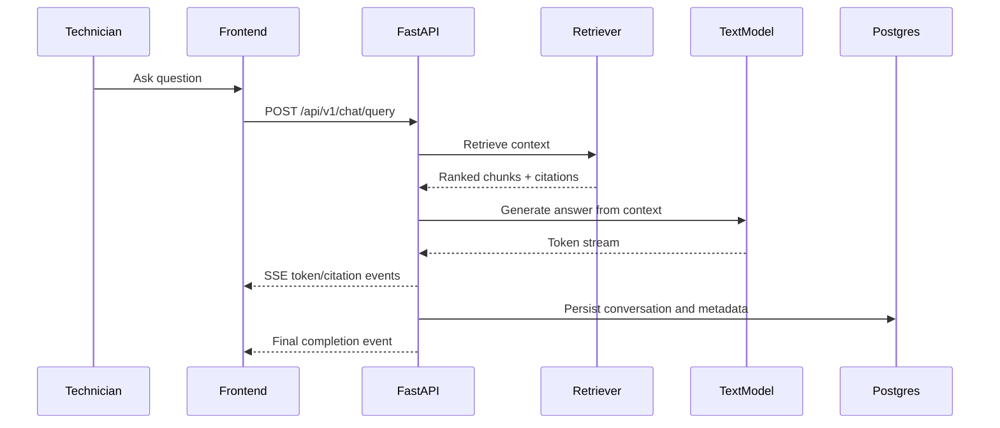
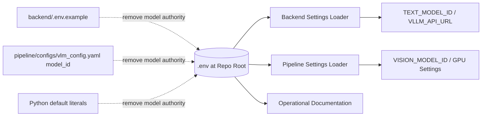
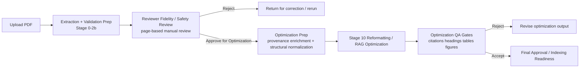
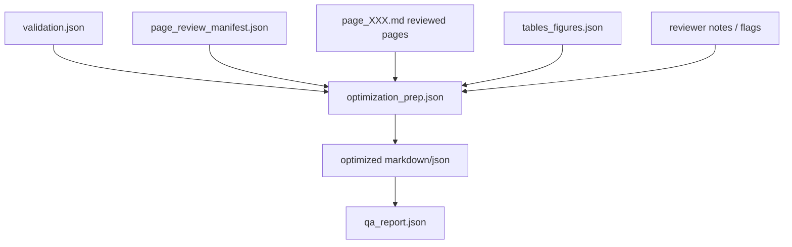

# PlantIQ Core Ingestion and Chat - Architecture Plan

## Executive Summary

The project scope is now intentionally narrowed to the two critical-path capabilities:

1. **Document ingestion pipeline** — convert facility PDFs into validated, chunked, indexed knowledge.
2. **Chatting** — retrieve the most relevant context and stream cited answers to technicians.

All non-core feature work is paused until these two capabilities are stable, testable, and operational end to end.

### Root Cause Behind the Change

The current repository reflects an earlier, broader roadmap that spread attention across review tooling, admin workflows, and several integration layers. It also spread model selection across multiple places:

- repo-root `.env`
- `backend/.env.example`
- pipeline YAML defaults
- Python defaults embedded in source files
- documentation and status files

That fragmentation makes model migrations slow, error-prone, and hard to audit.

### Architectural Direction

- Use **repo-root `.env` as the single source of truth** for runtime model identifiers.
- Standardize on **Qwen3-4B** for text and **Qwen3-VL-4B** for vision.
- Treat **NVIDIA RTX Pro 4000 (24GB VRAM)** as the baseline deployment target.
- Prefer **FastAPI + SSE** for one-way progress and token streaming.
- Add **Loguru** and **Rich** for observability and CLI/operator experience.
- Add **FlashRank** later as a CPU-only reranking layer.
- Run **Ragas** on offline/batch evaluation schedules only, not on live user queries.

## System Context

**Overview:** This shows the reduced system boundary: technicians consume chat, admins feed documents, and the platform centers on ingestion plus retrieval/chat.

**Key Components:** Frontend, FastAPI core API, ingestion pipeline, chat orchestrator, local text inference, local vision inference, PostgreSQL, and Qdrant.

**Relationships:** PDFs enter through ingestion, are validated and indexed, and become retrievable context for chat. Frontend clients talk only to FastAPI, which coordinates persistence, retrieval, inference, and streaming.

**Design Decisions:** The system now prioritizes a short, explicit critical path instead of broad feature coverage. Vision and text inference are treated as distinct runtime concerns because they have different latency and memory profiles.

**NFR Considerations:**
- **Scalability:** Ingestion and chat scale independently.
- **Performance:** Retrieval and token streaming remain isolated from document ingestion bursts.
- **Security:** All components remain local and air-gapped.
- **Reliability:** Clear ownership boundaries reduce cascading failures.
- **Maintainability:** Fewer active subsystems means faster iteration and easier debugging.

**Trade-offs:** Pausing non-core features delays broader UX completeness, but it accelerates delivery of the system’s real value.

**Risks and Mitigations:** Scope creep is the main risk; mitigate by explicitly treating paused features as backlog-only until ingestion and chat meet acceptance gates.

## Architecture Overview

The target architecture is built around four runtime lanes:

1. **Configuration lane** — repo-root `.env` is the only human-edited runtime configuration source.
2. **Ingestion lane** — PDF extraction, vision-assisted validation/description, chunking, indexing.
3. **Chat lane** — retrieval, optional reranking, response generation, citation packaging.
4. **Observability lane** — structured logs, correlation IDs, terminal progress, and evaluation reports.

### Single Environment Contract

All model references should resolve from root `.env` through a shared configuration contract. The recommended canonical keys are:

- `TEXT_MODEL_ID=Qwen/Qwen3-4B-Instruct`
- `VISION_MODEL_ID=Qwen/Qwen3-VL-4B-Instruct`
- `TEXT_INFERENCE_BACKEND=vllm`
- `VISION_INFERENCE_BACKEND=transformers`
- `VLLM_API_URL=http://localhost:8001`
- `EMBEDDING_MODEL_ID=BAAI/bge-large-en-v1.5`
- `RERANKER_ENABLED=false`
- `RERANKER_PROVIDER=flashrank`
- `GPU_VRAM_GB=24`

The backend and pipeline must **consume** these values, not redefine them. YAML files may remain for tuning defaults, but not for model identity.

## Component Architecture

**Overview:** This component map shows the clean split between ingestion and chat, with shared config and observability spanning both.

**Key Components:** Shared config contract, FastAPI APIs, Docling extractor, vision validation layer, retriever, optional reranker, text generation layer, and supporting persistence.

**Relationships:** The ingestion lane writes indexed knowledge into Qdrant; the chat lane reads from it. PostgreSQL stores job state, metadata, and user-facing status. SSE sits between FastAPI and the frontend for live updates.

**Design Decisions:**
- **SSE over polling** for progress and token streams because the dominant communication pattern is server-to-client.
- **Text and vision models separated** to avoid coupling the chat latency path to vision workloads.
- **FlashRank is deferred to Phase 2** because retrieval quality should first be validated without extra ranking complexity.
- **Ragas stays offline** because live-query evaluation would add cost and latency without improving user experience.

**NFR Considerations:**
- **Scalability:** Text inference, vision inference, and indexing can be scaled or throttled independently.
- **Performance:** SSE reduces UI latency and removes polling overhead. Optional reranking stays CPU-bound.
- **Security:** No cloud dependencies are required for the core path.
- **Reliability:** Shared config eliminates drift across services.
- **Maintainability:** Model migration becomes a configuration change instead of a code sweep.

**Trade-offs:** Using both vLLM and Transformers increases operational complexity slightly, but it aligns each workload with the more appropriate runtime.

**Risks and Mitigations:**
- Runtime drift between backend and pipeline → mitigate with one root config contract.
- Unclear event schemas → mitigate with stable SSE event types and versioned payloads.

## Deployment Architecture

**Overview:** The preferred deployment keeps the app services and databases on the application node while isolating inference workloads on a GPU-capable node.

**Key Components:** Browsers, frontend, FastAPI, PostgreSQL, Qdrant, shared storage, text inference, and vision worker.

**Relationships:** FastAPI is the only coordination layer exposed to the frontend. Inference services are internal-only dependencies.

**Design Decisions:**
- Treat **24GB VRAM** as the sizing baseline.
- Run **Qwen3-4B** on the fast text path.
- Keep **Qwen3-VL-4B** on a separate worker because ingestion is bursty and can be queued.

**NFR Considerations:**
- **Scalability:** Add more app nodes or inference workers independently.
- **Performance:** Chat stays responsive even during ingestion bursts.
- **Security:** Internal-only access to inference services reduces attack surface.
- **Reliability:** Ingestion can retry from stored artifacts after worker restarts.
- **Maintainability:** Clear deployment roles simplify runbooks.

**Trade-offs:** Separate nodes add some operational setup, but they reduce GPU contention and make troubleshooting simpler.

**Risks and Mitigations:**
- GPU contention during concurrent ingestion and chat → mitigate via workload isolation and job queues.
- Shared storage bottlenecks → mitigate with retention rules and bounded artifact lifetimes.

## Data Flow

**Overview:** This diagram focuses on how raw documents become indexed knowledge and how indexed knowledge becomes cited chat responses.

**Key Components:** Extraction, validation, chunking, indexing, retrieval, optional reranking, prompt assembly, and generation.

**Relationships:** The ingestion path ends at Qdrant; the chat path starts there. Citation mapping is produced during ingestion so chat can stay lightweight and deterministic.

**Design Decisions:** Generate citation metadata once during ingestion instead of reconstructing provenance at query time.

**NFR Considerations:**
- **Scalability:** Retrieval and generation remain lightweight relative to ingestion.
- **Performance:** Precomputed citation mapping reduces chat latency.
- **Security:** All data remains within the local boundary.
- **Reliability:** Artifact checkpoints support partial reprocessing.
- **Maintainability:** Each stage has a clear contract.

**Trade-offs:** Slightly more ingestion work in exchange for faster, simpler query-time behavior.

**Risks and Mitigations:** Broken chunk provenance would undermine trust; mitigate with ingestion-time validation and regression tests for citation contracts.

## Key Workflows

### Document Ingestion Workflow

**Overview:** This is the critical ingestion journey from upload to indexed document.

**Key Components:** Admin UI, FastAPI, pipeline worker, vision worker, Qdrant, PostgreSQL.

**Relationships:** FastAPI owns job lifecycle, Pipeline owns document transformation, and the frontend receives status only through SSE.

**Design Decisions:** Use asynchronous job execution with SSE rather than blocking upload requests or relying on client polling.

**NFR Considerations:**
- **Scalability:** Jobs can queue without blocking the API.
- **Performance:** Users get immediate feedback and progressive status.
- **Security:** Upload and status access remain under API control.
- **Reliability:** Job state persists independently of browser sessions.
- **Maintainability:** Event-driven progress is easier to reason about than ad hoc polling loops.

**Trade-offs:** SSE is one-way only, but that is sufficient for progress reporting.

**Risks and Mitigations:** Reverse proxies can buffer streams; mitigate with SSE-compatible headers and proxy buffering disabled.

### Chat Workflow

**Overview:** This is the live user path for retrieval and answer generation.

**Key Components:** Frontend, FastAPI, retriever, text model, PostgreSQL.

**Relationships:** Retrieval is performed before generation, and all client updates are streamed via SSE.

**Design Decisions:** Keep the chat protocol one-way and incremental to optimize perceived latency and reduce frontend complexity.

**NFR Considerations:**
- **Scalability:** Stateless chat orchestration supports horizontal scaling.
- **Performance:** SSE provides fast perceived response time.
- **Security:** Citations are assembled from indexed metadata, not client-supplied state.
- **Reliability:** Final completion events allow resumable UI state.
- **Maintainability:** Stable event types simplify client handling and test coverage.

**Trade-offs:** WebSockets remain useful for future bidirectional features, but they are not required for the current core scope.

**Risks and Mitigations:** Retrieval quality may be insufficient initially; mitigate with offline evaluation first, then add FlashRank in Phase 2 if evidence supports it.

## Additional Diagram: Configuration Authority

**Overview:** This diagram captures the main configuration cleanup required for the model migration.

**Key Components:** Root `.env`, backend settings loader, pipeline settings loader, and deprecated authority sources.

**Relationships:** Model identity should flow outward from one place. Other files may document or tune behavior, but they must not redefine the chosen models.

**Design Decisions:** Centralizing configuration removes the need to chase model names across source files, docs, and test scaffolding.

**NFR Considerations:**
- **Scalability:** Easier multi-environment rollout.
- **Performance:** No direct performance gain, but fewer config mistakes reduce downtime.
- **Security:** Sensitive values stay in the env/secrets path.
- **Reliability:** Lower risk of mismatched runtime behavior.
- **Maintainability:** This is the biggest maintainability win in the current change plan.

**Trade-offs:** Slight upfront refactor cost.

**Risks and Mitigations:** Partial migration creates hidden drift; mitigate with a repo-wide search gate in CI that fails on legacy hardcoded model strings.

## Implementation Impact Inventory

The architecture audit identified the following concrete refactor targets for centralized model configuration.

### Backend targets

- `backend/app/core/config.py`
  - Replace `VLLM_MODEL` default literal with root `.env`-driven text model contract.
  - Preferred migration: introduce `TEXT_MODEL_ID` and keep `VLLM_MODEL` as a temporary compatibility alias only if needed.
- `backend/app/services/vllm_service.py`
  - Continue using settings-driven model selection; no model literal should remain in service logic.
- `backend/.env.example`
  - Remove retired hardcoded model value and document root `.env` ownership.
- `backend/README.md`
  - Update examples and setup notes to stop advertising the retired model name.

### Pipeline targets

- `pipeline/src/utils/vlm_options.py`
  - Remove default model literal for vision inference.
  - Load vision model identity from shared settings or explicit constructor input.
- `pipeline/src/cli/text_reformatter.py`
  - Remove hardcoded text model assignments and user-facing strings tied to retired models.
- `pipeline/src/cli/hitl_pipeline.py`
  - Remove literal defaults for `vlm_model` and `reformatter_model`.
  - Keep CLI flags if useful, but resolve defaults from shared settings instead of embedding model names.
- `pipeline/src/validation/enhanced_validator.py`
  - Replace CLI default literal for vision model.
- `pipeline/src/lineage/lineage_tracker.py`
  - Replace CLI default literals for text and vision models.
- `pipeline/src/ingestion/docling_converter.py`
  - Remove fallback literal for vision model.
  - Update informational log strings and CLI descriptions to generic or env-driven wording.
- `pipeline/configs/vlm_config.yaml`
  - Stop using this file as the authority for model identity.
  - It may remain as a tuning file for non-identity settings only.

### Transformer compatibility note

The repo currently references `Qwen2_5_VLForConditionalGeneration` in several pipeline modules. With the shift to Qwen3-VL, implementation must verify the correct Transformers import and runtime support for the selected model family before code changes are finalized.

This is an implementation-time validation step, not a documentation assumption.

### Recommended refactor sequence

1. Create one shared settings contract that reads from repo-root `.env`.
2. Migrate backend text model consumption to that contract.
3. Migrate pipeline vision/text model consumption to that contract.
4. Remove model identity from YAML defaults.
5. Replace user-facing log/help text that still names retired models.
6. Add regression checks to fail on retired model strings in first-party source/config/docs.

### Suggested acceptance criteria

- No first-party source file contains `Qwen2.5` model literals.
- Backend and pipeline both resolve active model IDs from the same root `.env` contract.
- CLI help text and logs no longer imply retired model families.
- Documentation, config templates, and runtime defaults all agree on Qwen3 text/vision targets.
- A repository search excluding third-party environments returns zero retired model references in maintained files.

## Phased Development

### Phase 1: Core Path Stabilization

- Ingestion upload → processing → indexing works end to end.
- Chat query → retrieval → cited streaming answer works end to end.
- SSE becomes the default streaming mechanism.
- Root `.env` becomes the only model authority.
- Loguru and Rich are added for debugging and operator visibility.

### Phase 2: Retrieval Quality Improvement

- Introduce FlashRank as optional CPU reranking.
- Compare baseline retrieval vs reranked retrieval on offline datasets.
- Keep reranking feature-flagged until it shows measurable value.

### Phase 3: Evaluation and Hardening

- Run Ragas against curated offline datasets on a schedule.
- Add regression thresholds for faithfulness, context precision, and factual correctness.
- Reintroduce paused features only after ingestion and chat are stable.

### Migration Path

1. Remove model literals from code and config defaults.
2. Introduce shared settings access in backend and pipeline.
3. Standardize SSE event schemas for ingestion and chat.
4. Validate baseline retrieval and answer quality.
5. Add reranking and offline evaluation only after baseline stability is proven.

## Non-Functional Requirements Analysis

### Scalability

- Separate ingestion from chat so heavy document work does not degrade technician experience.
- Keep text inference stateless behind FastAPI orchestration.
- Use CPU reranking only when enabled and justified.

### Performance

- SSE provides low-overhead progress and token delivery.
- Precomputed citations during ingestion reduce query-time assembly cost.
- The 24GB GPU baseline is better aligned to 4B-class local models than the previous larger-model direction.

### Security

- Preserve air-gapped operation.
- Keep model endpoints internal-only.
- Centralize configuration so secrets and runtime endpoints are easier to audit.

### Reliability

- Persist ingestion job state in PostgreSQL.
- Retain artifact checkpoints for partial recovery.
- Use correlation IDs and structured logs to simplify incident diagnosis.

### Maintainability

- One runtime config authority.
- Fewer active features and clearer service boundaries.
- Shared event contracts across frontend and backend.

## Risks and Mitigations

- **Legacy config drift:** Add a repository-wide audit to fail on legacy hardcoded model names.
- **SSE proxy buffering:** Configure no-buffer headers and verify in staging.
- **Retrieval quality plateau:** Use FlashRank only after offline evidence shows benefit.
- **Evaluation cost creep:** Keep Ragas off the live path and run it in controlled batches.
- **Logging inconsistency:** Standardize on Loguru across backend and pipeline, and use Rich only for CLI-facing flows.

## Technology Stack Recommendations

- **FastAPI + SSE** for upload progress, pipeline events, and chat token streaming.
- **Qwen3-4B** for text generation on the fast path.
- **Qwen3-VL-4B** for ingestion-time vision tasks.
- **Docling** for PDF extraction.
- **Qdrant** for vector retrieval.
- **PostgreSQL** for job state, metadata, and conversations.
- **Loguru** for structured logging and correlation-friendly output.
- **Rich** for terminal progress and operator-facing pipeline UX.
- **FlashRank** as Phase 2 reranking.
- **Ragas** as scheduled offline evaluation.

## Next Steps

1. Refactor backend and pipeline settings so model IDs come only from repo-root `.env`.
2. Remove hardcoded legacy model names from source, config templates, and documentation.
3. Standardize ingestion and chat streaming on SSE event schemas.
4. Add Loguru/Rich in the core execution paths.
5. Defer FlashRank and Ragas until baseline ingestion and chat flows are validated.

## HITL Workflow Realignment (Review → Optimization → QA)

### Executive Intent

The current manual review workflow mixes two different quality objectives in the wrong place:

- **Step 2 review** is fundamentally about fidelity, safety, and source correctness.
- **Current scoring criteria** (citations, question-style headings, table fact bullets, normalized figure descriptions) are mostly about downstream **RAG optimization quality**.

This creates a conceptual mismatch for reviewers and makes the UI imply that optimization-readiness is the same thing as source-faithful review. It is not. One is a trust gate; the other is a transform-quality gate.

The recommended modification is to split the workflow into two explicit gates:

1. **Reviewer Fidelity Gate** — human checks whether the extracted content is faithful enough to proceed.
2. **Optimization QA Gate** — system evaluates whether the optimization output is structurally ready for retrieval.

### Root Cause

The existing pipeline evolved from a single validation/QA concept into a richer multi-stage HITL workflow, but the UI and artifact semantics still reflect the earlier assumption that all scoring belongs before reformatting. As a result:

- reviewers see optimization-oriented criteria too early,
- approval semantics are ambiguous,
- Stage 10 receives enough information for some improvements but not enough explicit provenance structure for consistently strong citation generation,
- QA responsibilities are blurred between human review and post-transform validation.

### Recommended Target Workflow

**Overview:** This separates source-faithfulness review from RAG-readiness scoring and introduces an explicit optimization-prep handoff before Stage 10.

**Key Components:** validation prep, page review, optimization prep, text reformatter, QA gates, final approval.

**Relationships:** the reviewer does not score the reformatted output; the reviewer authorizes the system to create that output. The QA gate then evaluates the optimized artifact instead of the raw reviewed markdown.

**Design Decisions:**
- Rename the review action to **Approve for Optimization**.
- Reframe Step 2 criteria as **fidelity/safety checks** only.
- Run optimization-focused scoring **after** Stage 10.
- Introduce explicit optimization-prep artifacts so citations rely on structured provenance rather than inference alone.

**NFR Considerations:**
- **Scalability:** keeps human attention focused only where humans add unique value.
- **Performance:** avoids asking reviewers to judge machine-transformation criteria prematurely.
- **Security:** preserves human gate before optimized content can be treated as ingest-ready.
- **Reliability:** stronger artifact contracts reduce citation drift.
- **Maintainability:** clearer stage boundaries reduce UI and API ambiguity.

**Trade-offs:** this adds one explicit transition stage, but it removes semantic confusion and reduces hidden coupling between review and optimization.

**Risks and Mitigations:**
- Risk: users may confuse “Approve for Optimization” with final approval.
  - Mitigation: reserve “Final Approval” for the post-QA stage only.
- Risk: optimization prep duplicates validation logic.
  - Mitigation: keep validation prep minimal and make optimization prep consume its outputs instead of redoing them.

### Modified Stage Semantics

#### Step 2: Reviewer Fidelity / Safety Gate

This stage should answer only these questions:

- Is the page content materially faithful to the source PDF?
- Are tables, figures, and key technical statements present enough to proceed?
- Are there hallucinations, safety-critical omissions, or severe structure problems?
- Has the reviewer corrected or annotated issues that would make optimization unsafe?

The review UI should remove or relocate optimization-oriented guidance such as:

- citation coverage,
- question-style heading compliance,
- table-to-bullets transformation quality,
- normalized figure description coverage.

Instead, the review sidebar should show a fidelity-focused checklist:

- source content preserved,
- no hallucinated statements,
- critical tables retained,
- figures/schematics not misleadingly omitted,
- page markdown acceptable for downstream transformation,
- reviewer notes captured for unresolved ambiguity.

#### New Handoff: Approve for Optimization

This action means:

- the reviewed markdown is trustworthy enough to transform,
- the document is **not yet finally approved**,
- downstream automation may now enrich and optimize the content.

This is the most important UX clarification in the redesign.

#### New Stage: Optimization Prep

Optimization prep should be a distinct script/module that consumes:

- reviewed page markdown,
- page review manifest,
- validation report,
- table/figure metadata,
- reviewer notes and unresolved flags.

It should produce a structured intermediate artifact designed to improve Stage 10 reliability.

Recommended responsibilities:

1. build explicit page/section provenance mappings,
2. carry forward reviewer corrections as authoritative text,
3. normalize heading hierarchy before LLM-based rewriting,
4. extract table facts into structured bullet candidates,
5. normalize figure descriptions into reusable source-linked records,
6. package unresolved ambiguity flags so Stage 10 avoids inventing certainty.

This stage should **not** replace validation prep. It should extend it.

#### Step 3 / Stage 10: Reformatting and RAG Optimization

Stage 10 should consume the optimization-prep artifact instead of relying primarily on free-form markdown plus a general validation report. The reformatter remains responsible for:

- rewriting headings into retrieval-friendly questions where appropriate,
- producing chunk-ready markdown/JSON,
- attaching citations using explicit provenance,
- preserving technical meaning,
- avoiding unsupported synthesis.

#### Post-Optimization QA Gates

The current QA metrics are best positioned here. This gate should evaluate the optimized output for:

- citation coverage and correctness,
- heading normalization quality,
- table fact extraction completeness,
- figure description normalization coverage,
- overall structural readiness for indexing,
- confidence and unresolved critical issues.

This stage becomes the formal quality gate before final approval.

### Artifact Contract Changes

**Overview:** This artifact flow adds one authoritative intermediate contract between human review and LLM reformatting.

**Key Components:** validation artifact, page review manifest, reviewed page files, table/figure metadata, optimization prep artifact, optimized output, QA report.

**Relationships:** optimization prep becomes the single structured input to Stage 10. QA gates then score only the Stage 10 output.

**Design Decisions:** prefer explicit structured provenance over asking Stage 10 to infer page alignment from raw markdown.

**NFR Considerations:**
- **Scalability:** structured artifacts make regression testing easier as document volume grows.
- **Performance:** more deterministic inputs reduce repeated LLM repair work.
- **Security:** reviewer-approved text remains the trusted base.
- **Reliability:** citation quality improves with explicit page mapping.
- **Maintainability:** contracts become inspectable and testable.

**Trade-offs:** adds another artifact to maintain, but it meaningfully reduces ambiguity in later stages.

**Risks and Mitigations:** schema drift is the main risk; mitigate with versioned artifact fields and regression tests.

### Recommended Status Model

The status model should distinguish human review completion from optimization completion.

Recommended statuses:

- `validation-complete`
- `in-review`
- `review-complete`
- `approved-for-optimization`
- `optimizing`
- `optimization-complete`
- `qa-review`
- `qa-passed`
- `final-approved`
- `rejected`
- `failed`

If the team wants to minimize churn, `review-complete` can temporarily remain internal while the user-facing primary transition becomes `approved-for-optimization`.

### API and UI Modification Plan

#### Backend/API

1. Replace or extend the current review completion action so reviewer approval writes an explicit optimization-ready state.
2. Introduce an optimization-trigger endpoint or fold it into the approval transition.
3. Generate `optimization_prep.json` from page-review artifacts.
4. Update QA rescore to operate on the optimized artifact, not the pre-optimization review artifact.
5. Reserve final approval for the post-QA stage only.

#### Frontend/UI

1. Rename the review-page primary action to **Approve for Optimization**.
2. Replace the current review sidebar scoring box with a fidelity/safety guidance box.
3. Move the current scoring criteria to the QA Gates screen and clearly label them as optimization-output criteria.
4. Add status messaging so users understand the document is still pending final approval after reviewer approval.
5. Show optimization progress between review and QA gates.

### Testing and Validation Strategy

#### Functional validation

- reviewer approval transitions to optimization state,
- optimization prep artifact is created from reviewed pages,
- Stage 10 consumes structured provenance,
- QA gate scores optimized output only,
- final approval is blocked until QA passes.

#### Regression validation

- page edits persist into optimization prep,
- citations reference valid source pages,
- heading rewrites do not destroy section meaning,
- table fact extraction remains grounded in reviewed source content,
- figure descriptions remain page-linked and non-hallucinated.

#### Hidden-risk checks

- ambiguous reviewer notes do not become confident final statements,
- optimization reruns are idempotent against the same reviewed artifact set,
- reject paths from review and QA remain distinct and auditable.

### Phased Implementation Plan

#### Phase 1: Semantic realignment (low risk)

- update review UI wording,
- rename approval action to **Approve for Optimization**,
- replace review-stage scoring text with fidelity/safety guidance,
- relabel QA Gates as optimization-output scoring.

#### Phase 2: Status and workflow transition (medium risk)

- add `approved-for-optimization` and `optimizing` lifecycle states,
- wire reviewer approval to trigger optimization,
- update frontend routing and progress surfaces.

#### Phase 3: Artifact contract hardening (medium to high value)

- create `optimization_prep.json`,
- include explicit provenance records for headings, tables, figures, and reviewer notes,
- make Stage 10 consume the new artifact.

#### Phase 4: QA realignment and enforcement (medium risk)

- score only optimized output in QA,
- prevent final approval unless QA passes,
- update backend tests and live workspace validation flows.

### Recommended Implementation Sequence

1. **UI semantics first** — cheapest change, immediate clarity.
2. **Status transition second** — align user-visible workflow with backend state.
3. **Optimization prep artifact third** — improve data contract before pushing more logic into Stage 10.
4. **QA source-of-truth switch fourth** — then score the right artifact at the right stage.
5. **Final approval enforcement last** — once upstream transitions are stable.

### Final Recommendation

Do **not** remove the current validation step outright. Instead:

- keep validation as the source-faithfulness and evidence-generation stage,
- narrow its purpose to review preparation,
- add a dedicated optimization-prep stage after human approval,
- move optimization-oriented scoring entirely to post-reformat QA.

This produces a cleaner workflow, stronger provenance, more trustworthy citations, and a UI that matches what reviewers are actually being asked to decide.
