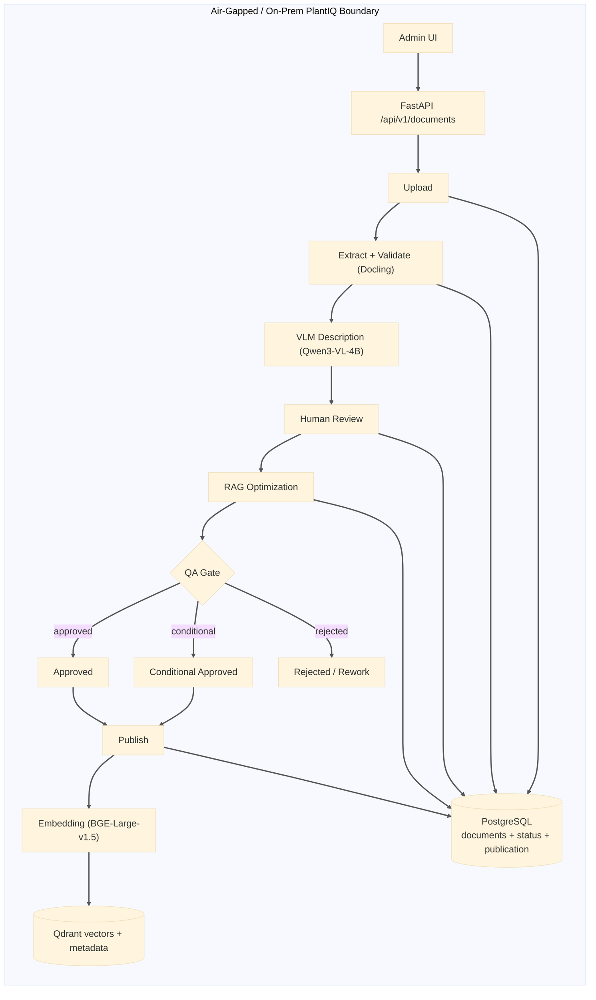
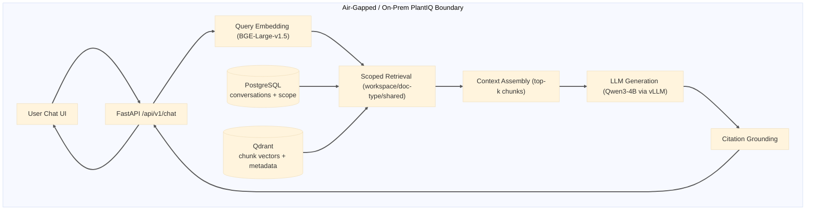

# PlantIQ Capstone — Alpha Checkpoint Report

**Project:** PlantIQ (Air-Gapped RAG System for Industrial OT Environments)  
**Checkpoint:** Alpha (Phase 1)  
**Date:** March 28, 2026  
**Prepared by:** PlantIQ Capstone Team

## Table of Contents

### Submission Checklist Items
- [1) In-Progress Capstone Report (Work Completed at Alpha)](#1-in-progress-capstone-report-work-completed-at-alpha)
- [2) Sponsor Feedback and Review](#2-sponsor-feedback-and-review)
- [3) Functions and Features Implemented in this Checkpoint](#3-functions-and-features-implemented-in-this-checkpoint)
- [4) Source Code Archive (ZIP Export)](#4-source-code-archive-zip-export)
- [5) Instructions to Compile, Build, and Deploy](#5-instructions-to-compile-build-and-deploy)
- [6) Code Statistics](#6-code-statistics)
- [7) Code Repository Link](#7-code-repository-link)
- [8) Public Prototype / VM Link](#8-public-prototype--vm-link)
- [9) Video: Compile, Build, and Deploy (<=5 minutes)](#9-video-compile-build-and-deploy-5-minutes)
- [10) Video: Design, Architecture, and Main Modules (<=5 minutes)](#10-video-design-architecture-and-main-modules-5-minutes)
- [11) Video: Prototype Functionality Demonstration (<=5 minutes)](#11-video-prototype-functionality-demonstration-5-minutes)
- [12) Known Problems, Gaps, Defects, and Next-Checkpoint Plan](#12-known-problems-gaps-defects-and-next-checkpoint-plan)
- [Alpha Quality Criteria Assessment](#alpha-quality-criteria-assessment)
- [Guideline Compliance Matrix](#guideline-compliance-matrix)

### In-Progress Capstone Report — Academic Structure
#### Part I: Background
- [Abstract](#abstract)
- [4. Introduction](#4-introduction)
  - [4a. Purpose of the Project](#4a-purpose-of-the-project)
  - [4b. Problem Statement](#4b-problem-statement)
  - [4c. Background of Sponsor Organization](#4c-background-of-sponsor-organization)
  - [4d. Background of Problem](#4d-background-of-problem)
- [5. Product Review of Existing Similar Solutions](#5-product-review-of-existing-similar-solutions)
#### Part II: Core Product Design and Implementation
- [6. Detailed Requirements](#6-detailed-requirements)
  - [6.1 Functional Requirements](#61-functional-requirements)
  - [6.2 Non-Functional Requirements](#62-non-functional-requirements)
  - [6.3 User Stories and Feature Coverage](#63-user-stories-and-feature-coverage)
  - [6.4 Code and Data Metrics](#64-code-and-data-metrics)
- [7. Design, Architecture, and Methodology](#7-design-architecture-and-methodology)
  - [7.1 Software Engineering Methodology](#71-software-engineering-methodology)
  - [7.2 High-Level System Design](#72-high-level-system-design)
  - [7.3 Low-Level Design and System Architecture](#73-low-level-design-and-system-architecture)
  - [7.4 Hardware and Software Dependencies](#74-hardware-and-software-dependencies)
  - [7.5 Detailed Component Design](#75-detailed-component-design)
- [8. Results and Discussion](#8-results-and-discussion)
- [9. Conclusion](#9-conclusion)
#### Part III: Action Items and Reflection (In Progress)
- [10. Recommendations to Sponsor](#10-recommendations-to-sponsor)
- [11. Limitations of the Project](#11-limitations-of-the-project)
- [12. Future Works](#12-future-works)
- [13. References](#13-references)

---

## 1) In-Progress Capstone Report (Work Completed at Alpha)

> This section presents the in-progress academic capstone report describing work completed as of the Alpha checkpoint. The report follows the prescribed APA-format outline and is written in past tense throughout. Detailed implementation evidence, code statistics, and video demonstrations are provided in items 3 through 12 of this submission package.

---

### Abstract

PlantIQ was developed as an air-gapped Retrieval-Augmented Generation (RAG) system designed for Cove Point LNG, a critical liquefied natural gas export facility operated by Berkshire Hathaway Energy Gas Transmission & Storage (BHE GT&S) in Lusby, Maryland. The system addressed a documented operational challenge: operations technicians required 30 or more minutes to locate equipment-specific guidance in proprietary vendor manuals during time-critical troubleshooting scenarios, while strict OT cybersecurity policies prohibited the use of external AI tools or cloud-hosted services. PlantIQ implemented a five-stage, human-curated document ingestion pipeline encompassing PDF extraction, Vision Language Model (VLM)-assisted validation, page-level human review, RAG-targeted content optimization, quality assurance (QA) gating, and controlled vector publication. The pipeline was paired with a citation-grounded natural language chat interface powered by a locally hosted large language model. The system was designed to operate entirely on-premises without any external network connectivity, satisfying IEC 62443 and NERC CIP compliance posture requirements. As of the Alpha checkpoint (March 2026), 76.9% of planned user stories were fully implemented, with a weighted completion rate of 80.8% when accounting for partial implementations. End-to-end functionality was successfully validated across all primary workflows: document ingestion, human review, QA gating, vector publication, and multi-turn chat with verifiable source citations. Remaining scope—Active Directory authentication integration and full role governance administration—was deferred to the Beta checkpoint.

---

### Part I: Background

---

### 4. Introduction

### 4a. Purpose of the Project

PlantIQ was created to provide operations technicians at Cove Point LNG with an on-premises, AI-powered knowledge access system capable of answering natural language troubleshooting questions grounded in the facility's proprietary vendor manuals. The purpose extended beyond simple document retrieval: the system was engineered to guarantee that only validated, human-reviewed content entered the retrieval index, thereby ensuring operational trust in AI-generated answers within a safety-critical environment. The project served three primary purposes: (a) to demonstrate that a quality-gated, air-gapped RAG system was technically feasible using open-source models and commercially available infrastructure; (b) to reduce technician information retrieval time from an average of 30 or more minutes to under 60 seconds; and (c) to provide a replicable implementation blueprint for industrial OT environments facing similar documentation access and cybersecurity constraints.

### 4b. Problem Statement

Real-time troubleshooting at LNG export facilities was significantly hampered by the inability to quickly access accurate, equipment-specific technical information during time-sensitive scenarios. Proprietary equipment manuals were not accessible online, and strict cybersecurity policies prohibited the use of cloud-based AI search tools (Holt, 2026). Technicians manually searched through hundreds of pages across multiple vendor manuals, a process averaging 30 or more minutes per query. This slow, error-prone approach increased the risk of operational downtime and elevated safety concerns in a critical infrastructure environment where rapid response was essential. The engineering manuals further compounded the challenge by containing complex visual elements—P&ID diagrams, electrical schematics, equipment photographs, data tables, and mathematical equations—that standard text extraction tools corrupted or omitted entirely, making even PDF-based search unreliable (IBM Corporation, 2024).

The fundamental problem was: how could an industrial facility provide technicians with fast, accurate, and citation-verified access to technical documentation while maintaining strict air-gapped security requirements and protecting proprietary vendor information?

### 4c. Background of Sponsor Organization

BHE GT&S (Berkshire Hathaway Energy Gas Transmission & Storage) was a subsidiary of Berkshire Hathaway Energy, one of North America's largest integrated energy infrastructure companies. BHE GT&S operated critical natural gas infrastructure including interstate pipelines spanning multiple states, natural gas storage facilities, LNG export terminals, and compression and processing facilities. The specific client site, Cove Point LNG at Lusby, Maryland, was an LNG export facility that liquefied natural gas for international export shipping.

The facility represented critical national energy infrastructure operating under continuous 24/7 operational requirements. Its organizational structure included operational departments—Power Block, Pre-Treatment, Liquefaction, and OSBL (Outside Battery Limits)—and maintenance disciplines including Instrumentation, DCS, Electrical, and Mechanical. Each department maintained extensive collections of vendor documentation governing maintenance, troubleshooting, and safety procedures for hundreds of specialized equipment units.

Key stakeholders in the project included Randy Holt (Supervisor, LNG Operations), Michael Thorne (Supervisor, LNG Operations), Virang Parekhji (Superintendent, LNG Operations), and Wesley Evers (LNG Production Coordinator). The OT cybersecurity team also maintained a role in validating the air-gapped compliance posture of any technology introduced to the facility network.

### 4d. Background of Problem

The project originated from direct field experience working as an OT Cybersecurity Technician at the Cove Point LNG facility. During routine operations and troubleshooting activities, a persistent operational inefficiency became apparent: technicians had no fast mechanism to locate precise, equipment-specific guidance in proprietary vendor manuals (Holt, 2026). Standard OT troubleshooting relied on alarms, system logs, and vendor documentation, but PDF search was limited to Windows file system tools, and physical manual retrieval depended on technicians' memory of manual titles and storage locations—unreliable under time pressure.

The problem was further compounded by strict security constraints. The Cove Point facility operated under IEC 62443 industrial cybersecurity standards and NERC CIP (Critical Infrastructure Protection) regulations, which governed what technology could connect to the facility network. Cloud-hosted AI tools were categorically prohibited because proprietary vendor manuals—licensed from manufacturers under strict data handling agreements—could not be uploaded to external services. Standard internet search engines could not access the proprietary documentation. No existing commercial off-the-shelf tool simultaneously addressed the security constraints, the document complexity requirements, and the accuracy governance standards needed for a safety-critical environment.

The sponsor formally framed the need as: a locally hosted system that could ingest existing vendor PDFs, apply AI-assisted quality validation, allow human reviewers to approve content accuracy, and serve technicians with natural language answers linking directly back to verified source pages.

---

### 5. Product Review of Existing Similar Solutions

Several categories of existing products were reviewed prior to and during the design phase to understand the competitive landscape and identify gaps this project addressed.

### Local "Chat with Your Documents" Tools

**PrivateGPT** was a self-hosted document Q&A application positioned around "no data leaves your execution environment," providing local document ingestion and natural language question-answering. While PrivateGPT demonstrated that private local RAG was technically feasible, it did not provide VLM-assisted validation, structured evidence artifact generation, quantitative QA gates, or formal reviewer approval workflows essential for safety-critical OT content.

**AnythingLLM** supported document chat using attachments or embedded RAG pipelines, including an "Accuracy Optimized" retrieval mode with reranking. It provided practical adjustable retrieval behavior but was not purpose-built for the engineering-manual fidelity challenges (tables, schematics, P&ID diagrams) that required a dedicated HITL pipeline in this project.

**Open WebUI** documented a RAG workflow: create a knowledge base, upload documentation, connect to a model, and query for AI-enhanced assistance. This established a usable reference UX pattern for knowledge-base chat, but provided no governed ingestion pipeline with reviewer approval gates required for safety-critical OT environments.

### Enterprise Search Platforms

**Elasticsearch** documented a RAG architectural pattern—retrieve relevant documents via full-text, vector, or hybrid search, then generate grounded responses through an LLM—with the ability to cite authoritative sources (Elastic, 2024). This represented a mature retrieval architecture suitable for enterprise-scale indexing, but it required substantial custom development to meet air-gapped, VLM-validated, and reviewer-approved ingestion requirements specific to this project.

**Danswer** provided open-source enterprise search and chat assistance for private and enterprise knowledge bases. As a general-purpose tool, it did not inherently enforce VLM validation, evidence artifact generation, or formal reviewer approval gates tuned to engineering manuals.

### Industrial Copilots

**Siemens Industrial Copilot** was positioned to support industrial work with generative AI experiences, reflecting growing market demand for faster AI-assisted access to expertise in industrial settings. However, it did not align with the facility-controlled, air-gapped governance of proprietary vendor manuals required by Cove Point LNG's security posture.

### Differentiation Summary

PlantIQ was differentiated by integrating four requirements into a single end-to-end system that no reviewed product addressed in combination: (a) complete air-gapped operation with zero cloud dependencies; (b) high-fidelity ingestion for complex engineering documents using VLM validation and quantitative QA gates; (c) explicit human-in-the-loop approval workflow before content entered the retrieval index; and (d) citation-grounded answers with full traceability back to source document pages and version history.

| Product | Local/Air-Gapped | VLM Validation | Human Approval Workflow | Source Citation |
|---|:---:|:---:|:---:|:---:|
| PrivateGPT | Yes | No | No | Limited |
| AnythingLLM | Yes | No | No | Limited |
| Open WebUI | Yes | No | No | Basic |
| Elasticsearch RAG | Partial | No | No | Configurable |
| Siemens Industrial Copilot | No | N/A | N/A | Partial |
| **PlantIQ (this project)** | **Yes** | **Yes** | **Yes** | **Yes** |

---

### Part II: Core Product Design and Implementation

---

### 6. Detailed Requirements

### 6.1 Functional Requirements

The following functional requirements were derived from stakeholder interviews, document analysis of vendor manuals, and iterative refinement with the sponsor. Each requirement maps to a user story and a requirement set.

| FR ID | Functional Requirement | Req. Set | Priority | Alpha Status |
|---|---|:---:|:---:|:---:|
| FR-1.1 | The system shall accept PDF uploads with metadata (title, version, system/workspace) and create a tracked document record. | RS-1 | High | Implemented |
| FR-1.2 | The system shall apply VLM-based content extraction and generate a categorized validation report identifying missing text, table fidelity issues, and figure description gaps. | RS-1 | High | Implemented |
| FR-1.3 | The system shall provide a web-based review interface with page-level evidence, inline content editing, and checklist-driven review progression. | RS-1 | High | Implemented |
| FR-1.4 | The system shall enforce approval and version locking so that only reviewed content proceeded to the RAG optimization and publication pipeline. | RS-1 | High | Implemented |
| FR-1.5 | The system shall maintain version history limited to the current version and the last approved version. | RS-1 | Medium | Partial |
| FR-1.6 | The system shall compute objective QA gate metrics and generate an accept, conditional, or reject recommendation with a weighted scoring rationale. | RS-1 | High | Implemented |
| FR-2.1 | The system shall accept natural language troubleshooting queries and return cited answers based on retrieved document context from published content. | RS-2 | High | Implemented |
| FR-2.2 | The system shall include citation payloads (document title, page number, source chunk) in each response, enabling technicians to verify guidance against source documentation. | RS-2 | High | Implemented |
| FR-2.3 | The system shall provide access to the full source context for cited passages through a dedicated source panel accessible from the chat interface. | RS-2 | High | Implemented |
| FR-2.4 | The system shall persist conversation context across multi-turn sessions, maintaining retrieval scope settings and chat message history. | RS-2 | High | Implemented |
| FR-2.5 | The system shall support bookmark save and remove controls for user-identified answers of recurring operational value. | RS-2 | Medium | Implemented |
| FR-3.1 | The system shall authenticate users via facility Active Directory credentials using LDAP integration. | RS-3 | High | Pending (Beta) |
| FR-3.2 | The system shall enforce role-based access control (User, Reviewer, Admin) with appropriate access restrictions and governance controls per role. | RS-3 | High | Pending (Beta) |

### 6.2 Non-Functional Requirements

| NFR ID | Non-Functional Requirement | Category | Target |
|---|---|---|---|
| NFR-1 | The system shall operate completely offline with zero external network dependencies during runtime. | Security / Compliance | 100% air-gapped |
| NFR-2 | The system shall generate responses within 30 seconds for typical natural language queries on target on-premises hardware. | Performance | p95 ≤ 30 s |
| NFR-3 | The system shall maintain service uptime during scheduled operational hours without unhandled crashes. | Reliability | Zero crashes during demo windows |
| NFR-4 | QA gate citation coverage computed at publication time shall meet or exceed 90% for approved content. | Content Quality | ≥ 90% citation coverage |
| NFR-5 | The system shall maintain an audit trail of all document approval, QA decision, and publication events. | Compliance / Auditability | 100% event coverage |
| NFR-6 | No proprietary document content shall transit external networks at any point in the ingestion, retrieval, or generation lifecycle. | Security | 100% on-prem processing |
| NFR-7 | The system shall run on the specified on-premises hardware configuration: 64 GB RAM, NVIDIA RTX A6000 (24 GB VRAM), 1 TB NVMe SSD. | Hardware Compatibility | On-prem hardware validated |
| NFR-8 | The system shall support containerized deployment using Docker Compose for reproducible on-premises installation. | Deployability | Docker Compose |
| NFR-9 | VLM-assisted extraction shall preserve critical technical content including table structure, equipment specifications, and figure descriptions. | Extraction Accuracy | ≥ 95% table fidelity |
| NFR-10 | The system's retrieval layer shall apply workspace-scoped and document-type-filtered vector search to prevent context dilution from irrelevant documents. | Retrieval Quality | Scope-filtered retrieval enforced |

### 6.3 User Stories and Feature Coverage

All 13 user stories from the approved proposal were tracked through the Alpha checkpoint. Coverage as of Alpha:

- **Fully implemented at Alpha:** 10 of 13 user stories (76.9%)
- **Partially implemented at Alpha:** 1 of 13 user stories (7.7%)
- **Pending / deferred to Beta:** 2 of 13 user stories (15.4%)
- **Weighted completion (full + half-credit for partial):** 10.5 / 13 = **80.8%**

Full user story status is detailed in [Section 3: Functions and Features Implemented](#3-functions-and-features-implemented-in-this-checkpoint).

### 6.4 Code and Data Metrics

The following quantitative metrics were collected using `cloc v1.98` and `lizard` static analysis tools on Git-tracked files as of March 28, 2026. Full details are provided in [Section 6: Code Statistics](#6-code-statistics).

| Metric | Value |
|---|---|
| Total source files (modules) | 170 |
| Total LOC (blank + comment + code) | 55,719 |
| Code lines (CLOC) | 44,385 |
| Comment lines | 4,713 |
| Comment-to-code ratio | 10.62% |
| Python files / code lines | 52 / 15,559 |
| TypeScript files / code lines | 67 / 11,345 |
| Python classes | 111 |
| Python methods | 137 |
| Python top-level functions | 263 |
| Average cyclomatic complexity (AvgCCN) | 4.0 |
| Direct backend runtime dependencies | 16 |
| Direct pipeline runtime dependencies | 11 |
| Direct frontend runtime dependencies | 23 |
| Programming languages used | 14 |

---

### 7. Design, Architecture, and Methodology

### 7.1 Software Engineering Methodology

An iterative, milestone-driven development approach was employed throughout the project, with work organized into three checkpoint phases (Proposal, Alpha, Beta) aligned to the Spring 2026 semester timeline. Development proceeded in informal sprint cycles mapped to the three Requirement Sets defined in the proposal, with core pipeline and chat functionality treated as the critical path.

Requirements were gathered through structured stakeholder interviews with Cove Point LNG operations personnel, direct document analysis of sample vendor manuals representing real facility content, and iterative technology prototyping of key AI components. Stakeholder feedback was incorporated at bi-weekly checkpoints and formally consolidated in the Proposal document before development commenced.

The methodology emphasized three principles: core-functionality-first delivery (the five-stage ingestion pipeline and RAG chat runtime were completed before identity governance work began); evidence-driven quality (acceptance criteria for QA gates were defined quantitatively prior to implementation); and iterative integration (backend services, pipeline modules, and frontend components were integrated incrementally rather than assembled at the end).

Version control was maintained in GitHub with continuous commits and branch-based development. The commit history was preserved in its entirety as a record of continuous progress.

### 7.2 High-Level System Design

PlantIQ was organized into four primary architectural layers:

1. **Presentation Layer** — Next.js / React TypeScript frontend providing the admin document management interface (upload, review, QA, publish) and the operator chat interface (query, citation, conversation management).
2. **API Gateway Layer** — FastAPI REST services handling ingestion orchestration, pipeline lifecycle management, chat query processing, and real-time Server-Sent Event (SSE) streaming.
3. **Service Layer** — Modular Python business logic services: `PipelineService` (lifecycle state management and event broadcasting), `EmbeddingService` (batch vector generation), `QdrantService` (vector store management and scoped retrieval), `ChatService` (multi-turn conversation, RAG orchestration, and citation grounding), and `LLMService` (local model inference via vLLM).
4. **Data and Infrastructure Layer** — PostgreSQL as the transactional system of record for document lifecycle state and chat history; Qdrant as the vector retrieval store; and a local filesystem artifact store for validation, optimization, and QA artifacts.

The system's defining architectural characteristic was the intentional separation of transactional document lifecycle state (PostgreSQL) from semantic retrieval state (Qdrant). This ensured that operational auditability—who approved what and when—remained independent from retrieval performance optimization, allowing each store to be configured and scaled for its specific purpose.

### 7.3 Low-Level Design and System Architecture

#### Document Ingestion Pipeline

The five-stage sequential document ingestion pipeline was the central product differentiator:

1. **Upload and Metadata Capture** — The FastAPI `/api/v1/documents/upload` endpoint accepted multipart PDF uploads with metadata (title, version, system/workspace, document_type), persisted a document record in PostgreSQL, and dispatched the pipeline subprocess asynchronously.

2. **PDF Extraction and VLM Validation** — Docling performed structured PDF-to-markdown conversion with layout preservation. The Qwen3-VL-4B vision language model generated contextual descriptions for tables, figures, and complex visual elements that text-only extraction omitted or corrupted. Validation artifacts categorized extraction issues by type and severity (critical, high, medium, low) and computed per-page confidence scores.

3. **Human-in-the-Loop Review** — Document administrators reviewed page-level evidence via the web interface, edited extracted content against the original source, completed structured review checklists, and explicitly approved content for optimization. The review stage maintained a single-reviewer workflow with version locking on approval.

4. **RAG Optimization** — Approved reviewed content was reformatted specifically for retrieval effectiveness: sections were restructured with semantic boundaries, complex tables were converted to structured factual statements, figures were described in operational context, and heading hierarchies were optimized for relevance scoring. Optimization produced `*_rag_optimized.json` and `*_rag_optimized.md` artifacts stored in the document artifact directory.

5. **Semantic Chunking, QA Gating, and Publication** — Optimized markdown was chunked at configurable sizes (default 512 tokens, 50-token overlap) and scored against QA metrics: citation coverage (≥90%), question-heading compliance (≥85%), table-facts extraction ratio (≥95%), figure description coverage (100%), and overall confidence (≥80%). Approved documents were batch-embedded using BGE-Large-v1.5 and upserted into the Qdrant collection with full metadata payloads. Previous vectors for the document were deleted before upsert to maintain a clean, consistent retrieval index.

#### RAG Chat Runtime

The chat query pipeline processed requests through five steps:

1. Query embedding using BGE-Large-v1.5 (1024-dimensional cosine vectors).
2. Scoped Qdrant retrieval with workspace, document-type, and shared-document payload filters applied before ranking, reducing irrelevant context.
3. Context assembly combining the top-k retrieved chunks ranked by cosine similarity score.
4. Prompt assembly inserting the user query and retrieved context into a structured system prompt with citation extraction instructions.
5. Streaming token generation via Qwen3-4B running under vLLM, with citation grounding extracted from retrieved chunk metadata and formatted as `[Document Title, Page X]` references in the response.

A **relaxed threshold strategy** was implemented to prevent empty responses on sparse queries: if initial retrieval at the configured similarity threshold yielded fewer than the required context chunks, the similarity floor was incrementally lowered (from 0.65 toward a minimum of 0.45) until sufficient context was found.

### 7.4 Hardware and Software Dependencies

#### Hardware Configuration

| Environment | RAM | GPU | Storage |
|---|---|---|---|
| Development workstation | 32 GB | NVIDIA RTX 4050 (6 GB VRAM) | 512 GB NVMe SSD |
| Target deployment server | 64 GB | NVIDIA RTX A6000 (24 GB VRAM) | 1 TB NVMe SSD |
| Public prototype host | 32 GB | NVIDIA RTX 4050 (6 GB VRAM) | 512 GB NVMe SSD |

#### Key Software Components

| Component | Technology | Version / Notes |
|---|---|---|
| Backend API | FastAPI + Python | Python 3.10+, Uvicorn ASGI |
| Relational database | PostgreSQL | v15 |
| Vector database | Qdrant | v1.x, cosine distance, payload-filtered |
| PDF extraction | Docling | Open source, structure-preserving |
| VLM (visual validation) | Qwen3-VL-4B | Local inference, VRAM-optimized |
| Embedding model | BAAI/bge-large-en-v1.5 | 1024-dim cosine embeddings |
| LLM (chat generation) | Qwen3-4B via vLLM | Local inference, streaming |
| Frontend framework | Next.js 15 + React | TypeScript, Tailwind CSS, shadcn/ui |
| Containerization | Docker + Docker Compose | Offline-capable deployment |
| Authentication (planned) | LDAP / Active Directory | Deferred to Beta |

#### External Libraries Used

- **Backend**: `langchain-core`, `sentence-transformers`, `qdrant-client`, `psycopg2`, `pydantic`, `python-multipart`, `python-jose` (JWT), `passlib`, `ldap3`
- **Pipeline**: `docling`, `vllm`, `torch`, `pillow`, `tiktoken`, `lizard`
- **Frontend**: `react`, `next`, `shadcn/ui`, `tailwindcss`, `typescript`, `vitest`, `lucide-react`

### 7.5 Detailed Component Design

#### Pipeline Service (`backend/app/services/pipeline_service.py`)

The `PipelineService` implemented a document lifecycle state machine managing transitions between: `uploaded → extracting → validating → review_ready → reviewing → approved_for_review → optimizing → optimization_complete → qa_ready → qa_complete → published`. The service maintained an in-memory SSE event history and subscriber registry for real-time frontend event streaming, and managed subprocess invocation for pipeline stages.

**Key coupling metric**: `backend.app.api.pipeline` was the highest-efferent-coupling module with 22 internal dependencies—expected given its role as the primary orchestration boundary for the most complex domain in the system.

#### QA Gate Module (`pipeline/src/qa/qa_gates.py`)

The QA gate computed a weighted overall confidence score (0–100) from four sub-metrics: citation coverage (30%), question-heading compliance (15%), table-to-bullets quality (25%), and figure description coverage (30%). A hallucination-risk penalty (0–10 points) was subtracted. Decision thresholds were: Approved (0 failed criteria), Conditional Approval (1–2 failed criteria, zero critical issues), Rejected (3+ failed criteria or any critical issue violation). Risk-based sampling applied 100% sampling for critical/high-risk sections, 50% for medium-risk, and 15% for low-risk.

#### Qdrant Service (`backend/app/services/qdrant_service.py`)

Managed collection lifecycle (`ensure_collection`), incremental document vector replacement (`delete_document_chunks` → `upsert_chunks`), and scoped similarity search. Search applied Qdrant payload filters for `workspace`, `document_type`, `is_shared`, and optionally `document_id` before cosine similarity ranking, ensuring retrieval scope was enforced at the vector store layer rather than post-retrieval.

#### Chat Service (`backend/app/services/chat_service.py`)

Managed the full chat request lifecycle: scope resolution from conversation settings and request parameters, Qdrant retrieval with configurable relaxed-threshold fallback (`_RELAXED_SCORE_THRESHOLD_FLOOR = 0.45`, `_RELAXED_SCORE_THRESHOLD_DELTA = 0.05`), prompt assembly with system guidelines and retrieved context, LLM generation (synchronous and streaming), citation extraction from chunk metadata, and message and citation persistence to PostgreSQL.

---

### 8. Results and Discussion

### Pipeline Implementation Outcomes

The five-stage document ingestion pipeline was successfully implemented and validated as a complete end-to-end workflow. Documents progressed from PDF upload through VLM extraction, human review, RAG optimization, QA scoring, and vector publication within a single integrated system. The pipeline produced structured artifacts at each stage: validation reports, review manifests, optimization outputs, QA scoring reports, and Qdrant payload-annotated vector sets.

QA gate evaluation was operational with all five metric dimensions (citation coverage, question-heading compliance, table-facts ratio, figure description coverage, overall confidence) producing scored recommendations that drove administration workflow. During internal testing, documents with well-structured vendor manual layouts achieved Approved or Conditional Approval decisions. Documents with heavily visual content (dense P&ID diagrams without textual accompaniment) required reviewer intervention and additional optimization cycles, validating the necessity of the HITL review stage.

### Chat System Outcomes

The RAG chat system successfully answered natural language queries with cited responses linking answers to specific document pages. Multi-turn conversation context was preserved across sessions through the PostgreSQL conversation schema, enabling technicians to ask follow-up questions without repeating context. Source citation rendering in the frontend's source drawer allowed users to view the full retrieved chunk context alongside the model's response, satisfying the citation-verification requirement (FR-2.3).

The relaxed threshold retrieval strategy demonstrated value during testing: queries about rarely-mentioned equipment subsystems that returned no results at the nominal 0.65 similarity threshold produced usable responses when the threshold was relaxed to 0.50, without observable degradation in answer relevance for the test queries evaluated.

### Code Quality Assessment

The codebase measured at 44,385 code lines across 170 files, with an average cyclomatic complexity of 4.0—within the maintainable range for an Alpha system. 34 functions exceeded the default complexity warning threshold, concentrated in the pipeline orchestration and QA gate modules, which were inherently complexity-intensive by design. Frontend TypeScript modules achieved 100% low-coupling cohesion proxy (all modules had ≤2 internal dependencies), reflecting the modular API client architecture.

### Limitations Encountered During Alpha

Known limitations identified during Alpha testing—including authentication readiness, concurrent-user capacity validation, version retention enforcement, and VLM accuracy boundaries for complex visual content—are documented in full in [Section 11: Limitations of the Project](#11-limitations-of-the-project).

---

### 9. Conclusion

PlantIQ successfully reached the Alpha checkpoint with 76.9% of planned user stories fully implemented and an additional 7.7% partially implemented, achieving an 80.8% weighted completion rate. The system delivered the two critical product paths that defined the proposal's MVP: a five-stage, human-curated document ingestion pipeline with quantitative QA gating, and a citation-grounded natural language RAG chat interface operating entirely on-premises. The architecture demonstrated that an air-gapped, safety-focused RAG system could be built using exclusively open-source models and infrastructure, satisfying the core constraints of OT cybersecurity compliance and proprietary data protection.

The quality-gated ingestion approach—in which no content entered the retrieval index until it passed VLM extraction, human review, RAG optimization, and quantitative QA scoring—functioned as designed. Human reviewers could identify and correct extraction errors in complex engineering manual content before those errors could propagate to technician responses. The citation grounding mechanism successfully linked AI-generated answers back to source document pages, enabling technicians to verify guidance independently.

Remaining work for the Beta checkpoint centered on production-readiness hardening: Active Directory authentication integration, full role governance administration, strict version retention policy enforcement, and formal concurrent-user capacity validation. These items represented authentication and governance hardening on top of an operational core product, rather than foundational capability gaps. The system was judged technically ready for controlled on-site testing following Beta completion.

---

### Part III: Action Items and Reflection (In Progress at Alpha)

---

### 10. Recommendations to Sponsor

The following preliminary recommendations were formulated based on work completed through the Alpha checkpoint. A more complete recommendations section will be delivered at the Beta checkpoint following identity integration, on-site testing, and full user acceptance validation.

#### Workflow Changes

**Phased document onboarding**: The sponsor was advised to begin with a curated priority set of the most frequently referenced vendor manuals (estimated 20–30 documents) rather than attempting bulk ingestion of the entire documentation library at deployment. This would allow the review team to calibrate the HITL review process, establish reviewer familiarity with the interface, and validate QA gate thresholds against real facility content before scaling.

**Dedicated document reviewer role**: A named reviewer—ideally an experienced operation technician or instrumentation engineer—should be assigned responsibility for the document review stage. The review interface was designed for a single-reviewer sequential workflow; assigning an inappropriate mix of staff would introduce inconsistency in approval standards. Reviewer training on the checklist items and evidence interpretation should be completed before any production content is onboarded.

**Human review for complex diagrams**: Documents containing dense P&ID diagrams, wiring diagrams, or multi-column specification tables should be flagged for extended review windows. The VLM extraction model produced accurate text-based descriptions for most visual elements, but reviewers were the final quality gate for safety-critical schematic content. The sponsor should treat the review checklist as a minimum standard, not a ceiling.

#### Deployment Recommendations

**Development to on-site staging progression**: The system was recommended for deployment in a staging environment on the client-provisioned A6000 hardware prior to live service. This staging run should include: (a) loading representative facility documents through the full pipeline, (b) conducting a controlled user acceptance test (UAT) with 3–5 operations technicians representing different workspaces, and (c) validating response quality against the test query set derived from historical troubleshooting records.

**Authentication integration timing**: Active Directory integration should be completed and tested in the staging environment before any on-site deployment. Development-mode authentication was not appropriate for production use. The integration required coordination with the facility LDAP administrator to obtain test account access and validate bind credentials and group-mapping configuration.

**Air-gapped packaging**: For final on-site deployment, all Docker images, Python packages, and model weights should be bundled into a self-contained offline installation archive. The current `make docker-build` and `make docker-up` workflow was designed to be offline-capable, but a formal air-gapped packaging checklist should be verified prior to facility installation.

#### Detailed User Manual (Preliminary)

A detailed user manual will be produced at the Beta checkpoint following UAT. As of Alpha, the following high-level operational sequence applied:

**For Document Administrators (Ingestion Workflow):**
1. Log in with facility credentials (Admin role).
2. Navigate to Admin → Documents → Upload.
3. Complete the upload form (document title, version, system/workspace, document type) and attach the vendor PDF.
4. Monitor ingestion progress via the live stage visualization; review any extraction warnings flagged in the validation stage.
5. Enter the review workspace to inspect each page's extracted content against the source PDF evidence.
6. Complete the review checklist, edit any content inaccuracies, and approve the document for optimization.
7. Monitor optimization progress; review the QA score report when available.
8. If the QA decision is Approved or Conditional Approved, execute final publish to make the document retrieval-active.

**For Operations Technicians (Chat Workflow):**
1. Log in with facility credentials (User role).
2. Navigate to the Chat workspace.
3. Select or create a conversation; set the workspace scope to match the relevant facility area (e.g., Power Block, Pre-Treatment).
4. Type a natural language troubleshooting question (example: "What are the recommended steps to clear a high differential pressure alarm on the HP separator?").
5. Review the cited response; click any citation to open the source panel and verify the guidance against the retrieved document page.
6. Ask follow-up questions in the same conversation thread; the system will maintain context.
7. Bookmark any answer of recurring value using the button in the response header.

---

### 11. Limitations of the Project

The following limitations were identified as of the Alpha checkpoint. They encompassed both technical constraints of the current implementation and broader scope constraints that were intentionally deferred for post-capstone consideration.

#### 11.1 Authentication and Access Governance Not Production-Ready

Active Directory and LDAP authentication integration was not completed at Alpha. All system demonstrations and testing were conducted with development-mode authentication disabled. Role-based access enforcement—while architecturally defined and partially implemented in the data schema—was not fully activated or tested end-to-end at Alpha. This was the highest-priority limitation for Beta completion.

#### 11.2 Concurrent-User Capacity Not Formally Validated

No controlled-load testing was performed to quantify the system's throughput, p95/p99 response latency, or error rate under multi-user concurrent access. The test harness (`backend/tests/test_performance_benchmarks.py`) and measurement protocol were defined and ready, but no formal load run was executed by the Alpha checkpoint. The system was not validated beyond informal multi-tab testing scenarios.

#### 11.3 Version Retention Policy Partially Enforced

User story US-1.5—strict enforcement of a two-version retention policy (current + last approved only)—was partially implemented. Versioning and artifact lineage existed in the data schema, but automated pruning of older artifacts and enforcement reporting were not completed. Artifact storage growth was uncontrolled at Alpha for documents that underwent multiple reprocessing cycles.

#### 11.4 VLM Accuracy on High-Complexity Visual Content

The Qwen3-VL-4B vision language model performed well on tables with clear grid structures and standard figure types. However, multi-layer P&ID diagrams, compound electrical schematics, and dense multi-column specification tables occasionally produced incomplete or generalized descriptions requiring significant reviewer correction. The HITL review stage compensated for this limitation, but it increased review time for heavily visual documents.

#### 11.5 Single-Reviewer Sequential Workflow

The current implementation supported a single-reviewer sequential workflow per document. Concurrent multi-reviewer workflows, reviewer assignment queues, and review delegation were not implemented. For large documentation libraries or time-constrained onboarding scenarios, the single-reviewer constraint could create bottlenecks.

#### 11.6 Local Hardware Dependency for Model Inference

All AI model inference—VLM extraction and LLM chat generation—was bound to the on-premises hardware configuration. The development hardware (RTX 4050, 6 GB VRAM) required the 4B-parameter quantized model tier; the production A6000 (24 GB VRAM) supported higher-quality model tiers. Facilities without compatible NVIDIA GPU hardware would require hardware procurement before deployment.

#### 11.7 No Automated Backup or Disaster Recovery

The current system had no automated backup mechanism for the PostgreSQL database, Qdrant vector collection, or document artifact store. All data persistence relied on the underlying storage infrastructure. Manual export procedures existed but were not operationalized as scheduled jobs. Data recovery in the event of hardware failure required manual restoration from backup.

#### 11.8 Scope of Document Type Coverage

The system was validated with standard PDF vendor manuals in English. Multi-language documents, native CAD formats, scanned image-only PDFs without selectable text, and very large documents (>500 pages) were not formally tested. Scanned PDFs may require OCR pre-processing not currently integrated into the pipeline.

---

### 12. Future Works

The following enhancements, extensions, and production-readiness items were identified as post-Alpha and post-Beta development priorities.

#### 12.1 Active Directory Integration and RBAC Hardening (Beta Priority)

Complete LDAP bind configuration, group-to-role mapping, session management hardening, and end-to-end RBAC policy validation. This was the highest-priority post-Alpha work item and the primary functional gap between Alpha and a production-deployable build.

#### 12.2 Concurrent-User Load Validation (Beta Priority)

Execute the already-designed performance benchmarking harness under controlled concurrent-user scenarios (5, 10, 20 simultaneous users) on the target A6000 hardware. Establish p95/p99 response latency baselines and identify any bottlenecks in LLM inference queue management or database connection pooling.

#### 12.3 Version Retention Policy Completion (Beta Priority)

Implement automated artifact pruning, retention policy reporting, and the enforcement guardrails required to complete US-1.5. Include retention audit logging visible to document administrators.

#### 12.4 Multi-Reviewer Workflow and Reviewer Assignment Queue

Extend the review system to support parallel review assignment, reviewer queues, and review delegation. This was not required for the MVP but would be necessary for production deployments with large documentation libraries or teams of multiple technical reviewers.

#### 12.5 On-Site UAT and Production Deployment (Post-Beta)

Conduct formal user acceptance testing at the Cove Point facility with operations technicians across multiple workspaces. Collect query quality feedback, identify knowledge gap areas in published documentation, and validate the system's mean query-response time against the 60-second target. After UAT sign-off, execute production deployment on the facility-provisioned server hardware with full air-gapped package installation.

#### 12.6 Hybrid Retrieval with Keyword Boosting

The current retrieval relied exclusively on dense semantic similarity. Implementing hybrid retrieval combining BM25 keyword scoring with dense vector similarity could improve retrieval accuracy for exact technical term queries (e.g., specific equipment tag numbers, part numbers, or alarm codes) that pure semantic models may not handle optimally.

#### 12.7 On-Demand Reranking Layer

A cross-encoder reranking stage using FlashRank or a similar cross-encoder model was identified during design but deferred from Alpha scope. Adding a reranking pass over the initial top-k retrieved candidates could improve response relevance for ambiguous or multi-topic queries.

#### 12.8 Automated Backup and Disaster Recovery

Implement scheduled backup jobs for PostgreSQL, Qdrant snapshots, and document artifacts. Design a documented recovery procedure and validate recovery time against operational requirements. Integrate optional backup export to an isolated on-premises storage target.

#### 12.9 Extended Document Type Support

Evaluate and extend the pipeline to handle: scanned PDF pre-processing with OCR, large documents (>500 pages) with incremental chunk indexing, and natively structured formats (Word, Excel) used for standard operating procedures and maintenance logs.

#### 12.10 System Monitoring and Alerting

Implement a lightweight operational monitoring dashboard (e.g., Prometheus + Grafana or an equivalent on-premises solution) to track model inference latency, Qdrant query performance, PostgreSQL connection health, and pipeline stage error rates. This was deferred from the MVP scope but was identified as necessary for long-term production operations.

---

### 13. References

Berkshire Hathaway Energy Gas Transmission & Storage. (2026). *Cove Point LNG facility overview*. Internal stakeholder documentation provided by R. Holt, Supervisor LNG Operations.

Docling Project. (2024). *Docling: An open-source document conversion library* (Version 2.x) [Software]. IBM Research. https://github.com/docling-project/docling

Elastic. (2024). *Retrieval augmented generation (RAG) with Elasticsearch*. Elastic Documentation. https://www.elastic.co/guide/en/elasticsearch/reference/current/semantic-search-rag.html

Holt, R. (2026, March 27). *Sponsor review and feedback — PlantIQ Alpha checkpoint* [Personal communication]. BHE GT&S, Cove Point LNG.

IBM Corporation. (2024). *Enterprise document AI: Challenges in complex technical document extraction* [Technical white paper]. IBM Research.

Kwon, W., Li, Z., Zhuang, S., Sheng, Y., Zheng, L., Yu, C. H., Gonzalez, J. E., Zhang, H., & Stoica, I. (2023). Efficient memory management for large language model serving with PagedAttention. *Proceedings of the 29th Symposium on Operating Systems Principles (SOSP)*. https://arxiv.org/abs/2309.06180

Lewis, P., Perez, E., Piktus, A., Petroni, F., Karpukhin, V., Goyal, N., Küttler, H., Lewis, M., Yih, W., Rocktäschel, T., Riedel, S., & Kiela, D. (2020). Retrieval-augmented generation for knowledge-intensive NLP tasks. *Advances in Neural Information Processing Systems (NeurIPS)*, *33*, 9459–9474. https://arxiv.org/abs/2005.11401

Qdrant Team. (2024). *Qdrant vector search engine documentation* (Version 1.x) [Software documentation]. Qdrant. https://qdrant.tech/documentation/

Xiao, S., Liu, Z., Zhang, P., & Muennighoff, N. (2023). C-Pack: Packaged resources to advance general Chinese embedding. *arXiv preprint*. https://arxiv.org/abs/2309.07597 *(BGE embedding model family reference)*

Qwen Team. (2024). *Qwen2.5-VL technical report*. Alibaba Cloud / DAMO Academy. https://arxiv.org/abs/2502.13923

---

## 2) Sponsor Feedback and Review

**Sponsor:** Randy Holt (BHE GT&S)  
**Review Date:** March 27, 2026  

---

The system works end-to-end: upload documents → review content for accuracy → optimize for search → publish to the chat engine. Everything runs locally (no cloud), content is human-reviewed before going live, and answers are tied to specific pages in the source documents.

Two features are pending:

1. **User login system** — Needs Active Directory integration
2. **Admin role controls** — Access governance framework exists but needs full implementation.

---

### Recommendation

The system is ready to move forward with priority on login and admin controls, schedule on-site testing, and plan June rollout.

---

## 3) Functions and Features Implemented in this Checkpoint

### How PlantIQ Differentiates Its RAG Approach

Unlike conventional RAG systems that treat documents as raw inputs directly vectorized for retrieval, **PlantIQ implements a human-curated, quality-gated RAG pipeline** where documents undergo rigorous validation, human review, optimization, and QA gates before vectors are indexed. This approach ensures that only verified, high-quality content reaches the retrieval layer—reducing hallucinations, improving citation accuracy, and maintaining operational trust.

**Architecture Overview (Alpha): Quality-Gated RAG in an Air-Gapped Environment**

- **Diagram 1 (Ingest/QA/Publish)** shows the quality-gated document flow through upload, validation, review, optimization, QA decisions, and publication.
- **Diagram 2 (Chat/Retrieval/Response)** shows query embedding, scoped retrieval, context assembly, local generation, and citation grounding.
- **QA outcomes**: Approved and Conditional Approved proceed to publish; rejected artifacts are routed for rework.
- **Model references are explicit**: Qwen3-VL-4B (VLM), BGE-Large-v1.5 (embeddings), and Qwen3-4B via vLLM (generation).
- **Air-gapped runtime**: no content leaves the facility; all retrieval and generation run on local infrastructure.

> For complete design details covering the five-stage pipeline, QA scoring model, data layer schema, and retrieval architecture, see [Section 7: Design, Architecture, and Methodology](#7-design-architecture-and-methodology) of this report.

---

The Alpha implementation is organized below as **functions** (core operational capabilities delivered by the product runtime) and **features** (user-facing controls and experience enhancements built on top of those functions).

### A) Functions Implemented at Alpha (Core Product Behavior)

1. **Document ingestion and orchestration lifecycle**
   - The system accepts PDF uploads with metadata, persists a document record, and starts asynchronous processing through the HITL pipeline entrypoint.
   - It supports lifecycle progression from upload through extraction, validation, review readiness, optimization, QA, and publication states, including guarded transitions for rerun and deletion operations.
   - **Code references:** `backend/app/api/pipeline.py` (`POST /api/v1/documents/upload`, `POST /api/v1/documents/{id}/reprocess`, `DELETE /api/v1/documents/{id}`), `backend/app/services/pipeline_service.py` (`PipelineService.trigger_pipeline`, status/stage mappings), `pipeline/src/cli/hitl_pipeline.py` (pipeline entrypoint invoked by backend).

2. **Real-time and persisted pipeline state management**
   - Each document exposes persisted status snapshots and live event streaming for operational visibility.
   - The implementation combines status polling and SSE event streams to represent progression, terminal completion, and failure conditions.
   - **Code references:** `backend/app/api/pipeline.py` (`GET /api/v1/documents/{id}/status`, `GET /api/v1/documents/{id}/events`), `backend/app/services/pipeline_service.py` (`get_pipeline_status`, `stream_events`, `_event_history`, `_event_subscribers`), `backend/app/core/sse.py` (SSE response/event encoding helpers).

3. **Human-in-the-loop review and optimization workflow**
   - The platform provides page-based review units, editable content updates, checklist-driven review progression, and controlled approval to optimization.
   - Post-review optimization runs as a managed long-running stage with explicit state transitions and log/event handling.
   - **Code references:** `backend/app/api/pipeline.py` (`GET /api/v1/documents/{id}/pages`, `PATCH /api/v1/documents/{id}/pages/{page_id}/content`, `POST /api/v1/documents/{id}/approve-for-optimization`, `GET /api/v1/documents/{id}/optimization/logs`), `backend/app/core/optimization_log.py` (optimization log manager/handler).

4. **QA gate and publication readiness flow**
   - Optimized outputs are rescored, evaluated, and moved through explicit QA decisions before final approval.
   - Publication status is tracked independently from human approval to preserve operational control over release-to-retrieval timing.
   - **Code references:** `backend/app/api/pipeline.py` (`POST /api/v1/documents/{id}/qa-rescore`, `POST /api/v1/documents/{id}/qa-decision`, `POST /api/v1/documents/{id}/final-approve`), `pipeline/src/qa/qa_gates.py` (QA metric computation/gate evaluation).

5. **Vector indexing and retrieval data publication**
   - Approved optimized chunks are transformed into semantic vectors via batch embedding (BAAI/bge-large-en-v1.5), previous vectors for the same document are deleted, and updated payloads are upserted into Qdrant's configured collection with cosine distance metrics.
   - Each vector is stored with rich metadata: document ID, chunk ID, page reference, workspace tag, document type, section heading, table facts, and detected ambiguity flags. This metadata enables post-retrieval filtering and source verification without requiring full vector rescans.
   - Publication is explicitly controlled—only documents approved through the QA gate can be published, preventing drafts or failed transformations from entering the retrieval index.
   - **Code references:** `backend/app/api/pipeline.py` (`POST /api/v1/documents/{id}/publish`, `_publish_document_to_rag`), `backend/app/services/embedding_service.py` (`embed_batch`), `backend/app/services/qdrant_service.py` (`ensure_collection`, `delete_document_chunks`, `upsert_chunks`).

6. **RAG chat generation (synchronous and streaming)**
   - The chat runtime supports both complete-response and token-streaming query paths, enabling real-time UI feedback for long responses.
   - Query handling integrates: (1) scoped retrieval to fetch top-k relevant vectors constrained by workspace/document-type filters, (2) prompt assembly combining user query + retrieved context + system guidelines, (3) response generation via local LLM (Qwen3-4B via vLLM), and (4) structured citation extraction linking response text back to source documents and page numbers.
   - Citation grounding is extracted from retrieval metadata: user sees "[Document Name, Page X]" where X is the source_pages field from the retrieved chunk payload. Failures to find cited sources are logged for QA analysis.
   - **Code references:** `backend/app/api/chat.py` (`POST /api/v1/chat/query`, `POST /api/v1/chat/stream`), `backend/app/services/chat_service.py` (`process_query`, `process_query_stream`, `_build_rag_prompt`, `_create_citations`, `_save_message`), `backend/app/services/llm_service.py` (`generate`, `generate_stream`).

7. **Scoped retrieval enforcement for chat relevance**
   - Retrieval behavior applies configurable workspace, document-type, and shared-document controls to reduce irrelevant context and improve signal-to-noise ratio.
   - Workspace filtering enforces aliases (e.g., "pretreatment" → "Pre Treatment") and excludes globally-shared documents unless explicitly included. Document-type filtering boosts relevance scores by 8% for preferred categories, allowing soft prioritization without hard exclusion.
   - When initial retrieval at high thresholds yields insufficient context, the system applies a **relaxed threshold strategy**: similarity floor is incrementally lowered (from configured threshold down to minimum 0.45) until usable context emerges. This prevents "no answer" responses while preserving quality control.
   - Scope decisions are resolved from conversation-level settings and explicit request parameters, then propagated into Qdrant's payload filters and similarity computation, maintaining retrieval coherence across multi-turn sessions.
   - **Code references:** `backend/app/services/chat_service.py` (conversation/request scope resolution, `_RELAXED_SCORE_THRESHOLD_FLOOR`, `_RELAXED_SCORE_THRESHOLD_DELTA`), `backend/app/services/qdrant_service.py` (`search_similar` with `workspace_filter`, `document_type_filter`, `include_shared_documents`), `backend/app/models/chat.py` (scope and retrieval control models).

8. **Artifact production and retrieval for operations**
   - Validation, manifest, optimization, QA, and review artifacts are generated and retrievable through backend endpoints.
   - Artifact access is lifecycle-aware and supports operational inspection, review continuation, and audit traceability.
   - **Code references:** `backend/app/api/pipeline.py` (`GET /api/v1/documents/{id}/artifacts/{type}`, artifact path resolution/load helpers such as `_find_validation_report`, `_resolve_qa_report_path`, `_find_optimized_artifact_paths`), `backend/app/core/config.py` (`get_artifacts_path`).

### B) Features Implemented at Alpha (User Experience and Operational Controls)

1. **Admin upload experience with live stage visualization**
   - The frontend provides a guided upload flow, stage-by-stage progress display, and terminal success/failure handling tied to backend ingestion signals.
   - **Code references:** `frontend/app/admin/documents/upload/page.tsx` (upload form, stage mapping, live status rendering), `frontend/lib/api/pipeline.ts` (`uploadDocument`, `streamIngestionEvents`, `parseIngestionSSEBlock`).

2. **Resilient long-running ingestion UX**
   - If live event streams are interrupted, the UI falls back to status polling and continues tracking until a terminal pipeline state is reached.
   - **Code references:** `frontend/app/admin/documents/upload/page.tsx` (`monitorPipelineUntilTerminal`, SSE disconnect handling), `frontend/lib/api/pipeline.ts` (typed ingestion stream handling and terminal event semantics).

3. **Document review workspace features**
   - Admin users can inspect page-level evidence, edit review content, follow checklist progress, and continue workflow actions toward optimization and QA.
   - **Code references:** `backend/app/api/pipeline.py` (review page/content/checklist endpoints and models), `frontend/lib/api/pipeline.ts` (artifact/review API helpers), `frontend/app/admin/documents/upload/page.tsx` (handoff into review flow).

4. **Interactive citation-aware chat interface**
   - Users receive citation-linked responses, can inspect source snippets in a dedicated source panel, and navigate from citations back to document context.
   - **Code references:** `frontend/app/chat/page.tsx` (`SourceDrawer`, citation list rendering/toggles, citation-driven navigation), `frontend/lib/api/chat.ts` (`streamChatQuery`, citation event parsing), `backend/app/services/chat_service.py` (`_create_citations`).

5. **Conversation management controls**
   - The chat workspace supports thread continuity and operator productivity controls including search, filtering, pin/unpin, rename, delete, and bookmark actions.
   - **Code references:** `frontend/app/chat/page.tsx` (conversation list/search/filter/pin/rename/delete/bookmark interactions), `frontend/lib/api/index.ts` (conversation/bookmark API methods), `backend/app/services/chat_service.py` (conversation/message persistence).

6. **Conversation-level scope controls**
   - Users can set and persist per-conversation scope (workspace, document type, shared content), improving repeatability of retrieval behavior across sessions.
   - **Code references:** `frontend/app/chat/page.tsx` (`persistConversationScope`, scope selectors and save controls), `backend/app/services/chat_service.py` (scope persistence and retrieval application), `backend/app/services/qdrant_service.py` (scope-aware vector filtering).

7. **Frontend API contract normalization**
   - Shared client modules centralize endpoint and stream handling, reducing integration drift between frontend flows and backend contracts.
   - **Code references:** `frontend/lib/api/client.ts` (base URL/auth token/fetch wrapper), `frontend/lib/api/pipeline.ts` (pipeline + SSE contracts), `frontend/lib/api/chat.ts` (chat + SSE contracts), `frontend/lib/api/auth.ts` (auth request helpers used by UI).

#### Coverage Summary (Alpha)

- **Fully implemented at Alpha:** **10 / 13** user stories (**76.9%**)
- **Partially implemented at Alpha:** **1 / 13** user stories (**7.7%**)
- **Pending / deferred beyond Alpha:** **2 / 13** user stories (**15.4%**)
- **Weighted completion estimate (full + half-credit for partial):** **10.5 / 13 = 80.8%**

#### User-Story Status Matrix

| User Story | Alpha Status | Implementation Status |
|---|---|---|
| **US-1.1** Upload document with metadata | **Implemented** | Delivered through upload API + admin upload UI with metadata capture and pipeline kickoff. |
| **US-1.2** VLM validation report with categorized issues | **Implemented** | Validation artifacts and categorized issue surfaces are available in the review workflow and backend artifact contracts. |
| **US-1.3** Web-based review with checklist and inline evidence | **Implemented** | Page-based review units, checklist handling, evidence thumbnails, and edit persistence are operational. |
| **US-1.4** Approve and lock reviewed version | **Implemented** | Approval/transition controls and status guards are implemented, with lifecycle progression into optimization/QA/final approval. |
| **US-1.5** Keep current + last approved version only | **Partially Implemented** | Versioning and artifact lineage exist, but strict enforcement/reporting of a hard two-version retention contract is not fully completed in Alpha. |
| **US-1.6** QA gate metrics with recommendation | **Implemented** | QA rescoring, recommendation output, and QA decision workflow are delivered and integrated with lifecycle status transitions. |
| **US-2.1** Plain-English troubleshooting chat | **Implemented** | RAG chat query path is operational in sync + streaming modes. |
| **US-2.2** Answers with citations and page numbers | **Implemented** | Citation payloads are emitted and rendered with document/page references. |
| **US-2.3** Open cited source in context | **Implemented** | Frontend source drawer and citation-linked navigation are implemented. |
| **US-2.4** Multi-turn contextual conversation | **Implemented** | Conversation persistence and scoped follow-up interactions are operational. |
| **US-2.5** Bookmark useful answers | **Implemented** | Save/remove bookmark controls and persisted bookmark workflows are available. |
| **US-3.1** Login with facility Active Directory credentials | **Pending (Beta-targeted)** | Authentication modules exist, but production AD-integrated delivery is intentionally deferred from Alpha scope. |
| **US-3.2** Admin role assignment and user-role governance | **Pending (Beta-targeted)** | Core runtime focus prioritized ingestion/chat; full production role-governance administration remains post-Alpha. |

#### Client Expectation View: What Is Delivered vs Pending

**Delivered in Alpha (core client value):**
- End-to-end ingestion and review pipeline (upload → validation → review → optimization → QA → publish)
- Citation-grounded chat with multi-turn conversations and bookmark support
- Operational visibility through status APIs, SSE streams, and lifecycle controls

**Pending after Alpha (expected for Beta/hardening):**
- Production-grade identity integration and enterprise access governance (US-3.1, US-3.2)
- Strict policy-level retention enforcement for version-history constraints (US-1.5 completion)

Overall, Alpha implementation is aligned with the proposal’s primary operational objective (faster, cited, air-gapped knowledge access) while deferring identity-governance hardening and selected policy constraints to the next checkpoint phase.

---

## 4) Source Code Archive (ZIP Export)

- **Zip File Link** `https://drive.google.com/file/d/1jt5cB5uhI1U7ms2icpRUrvbs6SZeB9uH/view?usp=drive_link`
- **Export date:** `2026-03-28`
- **Submission packaging note:** The ZIP archive accompanies the checkpoint submission package as the source snapshot for this Alpha deliverable.

---

## 5) Instructions to Compile, Build, and Deploy

### Local Development Setup

1. Clone repository and configure environment:
   - Copy `.env.example` to `.env`
   - Set required runtime values for the local environment.
2. Install dependencies:
   - `make install`
3. Start local services:
   - `make docker-up`
4. Run tests:
   - `make test`

### Backend Run (Development)

- Start backend app server (development mode) via Uvicorn from `backend`.
- API docs are available at `/api/docs` when backend is running.

### Frontend Run (Development)

- Start frontend dev server from `frontend`.
- Build for production via frontend build script.

### Containerized Deployment (Development/Staging Style)

- Build app containers: `make docker-build`
- Start stack: `make docker-up`
- View logs: `make docker-logs`
- Stop stack: `make docker-down`

> Note: Current instructions target local/development/staging usage for checkpoint validation and demonstration.

---

## 6) Code Statistics

### Section 6 Quick Links

- [6.1 Measurement Method (cloc)](#61-measurement-method-cloc)
- [6.2 Size and Composition (from cloc)](#62-size-and-composition-from-cloc)
- [6.3 Programming Languages Used (from cloc)](#63-programming-languages-used-from-cloc)
- [6.4 Complexity, Cohesion, Coupling, and Structural Counts](#64-complexity-cohesion-coupling-and-structural-counts)
- [6.5 Libraries, External Components, and Dependency Tree (High-Level)](#65-libraries-external-components-and-dependency-tree-high-level)

The following statistics were generated using **cloc v1.98** on March 28, 2026, on **Git-tracked files only**.

### 6.1 Measurement Method (cloc)

Command used:

`cloc --vcs=git .`

Scope note:
- Counts include only files tracked by Git at analysis time (text/code files recognized by `cloc`; binary files are skipped).

### 6.2 Size and Composition (from cloc)

- **Number of source files (modules):** **170**
- **Total LOC (blank + comment + code):** **55,719**
- **CLOC / code lines:** **44,385**
- **Comment lines:** **4,713**
- **Blank lines:** **6,621**
- **Comment-to-code ratio:** **0.1062** (≈ **10.62%**)

### 6.3 Programming Languages Used (from cloc)

- **Python:** 52 files, 15,559 code lines
- **TypeScript:** 67 files, 11,345 code lines
- **JSON:** 4 files, 10,578 code lines
- **Markdown:** 25 files, 5,393 code lines
- **SQL:** 9 files, 607 code lines
- **make:** 1 file, 254 code lines
- **YAML:** 2 files, 253 code lines
- **Bourne Shell:** 1 file, 146 code lines
- **CSS:** 1 file, 106 code lines
- **TOML:** 3 files, 80 code lines
- **Dockerfile:** 2 files, 31 code lines
- **Text:** 1 file, 21 code lines
- **INI:** 1 file, 6 code lines
- **JavaScript:** 1 file, 6 code lines

### 6.4 Complexity, Cohesion, Coupling, and Structural Counts

Additional metrics were generated for the codebase using installed static-analysis tools in a local isolated environment (`.metrics-venv`):
- `lizard` for cyclomatic complexity and function-level structural metrics
- `radon` (installed for Python static analysis support)

**Analysis scope for these metrics:** `backend/app`, `pipeline/src`, `frontend/app`, `frontend/lib`.

#### Cyclomatic Complexity (lizard)

- **Total analyzed NLOC:** **17,879**
- **Function count:** **763**
- **Average cyclomatic complexity (AvgCCN):** **4.0**
- **Warning count:** **34** functions over the default warning threshold

Interpretation: overall complexity is in a maintainable range for an Alpha system, with a limited set of high-complexity hotspots suitable for targeted refactoring.

#### Structural Counts

- **Python classes:** **111**
- **Python methods:** **137**
- **Python top-level functions:** **263**
- **TypeScript classes:** **5**
- **TypeScript methods (static-analysis approximation):** **234**

#### Coupling Metrics (import-dependency based)

Coupling was measured as internal module import relationships:
- **Efferent coupling (Ce):** outgoing dependencies per module
- **Afferent coupling (Ca):** incoming dependencies per module

**Python modules (50 analyzed):**
- **Average Ce:** **2.86**
- **Average Ca:** **2.86**
- **Highest Ce module:** `backend.app.api.pipeline` (**22** internal dependencies)
- **Highest Ca module:** `backend.app` (**15** incoming dependencies)

**TypeScript modules (42 analyzed):**
- **Average Ce:** **0.33**
- **Average Ca:** **0.33**
- **Highest Ce module:** `frontend/lib/api/documents` (**2** internal dependencies)
- **Highest Ca module:** `frontend/lib/api/client` (**7** incoming dependencies)

#### Cohesion (module-focus proxy)

Cohesion has been measured as the percentage of modules with low dependency spread (<=2 internal dependencies), indicating tighter module focus:

- **Python low-coupled modules:** **56.0%**
- **TypeScript low-coupled modules:** **100.0%**

These cohesion-proxy results indicate strong functional focus in frontend modules and generally acceptable backend/pipeline modular focus, with expected orchestration concentration in pipeline/API modules.

### 6.5 Libraries, External Components, and Dependency Tree (High-Level)

- **Direct runtime dependencies (declared):**
  - Backend (`backend/pyproject.toml`): **16**
  - Pipeline (`pipeline/pyproject.toml`): **11**
  - Frontend (`frontend/package.json`): **23**
- **Direct dev dependencies (declared):**
  - Frontend (`frontend/package.json`): **9**

External components used:
- PostgreSQL
- Qdrant
- Docling service
- Local LLM inference service (Ollama/vLLM-compatible path)
- FastAPI backend
- Next.js frontend
- Docker / Docker Compose
- LDAP/AD integration path (mock-enabled in development)

---

## 7) Code Repository Link

- **Repository URL:** https://github.com/abedhossainn/PlantIQ
- **Git workflow note:** Commit history is preserved and used as continuous progress evidence.

---

## 8) Public Prototype

**Public Prototype URL (Cloudflare Tunnel):**  
https://plantiq.sahossain.com/PlantIQ/

**Deployment Details:**
- **Frontend:** Accessible via Cloudflare Tunnel at the URL above
- **Backend API:** Available at `https://plantiqapi.sahossain.com/` (called by frontend)
- **Tunnel Status:** Active with 4 redundant Cloudflare edge connections
- **Authentication:** Development mode (auth disabled) — full AD integration pending Beta phase
- **Data State:** Development/test data only; no production content
- **Access Scope:** Temporary reviewer access for checkpoint demonstration and stakeholder feedback

**How to Access:**
1. Open the public URL in a modern web browser (Chrome, Firefox, Safari, or Edge).
2. Navigate through document upload, review, optimization, and QA workflows.
3. Test chat functionality with published documents.
4. All endpoints are protected by CORS on the public domain to help prevent unauthorized API abuse.

---

## Alpha Quality Criteria Assessment

- **Percentage of product functionality implemented:** 76.9% fully implemented (80.8% weighted, including partial completion)
- **Percentage of critical functionality implemented:** ~80%
- **Percentage of features pending/deferred beyond Alpha scope:** 15.4%
- **Non-production quality level:** Suitable for controlled demonstrations and functional validation; ongoing hardening continues for long-run stability and scale reliability

---

### Additional Non-Production Quality Metrics

The following non-production quality metrics are tracked with explicit measurement methodology, acceptance targets, and evidence locations. Final numeric results are recorded only after controlled validation runs complete.

| Metric | Current Status | Evidence/Source | Notes |
|---|---|---|---|
| Runtime stability (extended run) | **Interim evidence available; final soak run pending** | `backend/tests/test_performance_benchmarks.py` (test harness), `backend/tests/evidence/runtime_stability_evidence.md` (reviewer-accessible summary) | Includes summarized results from repeated monitor runs (durations/sample counts/terminal statuses). **Target:** zero unhandled crashes and no sustained degradation trend during extended run window. |
| Concurrent-user capacity (controlled load) | **Deferred to Beta — no measured data at Alpha** | `backend/tests/test_performance_benchmarks.py` (harness ready, not yet run), `backend/tests/evidence/concurrency_capacity_evidence.md` (protocol + acceptance framing only — no results) | Test harness and measurement protocol are defined. No controlled-load run has been executed. **Planned for Beta:** throughput (req/s), p95/p99 latency, and error rate under checkpoint concurrency. |

Measurement scope note: all quality metrics are executed in development/staging-equivalent environments only (non-production). Reviewer-facing evidence is published under `backend/tests/evidence/`; raw operational artifacts remain in local runtime logs.

---

## 9) Video: Compile, Build, and Deploy

- **Video link:** `https://drive.google.com/file/d/1KpleYXrY3HfY7c79RcZ0l7C6pw7RXsN4/view?usp=drive_link`

---

## 10) Video: Design, Architecture, and Main Modules

- **Video link:** `https://drive.google.com/file/d/1TT3j7E33TZBUP02Dw0VYWLbFQhJQv01o/view?usp=drive_link`

---

## 11) Video: Prototype Functionality Demonstration

- **Video link:** `https://drive.google.com/file/d/1FNQFH7GxOZKNpTipc5I4ONsekBrCqMke/view?usp=drive_link`

---

## 12) Known Problems, Gaps, Defects, and Next-Checkpoint Plan

| Area | Current Gap/Defect | Impact | Planned Action | Target Checkpoint | Verification |
|---|---|---|---|---|---|
| Authentication (AD integration) | Active Directory integration is not finalized for production login flow | Prevents sponsor-ready enterprise auth validation and full RBAC path in target environment | Complete AD bind/config hardening, integration testing with facility-aligned test accounts, and fallback/error-path handling | **Beta** | Auth integration test evidence, login trace logs, stakeholder UAT sign-off |
| Role governance and admin controls | Full admin role assignment/governance workflow is pending completion | Access-control administration remains partially manual and not fully demonstrable | Finalize role governance endpoints/UI flows and enforce policy checks across admin surfaces | **Beta** | Role-policy test matrix, permission regression suite, reviewer acceptance |
| Version retention policy (US-1.5) | Strict two-version retention enforcement/reporting is only partially implemented | Risk of policy drift in retained document history artifacts | Implement strict retention guardrails and automated pruning/reporting to enforce current + last approved only | **Beta** | Retention policy tests, artifact inventory evidence before/after enforcement |
| Demo reliability hardening | Long-running demo scenarios still require resilience hardening for transient stream/runtime disruptions | Live demo confidence and reviewer experience can degrade under transient conditions | Continue SSE/retry hardening, stale-state recovery, and end-to-end demo rehearsal runbook updates | **Beta** | Rehearsal logs, deterministic demo checklist pass, incident-free dry runs |
| Stability and concurrency validation evidence | Formal extended-runtime stability and concurrent-user capacity evidence is not yet finalized in report form | Checkpoint quality evidence is incomplete for performance/reliability criteria | Execute final non-production stability/concurrency validation run and attach measured evidence | **Beta** | Archived test reports, run logs, and summarized benchmark evidence |

---

## Guideline Compliance Matrix

| Guideline Item | Requirement | Status | Evidence Location |
|---|---|:---:|---|
| 1 | In-progress Capstone Report (Alpha work described) | ✅ Complete | [Section 1: In-Progress Report](#1-in-progress-capstone-report-work-completed-at-alpha) |
| 1 → Abstract | Abstract section | ✅ Complete | [Abstract](#abstract) |
| 1 → Intro | Introduction with all four subsections | ✅ Complete | [Section 4](#4-introduction) |
| 1 → Product Review | Review of existing similar solutions | ✅ Complete | [Section 5](#5-product-review-of-existing-similar-solutions) |
| 1 → Requirements | Functional & Non-Functional requirements, user stories, LOC | ✅ Complete | [Section 6](#6-detailed-requirements) |
| 1 → Design | Architecture, methodology, components | ✅ Complete | [Section 7](#7-design-architecture-and-methodology) |
| 1 → Results | Results and discussion | ✅ Complete | [Section 8](#8-results-and-discussion) |
| 1 → Conclusion | Conclusion | ✅ Complete | [Section 9](#9-conclusion) |
| 1 → Recommendations | Preliminary recommendations to sponsor | ✅ In Progress | [Section 10](#10-recommendations-to-sponsor) |
| 1 → Limitations | Limitations of the project | ✅ Complete | [Section 11](#11-limitations-of-the-project) |
| 1 → Future Works | Future works | ✅ Complete | [Section 12](#12-future-works) |
| 1 → References | References list | ✅ Complete | [Section 13](#13-references) |
| 2 | Sponsor feedback and review | ✅ Complete | [Section 2](#2-sponsor-feedback-and-review) |
| 3 | Functions and features implemented | ✅ Complete | [Section 3](#3-functions-and-features-implemented-in-this-checkpoint) |
| 4 | Source code ZIP archive | ✅ Complete | [Section 4](#4-source-code-archive-zip-export) |
| 5 | Compile, build, and deploy instructions | ✅ Complete | [Section 5](#5-instructions-to-compile-build-and-deploy) |
| 6 | Code statistics (LOC, CLOC, complexity, cohesion, coupling, dependencies) | ✅ Complete | [Section 6](#6-code-statistics) |
| 7 | GitHub repository link with preserved commit history | ✅ Complete | [Section 7](#7-code-repository-link) |
| 8 | Public prototype / VM link accessible to reviewers | ✅ Complete | [Section 8](#8-public-prototype) |
| 9 | Video: compile, build, deploy (≤5 min, MP4) | ✅ Complete | [Section 9](#9-video-compile-build-and-deploy) |
| 10 | Video: design, architecture, main modules (≤5 min, MP4) | ✅ Complete | [Section 10](#10-video-design-architecture-and-main-modules) |
| 11 | Video: prototype functionality demo (≤5 min, MP4) | ✅ Complete | [Section 11](#11-video-prototype-functionality-demonstration) |
| 12 | Known problems, gaps, defects, and Beta plan | ✅ Complete | [Section 12](#12-known-problems-gaps-defects-and-next-checkpoint-plan) |
| 13 | Differences from previous checkpoint | N/A | Alpha is first checkpoint — not applicable |
