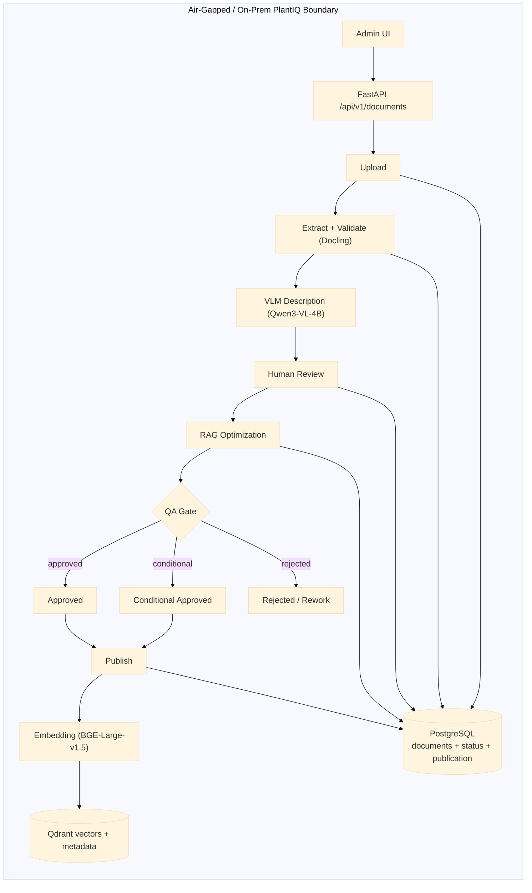
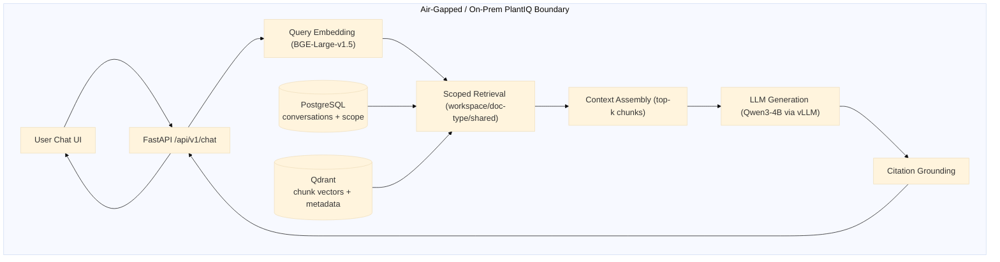
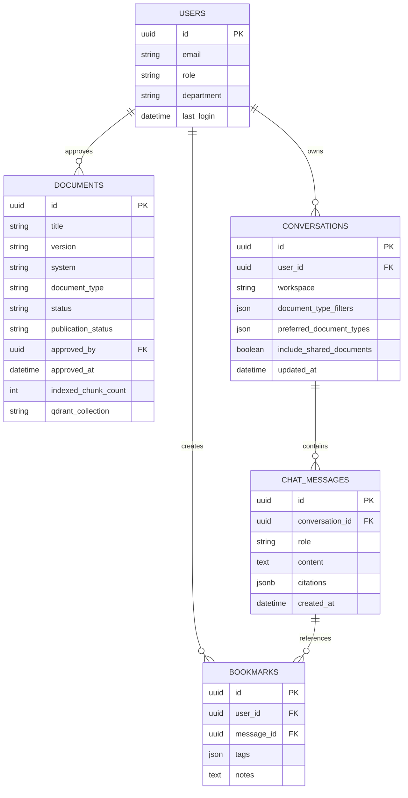
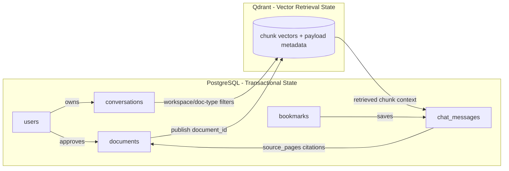

# PlantIQ Capstone Report (Alpha Checkpoint)

## 1. Title Page

**Project Title:** PlantIQ — Air-Gapped RAG System for Industrial OT Environments  
**Course:** SENG 701 Capstone in Software Engineering  
**Checkpoint:** Alpha (Phase 1)  
**Date:** March 30, 2026  
**Prepared by:** PlantIQ Capstone Team  
**Sponsor Organization:** BHE GT&S — Cove Point LNG, Lusby, Maryland  

---

## 2. Table of Contents

- [1. Title Page](#1-title-page)
- [2. Table of Contents](#2-table-of-contents)
- [3. Abstract](#3-abstract)
- [4. Introduction](#4-introduction)
  - [4a. Purpose of the Project](#4a-purpose-of-the-project)
  - [4b. Problem Statement](#4b-problem-statement)
  - [4c. Background of Sponsor Organization](#4c-background-of-sponsor-organization)
  - [4d. Background of Problem](#4d-background-of-problem)
- [5. Product Review of Existing Similar Solutions](#5-product-review-of-existing-similar-solutions)
- [6. Detailed Requirements](#6-detailed-requirements)
  - [6.1 Functional and Non-Functional Requirements](#61-functional-and-non-functional-requirements)
  - [6.2 Functions and Features Implemented at Alpha](#62-functions-and-features-implemented-at-alpha)
  - [6.3 Code Statistics and Engineering Metrics](#63-code-statistics-and-engineering-metrics)
  - [6.4 Source Archive and Repository Evidence](#64-source-archive-and-repository-evidence)
- [7. Design, Architecture, and Methodology](#7-design-architecture-and-methodology)
  - [7.1 Software Engineering Methodology](#71-software-engineering-methodology)
  - [7.2 High-Level System Design](#72-high-level-system-design)
  - [7.3 Low-Level Design and Runtime Architecture](#73-low-level-design-and-runtime-architecture)
  - [7.4 Hardware and Software Dependencies](#74-hardware-and-software-dependencies)
  - [7.5 Detailed Component Design and Build/Deploy Instructions](#75-detailed-component-design-and-builddeploy-instructions)
- [8. Results and Discussion](#8-results-and-discussion)
  - [8.1 Alpha Completion and Quality Criteria](#81-alpha-completion-and-quality-criteria)
  - [8.2 Public Prototype and Operational Behavior](#82-public-prototype-and-operational-behavior)
  - [8.3 Sponsor Feedback and Review](#83-sponsor-feedback-and-review)
  - [8.4 Video Evidence](#84-video-evidence)
  - [8.5 Known Problems, Gaps, Defects, and Next-Checkpoint Plan](#85-known-problems-gaps-defects-and-next-checkpoint-plan)
- [9. Conclusion](#9-conclusion)
- [10. Recommendations to the Sponsor](#10-recommendations-to-the-sponsor)
- [11. Limitations of the Project or Approach](#11-limitations-of-the-project-or-approach)
- [12. Future Works](#12-future-works)
- [13. References](#13-references)

---

## 3. Abstract

PlantIQ was developed as an air-gapped Retrieval-Augmented Generation (RAG) system for Cove Point LNG, a critical energy facility operated by BHE GT&S. The project addressed a field-validated operational problem: technicians often required 30 or more minutes to find correct troubleshooting guidance in proprietary vendor manuals under time-sensitive conditions. Because OT cybersecurity controls prohibited cloud AI usage and external data transmission, the solution had to operate entirely on-premises. 

The implemented system used a five-stage document lifecycle: PDF ingestion, VLM-assisted extraction and validation, human review, RAG optimization, and QA-gated publication to the vector retrieval index. Chat responses were generated by a local language model and grounded with document-page citations so users could verify every answer against source evidence. 

At Alpha, the core workflow operated end to end across ingestion, review, QA scoring, publication, and multi-turn chat. The project reached 76.9% full user-story completion (80.8% weighted including partial completion). Remaining scope was concentrated in production hardening rather than core capability creation, especially Active Directory authentication integration, complete role-governance administration, strict retention enforcement, and formal concurrent-user load validation. The Alpha outcome demonstrated technical feasibility for a safety-focused, citation-grounded, and fully local industrial RAG platform.

---

## 4. Introduction

### 4a. Purpose of the Project

The project was designed to provide operations technicians with faster access to accurate, traceable troubleshooting information from proprietary manuals while preserving strict OT security boundaries. PlantIQ was built not only to retrieve content quickly, but also to guarantee content trustworthiness by requiring validation and human approval before publication to retrieval.

### 4b. Problem Statement

Technicians at Cove Point LNG relied on manual PDF searching across large vendor documentation sets during urgent troubleshooting events. This process was slow and error-prone. At the same time, facility policy prevented use of cloud-hosted AI tools because proprietary documentation could not leave the site network. Existing approaches failed to meet both speed and security requirements simultaneously.

### 4c. Background of Sponsor Organization

BHE GT&S operated critical natural-gas infrastructure, including Cove Point LNG. The sponsor organization managed multiple operational areas (Power Block, Pre-Treatment, Liquefaction, OSBL) and maintenance disciplines (Instrumentation, DCS, Electrical, Mechanical). Stakeholder guidance was provided through operations leadership and reflected real, high-consequence troubleshooting constraints.

### 4d. Background of Problem

The need originated from recurring field delays when technicians attempted to locate precise procedures in dense technical manuals containing complex diagrams, tables, and mixed-format engineering content. Standard text extraction and naive search were insufficient for these documents. Sponsor requirements emphasized: local hosting, citation verification, reviewer control, and workflow auditability.

---

## 5. Product Review of Existing Similar Solutions

Several product categories were reviewed before implementation:

- **PrivateGPT / AnythingLLM / Open WebUI:** Demonstrated local document chat capability but did not provide full quality-gated ingestion with reviewer-controlled publication.
- **Elasticsearch RAG patterns:** Provided strong enterprise retrieval concepts but required substantial custom implementation for the sponsor’s air-gapped, safety-governed workflow needs.
- **Danswer:** Offered enterprise search/chat patterns but did not natively enforce the project’s required QA-gate and reviewer-approval model.
- **Industrial copilots (e.g., Siemens Industrial Copilot):** Showed market direction but did not match facility-controlled, offline governance constraints.

PlantIQ differed by combining four requirements in one pipeline: full air-gapped operation, VLM-assisted fidelity handling for engineering documents, explicit human approval gates, and citation-grounded outputs with source traceability.

| Product | Local/Air-Gapped | VLM Validation | Human Approval Workflow | Source Citation |
|---|:---:|:---:|:---:|:---:|
| PrivateGPT | Yes | No | No | Limited |
| AnythingLLM | Yes | No | No | Limited |
| Open WebUI | Yes | No | No | Basic |
| Elasticsearch RAG | Partial | No | No | Configurable |
| Siemens Industrial Copilot | No | N/A | N/A | Partial |
| **PlantIQ (this project)** | **Yes** | **Yes** | **Yes** | **Yes** |

---

## 6. Detailed Requirements

### 6.1 Functional and Non-Functional Requirements

The following functional requirements were derived from stakeholder interviews, document analysis of vendor manuals, and iterative refinement with the sponsor.

#### Functional Requirements

| FR ID | Functional Requirement | Req. Set | Priority | Alpha Status |
|---|---|:---:|:---:|:---:|
| FR-1.1 | The system shall accept PDF uploads with metadata (title, version, system/workspace) and create a tracked document record. | RS-1 | High | Implemented |
| FR-1.2 | The system shall apply VLM-based content extraction and generate a categorized validation report identifying missing text, table fidelity issues, and figure description gaps. | RS-1 | High | Implemented |
| FR-1.3 | The system shall provide a web-based review interface with page-level evidence, inline content editing, and checklist-driven review progression. | RS-1 | High | Implemented |
| FR-1.4 | The system shall enforce approval and version locking so that only reviewed content proceeds to the RAG optimization and publication pipeline. | RS-1 | High | Implemented |
| FR-1.5 | The system shall maintain version history limited to the current version and the last approved version. | RS-1 | Medium | Partial |
| FR-1.6 | The system shall compute objective QA gate metrics and generate an accept, conditional, or reject recommendation with weighted scoring rationale. | RS-1 | High | Implemented |
| FR-2.1 | The system shall accept natural-language troubleshooting queries and return cited answers based on retrieved document context from published content. | RS-2 | High | Implemented |
| FR-2.2 | The system shall include citation payloads (document title, page number, source chunk) in each response. | RS-2 | High | Implemented |
| FR-2.3 | The system shall provide access to full source context for cited passages through a dedicated source panel in chat. | RS-2 | High | Implemented |
| FR-2.4 | The system shall persist conversation context across multi-turn sessions, including retrieval scope settings and history. | RS-2 | High | Implemented |
| FR-2.5 | The system shall support bookmark save/remove controls for recurring high-value answers. | RS-2 | Medium | Implemented |
| FR-3.1 | The system shall authenticate users via facility Active Directory credentials using LDAP integration. | RS-3 | High | Pending (Beta) |
| FR-3.2 | The system shall enforce role-based access control with governance controls per role. | RS-3 | High | Pending (Beta) |

#### Non-Functional Requirements

| NFR ID | Non-Functional Requirement | Category | Target |
|---|---|---|---|
| NFR-1 | The system shall operate completely offline with zero external network dependencies during runtime. | Security / Compliance | 100% air-gapped |
| NFR-2 | The system shall generate responses within 30 seconds for typical natural-language queries on target on-premises hardware. | Performance | p95 ≤ 30 s |
| NFR-3 | The system shall maintain service uptime during scheduled operational windows without unhandled crashes. | Reliability | Zero crashes during demo windows |
| NFR-4 | QA citation coverage at publication time shall meet or exceed 90% for approved content. | Content Quality | ≥ 90% citation coverage |
| NFR-5 | The system shall maintain an audit trail of all approval, QA decision, and publication events. | Compliance / Auditability | 100% event coverage |
| NFR-6 | No proprietary document content shall transit external networks at any point in ingestion, retrieval, or generation lifecycle. | Security | 100% on-prem processing |
| NFR-7 | The system shall run on target on-prem hardware (64 GB RAM, NVIDIA RTX A6000 24 GB VRAM, 1 TB NVMe SSD). | Hardware Compatibility | On-prem hardware validated |
| NFR-8 | The system shall support containerized deployment using Docker Compose. | Deployability | Docker Compose |
| NFR-9 | VLM-assisted extraction shall preserve critical technical content including tables, equipment specifications, and figure descriptions. | Extraction Accuracy | ≥ 95% table fidelity |
| NFR-10 | Retrieval shall apply workspace and document-type filtering to reduce irrelevant context. | Retrieval Quality | Scope-filtered retrieval enforced |

### 6.2 Functions and Features Implemented at Alpha

#### How PlantIQ Differentiates Its RAG Approach

Unlike conventional RAG systems that treat documents as raw inputs directly vectorized for retrieval, **PlantIQ implements a human-curated, quality-gated RAG pipeline** where documents undergo rigorous validation, human review, optimization, and QA gates before vectors are indexed. This approach ensures that only verified, high-quality content reaches the retrieval layer — reducing hallucinations, improving citation accuracy, and maintaining operational trust in a safety-critical OT environment.

**Architecture Overview (Alpha): Quality-Gated RAG in an Air-Gapped Environment**



*Figure 6.2a — Document Ingestion, QA Gate, and Publication Flow (Air-Gapped)*



*Figure 6.2b — Chat Query, Scoped Retrieval, and Citation Grounding Flow (Air-Gapped)*

Key differentiators illustrated in both diagrams:
- **QA outcomes**: Approved and Conditional Approved proceed to publish; rejected artifacts are routed for rework.
- **Model references are explicit**: Qwen3-VL-4B (VLM extraction), BGE-Large-v1.5 (embeddings), Qwen3-4B via vLLM (generation).
- **Air-gapped runtime**: no content leaves the facility boundary; all retrieval and generation run on local infrastructure.
- **Scope-filtered retrieval**: workspace and document-type filters are applied at the Qdrant query layer before cosine ranking, not post-retrieval.

---

### A) Functions Implemented at Alpha (Core Product Behavior)

1. **Document ingestion and orchestration lifecycle**
   - The system accepts PDF uploads with metadata, persists a document record, and starts asynchronous processing through the HITL pipeline entrypoint.
   - It supports lifecycle progression from upload through extraction, validation, review readiness, optimization, QA, and publication states, including guarded transitions for rerun and deletion operations.
   - **Code references:** `backend/app/api/pipeline.py` (`POST /api/v1/documents/upload`, `POST /api/v1/documents/{id}/reprocess`, `DELETE /api/v1/documents/{id}`), `backend/app/services/pipeline_service.py` (`PipelineService.trigger_pipeline`, status/stage mappings), `pipeline/src/cli/hitl_pipeline.py` (pipeline entrypoint invoked by backend).

2. **Real-time and persisted pipeline state management**
   - Each document exposes persisted status snapshots and live event streaming for operational visibility.
   - The implementation combines status polling and SSE event streams to represent progression, terminal completion, and failure conditions.
   - **Code references:** `backend/app/api/pipeline.py` (`GET /api/v1/documents/{id}/status`, `GET /api/v1/documents/{id}/events`), `backend/app/services/pipeline_service.py` (`get_pipeline_status`, `stream_events`, `_event_history`, `_event_subscribers`), `backend/app/core/sse.py` (SSE response/event encoding helpers).

3. **Human-in-the-loop review and optimization workflow**
   - The platform provides page-based review units, editable content updates, checklist-driven review progression, and controlled approval to optimization.
   - Post-review optimization runs as a managed long-running stage with explicit state transitions and log/event handling.
   - **Code references:** `backend/app/api/pipeline.py` (`GET /api/v1/documents/{id}/pages`, `PATCH /api/v1/documents/{id}/pages/{page_id}/content`, `POST /api/v1/documents/{id}/approve-for-optimization`, `GET /api/v1/documents/{id}/optimization/logs`), `backend/app/core/optimization_log.py` (optimization log manager/handler).

4. **QA gate and publication readiness flow**
   - Optimized outputs are rescored, evaluated, and moved through explicit QA decisions before final approval.
   - Publication status is tracked independently from human approval to preserve operational control over release-to-retrieval timing.
   - **Code references:** `backend/app/api/pipeline.py` (`POST /api/v1/documents/{id}/qa-rescore`, `POST /api/v1/documents/{id}/qa-decision`, `POST /api/v1/documents/{id}/final-approve`), `pipeline/src/qa/qa_gates.py` (QA metric computation/gate evaluation).

5. **Vector indexing and retrieval data publication**
   - Approved optimized chunks are transformed into semantic vectors via batch embedding (BAAI/bge-large-en-v1.5), previous vectors for the same document are deleted, and updated payloads are upserted into Qdrant with cosine distance metrics.
   - Each vector is stored with rich metadata: document ID, chunk ID, page reference, workspace tag, document type, section heading, table facts, and detected ambiguity flags. This metadata enables post-retrieval filtering and source verification without requiring full vector rescans.
   - Publication is explicitly controlled — only documents approved through the QA gate can be published, preventing drafts or failed transformations from entering the retrieval index.
   - **Code references:** `backend/app/api/pipeline.py` (`POST /api/v1/documents/{id}/publish`, `_publish_document_to_rag`), `backend/app/services/embedding_service.py` (`embed_batch`), `backend/app/services/qdrant_service.py` (`ensure_collection`, `delete_document_chunks`, `upsert_chunks`).

6. **RAG chat generation (synchronous and streaming)**
   - The chat runtime supports both complete-response and token-streaming query paths, enabling real-time UI feedback for long responses.
   - Query handling integrates: (1) scoped retrieval to fetch top-k relevant vectors constrained by workspace/document-type filters, (2) prompt assembly combining user query + retrieved context + system guidelines, (3) response generation via local LLM (Qwen3-4B via vLLM), and (4) structured citation extraction linking response text back to source documents and page numbers.
   - Citation grounding is extracted from retrieval metadata: the user sees `[Document Name, Page X]` where X is the `source_pages` field from the retrieved chunk payload. Failures to find cited sources are logged for QA analysis.
   - **Code references:** `backend/app/api/chat.py` (`POST /api/v1/chat/query`, `POST /api/v1/chat/stream`), `backend/app/services/chat_service.py` (`process_query`, `process_query_stream`, `_build_rag_prompt`, `_create_citations`, `_save_message`), `backend/app/services/llm_service.py` (`generate`, `generate_stream`).

7. **Scoped retrieval enforcement for chat relevance**
   - Retrieval behavior applies configurable workspace, document-type, and shared-document controls to reduce irrelevant context and improve signal-to-noise ratio.
   - A relaxed-threshold fallback (`_RELAXED_SCORE_THRESHOLD_FLOOR = 0.45`, delta `0.05`) incrementally lowers the similarity floor when initial retrieval yields insufficient context — avoiding empty responses on sparse but valid queries without degrading relevance for well-indexed content.
   - **Code references:** `backend/app/services/chat_service.py` (conversation/request scope resolution, `_RELAXED_SCORE_THRESHOLD_FLOOR`, `_RELAXED_SCORE_THRESHOLD_DELTA`), `backend/app/services/qdrant_service.py` (`search_similar` with `workspace_filter`, `document_type_filter`, `include_shared_documents`), `backend/app/models/chat.py` (scope and retrieval control models).

8. **Artifact production and retrieval for operations**
   - Validation, manifest, optimization, QA, and review artifacts are generated and retrievable through backend endpoints, providing operators and reviewers with structured evidence at each pipeline stage.
   - **Code references:** `backend/app/api/pipeline.py` (`GET /api/v1/documents/{id}/artifacts/{type}`, artifact path resolution/load helpers `_find_validation_report`, `_resolve_qa_report_path`, `_find_optimized_artifact_paths`), `backend/app/core/config.py` (`get_artifacts_path`).

---

### B) Features Implemented at Alpha (User Experience and Operational Controls)

1. **Admin upload experience with live stage visualization**
   - The frontend provides a guided upload flow, stage-by-stage progress display, and terminal success/failure handling tied to backend ingestion signals.
   - **Code references:** `frontend/app/admin/documents/upload/page.tsx` (upload form, stage mapping, live status rendering), `frontend/lib/api/pipeline.ts` (`uploadDocument`, `streamIngestionEvents`, `parseIngestionSSEBlock`).

2. **Resilient long-running ingestion UX**
   - If live event streams are interrupted, the UI falls back to status polling and continues tracking until a terminal pipeline state is reached.
   - **Code references:** `frontend/app/admin/documents/upload/page.tsx` (`monitorPipelineUntilTerminal`, SSE disconnect handling), `frontend/lib/api/pipeline.ts` (typed ingestion stream handling and terminal event semantics).

3. **Document review workspace features**
   - Admin users can inspect page-level evidence, edit review content, follow checklist progress, and continue workflow actions toward optimization and QA.
   - **Code references:** `backend/app/api/pipeline.py` (review page/content/checklist endpoints and models), `frontend/lib/api/pipeline.ts` (artifact/review API helpers), `frontend/app/admin/documents/upload/page.tsx` (handoff into review flow).

4. **Interactive citation-aware chat interface**
   - Users receive citation-linked responses, can inspect source snippets in a dedicated source panel, and navigate from citations back to document context.
   - **Code references:** `frontend/app/chat/page.tsx` (`SourceDrawer`, citation list rendering/toggles, citation-driven navigation), `frontend/lib/api/chat.ts` (`streamChatQuery`, citation event parsing), `backend/app/services/chat_service.py` (`_create_citations`).

5. **Conversation management controls**
   - The chat workspace supports thread continuity and operator productivity controls including search, filtering, pin/unpin, rename, delete, and bookmark actions.
   - **Code references:** `frontend/app/chat/page.tsx` (conversation list/search/filter/pin/rename/delete/bookmark interactions), `frontend/lib/api/index.ts` (conversation/bookmark API methods), `backend/app/services/chat_service.py` (conversation/message persistence).

6. **Conversation-level scope controls**
   - Users can set and persist per-conversation scope (workspace, document type, shared content), improving repeatability of retrieval behavior across sessions.
   - **Code references:** `frontend/app/chat/page.tsx` (`persistConversationScope`, scope selectors and save controls), `backend/app/services/chat_service.py` (scope persistence and retrieval application), `backend/app/services/qdrant_service.py` (scope-aware vector filtering).

7. **Frontend API contract normalization**
   - Shared client modules centralize endpoint and stream handling, reducing integration drift between frontend flows and backend contracts.
   - **Code references:** `frontend/lib/api/client.ts` (base URL/auth token/fetch wrapper), `frontend/lib/api/pipeline.ts` (pipeline + SSE contracts), `frontend/lib/api/chat.ts` (chat + SSE contracts), `frontend/lib/api/auth.ts` (auth request helpers used by UI).

---

User-story coverage at Alpha:

- Fully implemented: **10 / 13 (76.9%)**
- Partially implemented: **1 / 13 (7.7%)**
- Deferred to Beta: **2 / 13 (15.4%)**
- Weighted completion: **10.5 / 13 = 80.8%**

#### User-Story Status Matrix

| User Story | Alpha Status | Implementation Status |
|---|---|---|
| **US-1.1** Upload document with metadata | **Implemented** | Delivered through upload API + admin upload UI with metadata capture and pipeline kickoff. |
| **US-1.2** VLM validation report with categorized issues | **Implemented** | Validation artifacts and categorized issue surfaces are available in review workflow and backend artifact contracts. |
| **US-1.3** Web-based review with checklist and inline evidence | **Implemented** | Page-based review units, checklist handling, evidence thumbnails, and edit persistence are operational. |
| **US-1.4** Approve and lock reviewed version | **Implemented** | Approval/transition controls and status guards are implemented, with lifecycle progression into optimization/QA/final approval. |
| **US-1.5** Keep current + last approved version only | **Partially Implemented** | Versioning and artifact lineage exist, but strict two-version retention enforcement/reporting is not fully complete at Alpha. |
| **US-1.6** QA gate metrics with recommendation | **Implemented** | QA rescoring, recommendation output, and QA decision workflow are delivered and integrated with lifecycle transitions. |
| **US-2.1** Plain-English troubleshooting chat | **Implemented** | RAG chat query path is operational in synchronous and streaming modes. |
| **US-2.2** Answers with citations and page numbers | **Implemented** | Citation payloads are emitted and rendered with document/page references. |
| **US-2.3** Open cited source in context | **Implemented** | Frontend source drawer and citation-linked navigation are implemented. |
| **US-2.4** Multi-turn contextual conversation | **Implemented** | Conversation persistence and scoped follow-up interactions are operational. |
| **US-2.5** Bookmark useful answers | **Implemented** | Save/remove bookmark controls and persisted workflows are available. |
| **US-3.1** Login with facility Active Directory credentials | **Pending (Beta-targeted)** | Authentication modules exist, but production AD-integrated delivery is intentionally deferred from Alpha scope. |
| **US-3.2** Admin role assignment and user-role governance | **Pending (Beta-targeted)** | Core runtime focus prioritized ingestion/chat; full production role-governance administration remains post-Alpha. |

#### Client Expectation View: Delivered vs. Pending

**Delivered in Alpha (core client value):**
- End-to-end ingestion and review pipeline (upload → validation → review → optimization → QA → publish)
- Citation-grounded chat with multi-turn conversations and bookmark support
- Operational visibility through status APIs, SSE streams, and lifecycle controls

**Pending after Alpha (expected for Beta/hardening):**
- Production-grade identity integration and enterprise access governance (US-3.1, US-3.2)
- Strict policy-level retention enforcement for version-history constraints (US-1.5 completion)

Overall, Alpha implementation is aligned with the proposal's primary operational objective (faster, cited, air-gapped knowledge access) while deferring identity-governance hardening and selected policy constraints to the next checkpoint phase.

### 6.3 Code Statistics and Engineering Metrics

This section follows the v1 measurement style and reports both tooling and outputs in detail.

#### 6.3.1 Measurement Tools and Execution Method

The following tools were used:

- **cloc v1.98** — source-size and language composition metrics
- **lizard** — cyclomatic complexity and function-level structural metrics
- **radon** — Python static-analysis support used alongside complexity review

Primary command used for size/language baseline:

`cloc --vcs=git .`

Scope note: counts were generated against **Git-tracked files only** at Alpha snapshot time; binary files were excluded by tool behavior.

#### 6.3.2 Size and Composition Output (cloc)

| Metric | Value |
|---|---|
| Number of source files (modules) | 170 |
| Total LOC (blank + comment + code) | 55,719 |
| CLOC / code lines | 44,385 |
| Comment lines | 4,713 |
| Blank lines | 6,621 |
| Comment-to-code ratio | 10.62% |

#### 6.3.3 Programming Language Breakdown (cloc)

| Language | Files | Code Lines |
|---|---:|---:|
| Python | 52 | 15,559 |
| TypeScript | 67 | 11,345 |
| JSON | 4 | 10,578 |
| Markdown | 25 | 5,393 |
| SQL | 9 | 607 |
| make | 1 | 254 |
| YAML | 2 | 253 |
| Bourne Shell | 1 | 146 |
| CSS | 1 | 106 |
| TOML | 3 | 80 |
| Dockerfile | 2 | 31 |
| Text | 1 | 21 |
| INI | 1 | 6 |
| JavaScript | 1 | 6 |

#### 6.3.4 Complexity, Cohesion, Coupling, and Structural Counts (lizard/radon)

Analysis scope for these metrics: `backend/app`, `pipeline/src`, `frontend/app`, `frontend/lib`.

**Cyclomatic complexity output (lizard):**

| Metric | Value |
|---|---|
| Total analyzed NLOC | 17,879 |
| Function count | 763 |
| Average cyclomatic complexity (AvgCCN) | 4.0 |
| Warning count (above default threshold) | 34 |

Interpretation: overall complexity remained in a maintainable Alpha range, with expected hotspots in orchestration-heavy pipeline/API modules.

**Structural counts:**

| Structural Metric | Value |
|---|---:|
| Python classes | 111 |
| Python methods | 137 |
| Python top-level functions | 263 |
| TypeScript classes | 5 |
| TypeScript methods (static-analysis approximation) | 234 |

**Coupling metrics (import-dependency based):**

| Module Group | Avg Efferent Coupling (Ce) | Avg Afferent Coupling (Ca) | Highest Ce | Highest Ca |
|---|---:|---:|---|---|
| Python modules (50 analyzed) | 2.86 | 2.86 | `backend.app.api.pipeline` (22) | `backend.app` (15) |
| TypeScript modules (42 analyzed) | 0.33 | 0.33 | `frontend/lib/api/documents` (2) | `frontend/lib/api/client` (7) |

**Cohesion proxy (low dependency spread ≤2 internal dependencies):**

| Module Group | Low-Coupled Share |
|---|---:|
| Python modules | 56.0% |
| TypeScript modules | 100.0% |

#### 6.3.5 Libraries, External Components, and Dependency Tree (High-Level)

Declared direct dependencies at Alpha checkpoint:

| Dependency Group | Count |
|---|---:|
| Backend runtime dependencies (`backend/pyproject.toml`) | 16 |
| Pipeline runtime dependencies (`pipeline/pyproject.toml`) | 11 |
| Frontend runtime dependencies (`frontend/package.json`) | 23 |
| Frontend dev dependencies (`frontend/package.json`) | 9 |

External components used in the running architecture:

- PostgreSQL
- Qdrant
- Docling service
- Local LLM inference service (Ollama/vLLM-compatible path)
- FastAPI backend
- Next.js frontend
- Docker / Docker Compose
- LDAP/AD integration path (mock-enabled during development)

Overall, the combined tooling outputs showed a maintainable Alpha codebase with strong frontend modular focus and concentrated backend/pipeline orchestration complexity consistent with system responsibilities.

### 6.4 Source Archive and Repository Evidence

- **Source code archive (ZIP):**  
  https://drive.google.com/file/d/1jt5cB5uhI1U7ms2icpRUrvbs6SZeB9uH/view?usp=drive_link
- **Repository link (full commit history):**  
  https://github.com/abedhossainn/PlantIQ

Commit history was preserved in full, consistent with course policy.

---

## 7. Design, Architecture, and Methodology

### 7.1 Software Engineering Methodology

The project followed a milestone-driven iterative approach aligned to Proposal → Alpha → Beta checkpoints. Development prioritized core functionality first (ingestion + chat), then governance hardening and scale validation. Requirements were refined through sponsor interviews, realistic document analysis, and incremental integration testing.

### 7.2 High-Level System Design

PlantIQ used a layered architecture:

- **Presentation:** Next.js/React TypeScript UI
- **API Layer:** FastAPI endpoints and SSE streams
- **Service Layer:** Pipeline, chat, embedding, retrieval, and model services
- **Data/Infra Layer:** PostgreSQL (workflow + chat state), Qdrant (vectors), local artifact store

A key design decision separated transactional lifecycle state from retrieval-state vectors to preserve auditability and retrieval performance.

**Figure 7.1 — High-Level Architecture Diagram**

```mermaid
flowchart TB
    subgraph PL[Presentation Layer]
        UIA[Admin UI\n(Upload/Review/QA/Publish)]
        UIO[Operator UI\n(Chat/Citations/Bookmarks)]
    end

    subgraph API[API Gateway Layer]
        FASTAPI[FastAPI\nREST + SSE]
    end

    subgraph SRV[Service Layer]
        PIPE[PipelineService\nLifecycle Orchestration]
        CHAT[ChatService\nRAG Orchestration]
        EMB[EmbeddingService\nBGE-Large-v1.5]
        QDS[QdrantService\nScoped Retrieval/Indexing]
        LLM[LLMService\nQwen3-4B via vLLM]
    end

    subgraph DATA[Data & Infrastructure Layer]
        PG[(PostgreSQL\nWorkflow + Chat State)]
        QD[(Qdrant\nVector Index + Payloads)]
        ART[(Artifact Store\nValidation/Review/QA Outputs)]
    end

    UIA --> FASTAPI
    UIO --> FASTAPI

    FASTAPI --> PIPE
    FASTAPI --> CHAT

    PIPE --> EMB
    PIPE --> QDS
    PIPE --> PG
    PIPE --> ART

    CHAT --> EMB
    CHAT --> QDS
    CHAT --> LLM
    CHAT --> PG

    EMB --> QD
    QDS --> QD

    style PL fill:#eaf3ff,stroke:#5b8def
    style API fill:#fff7e6,stroke:#d4a017
    style SRV fill:#eefaf0,stroke:#4f9d69
    style DATA fill:#f7f0ff,stroke:#8a63d2
```

### 7.3 Low-Level Design and Runtime Architecture

#### Ingestion Pipeline

1. Upload + metadata persistence
2. VLM-assisted extraction/validation
3. Human review and correction
4. RAG optimization
5. Semantic chunking, QA scoring, and controlled publication

> **Figure 7.2 Placeholder — Ingestion/QA/Publish Workflow Diagram**  
> *(Insert detailed workflow diagram for Upload → Extract/Validate → Review → Optimize → QA → Publish.)*

#### Chat Runtime

1. Query embedding
2. Scoped Qdrant retrieval
3. Context assembly
4. Prompt generation with citation guidance
5. Local LLM generation and citation mapping

> **Figure 7.3 Placeholder — Chat Retrieval and Generation Diagram**  
> *(Insert detailed diagram for Query Embedding → Scoped Retrieval → Context Assembly → LLM Generation → Citation Grounding.)*

#### Data Layer and Database Schema Design (Alpha)

PlantIQ intentionally separated **transactional workflow state** from **semantic retrieval state**.

##### PostgreSQL Schema (Transactional / Operational)

| Table | Purpose | Representative Fields |
|---|---|---|
| `documents` | Document lifecycle + publication state | `id`, `title`, `version`, `system`, `document_type`, `status`, `publication_status`, `approved_by`, `approved_at`, `indexed_chunk_count`, `qdrant_collection` |
| `conversations` | Conversation scope persistence | `id`, `workspace`, `document_type_filters`, `preferred_document_types`, `include_shared_documents`, `updated_at` |
| `chat_messages` | User/assistant turn history with grounding | `id`, `conversation_id`, `role`, `content`, `citations (JSONB)`, `created_at` |
| `users` | Identity and role mapping | `id`, `email`, `role`, `department`, `last_login` |
| `bookmarks` | Saved answer references | `id`, `user_id`, `message_id`, `tags`, `notes` |

##### Qdrant Payload Schema (Vector / Retrieval)

| Payload Field | Role in Retrieval |
|---|---|
| `chunk_id` | Unique chunk identity |
| `document_id` | Source document linkage |
| `document_title` | Citation and display metadata |
| `workspace` | Scope filtering |
| `document_type` | Hard/soft relevance filtering |
| `is_shared` | Shared-content inclusion toggle |
| `section_heading` | Context structuring |
| `page_number` / `source_pages` | Citation grounding |
| `table_facts` | Structured retrieval support for tabular facts |
| `ambiguity_flags` | QA/reliability metadata |

**Figure 7.4a — Logical Database Schema (Entity-Relationship)**

> This diagram shows the five core PostgreSQL entities and their cardinality relationships. `USERS` is the
> central actor: a user owns zero-or-more `CONVERSATIONS`, approves zero-or-more `DOCUMENTS`, and creates
> zero-or-more `BOOKMARKS`. Each `CONVERSATION` contains zero-or-more `CHAT_MESSAGES`. A `BOOKMARK` is a
> many-to-one reference from a user to a specific `CHAT_MESSAGE`, enabling operators to save and annotate
> individual LLM responses. Primary keys (`uuid id PK`) enforce row uniqueness; foreign keys
> (`user_id FK`, `conversation_id FK`, `message_id FK`, `approved_by FK`) enforce referential integrity
> across the relational boundary.



**Figure 7.4b — PostgreSQL ↔ Qdrant Logical Data Flow**

> This diagram illustrates how the two storage tiers collaborate at runtime. PostgreSQL owns all
> transactional and relational state (users, conversations, documents, messages, bookmarks). Qdrant owns
> the vector representation of each published document chunk. The bridge operates in two directions:
> *write path* — when a document is approved and published, `documents.id` is embedded as a payload field
> in every Qdrant chunk vector, making the chunk traceable back to its source row; *read path* — a
> conversation's `workspace` and `document_type_filters` are forwarded as Qdrant payload filters at query
> time, scoping retrieval to the operator's authorized document set. Retrieved chunk context flows into
> `chat_messages.citations`, which in turn references `documents` for source-page attribution. Bookmarks
> attach to individual `chat_messages`, completing the audit chain from raw vector retrieval to
> user-facing citation.



A relaxed-threshold retrieval fallback avoided empty responses for sparse but valid queries while maintaining retrieval scope controls.

### 7.4 Hardware and Software Dependencies

#### Hardware Configuration

| Environment | RAM | GPU | Storage |
|---|---|---|---|
| Development workstation | 32 GB | NVIDIA RTX 4050 (6 GB VRAM) | 512 GB NVMe SSD |
| Target deployment server | 64 GB | NVIDIA RTX A6000 (24 GB VRAM) | 1 TB NVMe SSD |
| Public prototype host | 32 GB | NVIDIA RTX 4050 (6 GB VRAM) | 512 GB NVMe SSD |

#### Key Software Components

| Component | Technology | Version / Notes |
|---|---|---|
| Backend API | FastAPI + Python | Python 3.10+, Uvicorn ASGI |
| Relational database | PostgreSQL | v15 |
| Vector database | Qdrant | v1.x, cosine distance, payload-filtered |
| PDF extraction | Docling | Open source, structure-preserving |
| VLM (visual validation) | Qwen3-VL-4B | Local inference, VRAM-optimized |
| Embedding model | BAAI/bge-large-en-v1.5 | 1024-dim cosine embeddings |
| LLM (chat generation) | Qwen3-4B via vLLM | Local inference, streaming |
| Frontend framework | Next.js 15 + React | TypeScript, Tailwind CSS, shadcn/ui |
| Containerization | Docker + Docker Compose | Offline-capable deployment |
| Authentication (planned) | LDAP / Active Directory | Deferred to Beta |

### 7.5 Detailed Component Design and Build/Deploy Instructions

Key backend components included `PipelineService`, `ChatService`, `QdrantService`, and QA gate modules. Frontend modules implemented upload/review workflows, chat UX, citation inspection, and conversation controls.

Build and deployment flow used local/dev/staging commands:

1. Configure environment from `.env.example`
2. Install dependencies (`make install`)
3. Build/start containers (`make docker-build`, `make docker-up`)
4. Run tests (`make test`)
5. Review logs (`make docker-logs`)

This fulfilled the compile/build/deploy instruction requirement for checkpoint validation.

---

## 8. Results and Discussion

### 8.1 Alpha Completion and Quality Criteria

Alpha quality criteria results were:

- Product functionality implemented: **76.9% fully implemented (80.8% weighted)**
- Critical functionality implemented: **~80%**
- Deferred/pending beyond Alpha: **15.4%**
- Non-production quality level: suitable for controlled demonstration and validation

Runtime stability evidence was available in interim form, while formal concurrency benchmarking remained deferred to Beta.

#### Additional Non-Production Quality Metrics

| Metric | Current Status | Evidence/Source | Notes |
|---|---|---|---|
| Runtime stability (extended run) | **Interim evidence available; final soak run pending** | `backend/tests/test_performance_benchmarks.py`, `backend/tests/evidence/runtime_stability_evidence.md` | Target: zero unhandled crashes and no sustained degradation during extended run window. |
| Concurrent-user capacity (controlled load) | **Deferred to Beta — no measured data at Alpha** | `backend/tests/test_performance_benchmarks.py`, `backend/tests/evidence/concurrency_capacity_evidence.md` | Planned Beta outputs: throughput, p95/p99 latency, error rate under target concurrency. |

### 8.2 Public Prototype and Operational Behavior

- **Public prototype URL:**  
  https://plantiq.sahossain.com/PlantIQ/
- **Backend API endpoint (public demo path):**  
  https://plantiqapi.sahossain.com/

The prototype supported reviewer access and demonstrated ingestion-to-chat continuity under non-production controls.

### 8.3 Sponsor Feedback and Review

Sponsor feedback (Randy Holt, March 27, 2026) confirmed that the end-to-end process worked as expected from document upload through chat response with page-grounded citations. Sponsor feedback identified two priority gaps for Beta: production identity integration (AD) and complete admin role governance.

### 8.4 Video Evidence

- **Compile/Build/Deploy Video:**  
  https://drive.google.com/file/d/1KpleYXrY3HfY7c79RcZ0l7C6pw7RXsN4/view?usp=drive_link
- **Design/Architecture/Main Modules Video:**  
  https://drive.google.com/file/d/1TT3j7E33TZBUP02Dw0VYWLbFQhJQv01o/view?usp=drive_link
- **Prototype Demonstration Video:**  
  https://drive.google.com/file/d/1FNQFH7GxOZKNpTipc5I4ONsekBrCqMke/view?usp=drive_link

### 8.5 Known Problems, Gaps, Defects, and Next-Checkpoint Plan

| Area | Current Gap/Defect | Impact | Planned Action | Target Checkpoint | Verification |
|---|---|---|---|---|---|
| Authentication (AD integration) | Active Directory integration is not finalized for production login flow | Prevents sponsor-ready enterprise auth validation and full RBAC path in target environment | Complete AD bind/config hardening, integration testing with facility-aligned test accounts, and fallback/error-path handling | **Beta** | Auth integration test evidence, login trace logs, stakeholder UAT sign-off |
| Role governance and admin controls | Full admin role assignment/governance workflow is pending completion | Access-control administration remains partially manual and not fully demonstrable | Finalize role governance endpoints/UI flows and enforce policy checks across admin surfaces | **Beta** | Role-policy test matrix, permission regression suite, reviewer acceptance |
| Version retention policy (US-1.5) | Strict two-version retention enforcement/reporting is only partially implemented | Risk of policy drift in retained document history artifacts | Implement strict retention guardrails and automated pruning/reporting to enforce current + last approved only | **Beta** | Retention policy tests, artifact inventory evidence before/after enforcement |
| Demo reliability hardening | Long-running demo scenarios still require resilience hardening for transient stream/runtime disruptions | Live demo confidence and reviewer experience can degrade under transient conditions | Continue SSE/retry hardening, stale-state recovery, and end-to-end demo rehearsal runbook updates | **Beta** | Rehearsal logs, deterministic demo checklist pass, incident-free dry runs |
| Stability and concurrency validation evidence | Formal extended-runtime stability and concurrent-user capacity evidence is not yet finalized in report form | Checkpoint quality evidence is incomplete for performance/reliability criteria | Execute final non-production stability/concurrency validation run and attach measured evidence | **Beta** | Archived test reports, run logs, and summarized benchmark evidence |

**Checkpoint-difference note (Guideline Item 13):** Not applicable for Alpha, because Alpha was the first checkpoint.

### 8.6 Guideline Compliance Matrix

| Guideline Item | Requirement | Status | Evidence Location |
|---|---|:---:|---|
| 1 | In-progress Capstone report (Alpha work described) | ✅ Complete | [Section 3–13](#3-abstract) |
| 1 → Abstract | Abstract section | ✅ Complete | [Section 3](#3-abstract) |
| 1 → Intro | Introduction with all four subsections | ✅ Complete | [Section 4](#4-introduction) |
| 1 → Product Review | Review of existing similar solutions | ✅ Complete | [Section 5](#5-product-review-of-existing-similar-solutions) |
| 1 → Requirements | Functional/non-functional requirements, capabilities, user stories, LOC/data | ✅ Complete | [Section 6](#6-detailed-requirements) |
| 1 → Design | Design, architecture, methodology, dependencies, component design | ✅ Complete | [Section 7](#7-design-architecture-and-methodology) |
| 1 → Results | Results and discussion | ✅ Complete | [Section 8](#8-results-and-discussion) |
| 1 → Conclusion | Conclusion | ✅ Complete | [Section 9](#9-conclusion) |
| 1 → Recommendations | Recommendations to sponsor | ✅ Complete | [Section 10](#10-recommendations-to-the-sponsor) |
| 1 → Limitations | Limitations of project/approach | ✅ Complete | [Section 11](#11-limitations-of-the-project-or-approach) |
| 1 → Future Works | Future works | ✅ Complete | [Section 12](#12-future-works) |
| 1 → References | References list | ✅ Complete | [Section 13](#13-references) |
| 2 | Sponsor feedback and review | ✅ Complete | [Section 8.3](#83-sponsor-feedback-and-review) |
| 3 | Functions and features implemented | ✅ Complete | [Section 6.2](#62-functions-and-features-implemented-at-alpha) |
| 4 | Source code archive (ZIP) | ✅ Complete | [Section 6.4](#64-source-archive-and-repository-evidence) |
| 5 | Compile/build/deploy instructions | ✅ Complete | [Section 7.5](#75-detailed-component-design-and-builddeploy-instructions) |
| 6 | Code statistics (LOC, CLOC, complexity, cohesion, coupling, etc.) | ✅ Complete | [Section 6.3](#63-code-statistics-and-engineering-metrics) |
| 7 | GitHub repository link with commit-history preservation | ✅ Complete | [Section 6.4](#64-source-archive-and-repository-evidence) |
| 8 | Public prototype / deployable review environment | ✅ Complete | [Section 8.2](#82-public-prototype-and-operational-behavior) |
| 9 | Video: compile/build/deploy (≤5 min) | ✅ Complete | [Section 8.4](#84-video-evidence) |
| 10 | Video: design/architecture/main modules (≤5 min) | ✅ Complete | [Section 8.4](#84-video-evidence) |
| 11 | Video: functionality demonstration (≤5 min) | ✅ Complete | [Section 8.4](#84-video-evidence) |
| 12 | Known problems/gaps/defects + next checkpoint plan | ✅ Complete | [Section 8.5](#85-known-problems-gaps-defects-and-next-checkpoint-plan) |
| 13 | Differences from previous checkpoint | N/A | Not applicable at Alpha (first checkpoint) |

---

## 9. Conclusion

The Alpha checkpoint demonstrated that PlantIQ’s core architecture was functional and aligned with sponsor constraints. The system implemented a quality-gated pipeline and citation-grounded chat in a fully local environment, satisfying the primary feasibility objective of secure AI-assisted troubleshooting support for OT operations. Remaining work was concentrated in production-readiness hardening, not in foundational capability creation.

---

## 10. Recommendations to the Sponsor

### Workflow Recommendations

- Begin deployment with a curated high-value manual set before scaling library size.
- Assign a dedicated reviewer role with checklist-based training.
- Enforce extended review windows for diagram-heavy documents.

### Deployment Recommendations

- Execute staging validation on target A6000 hardware before production use.
- Complete AD and role-policy testing in staging with representative accounts.
- Package all dependencies and models into an offline deployment bundle.

### Preliminary User Manual Sequence

#### For Document Administrators

1. Upload document with metadata.
2. Monitor extraction and validation outputs.
3. Complete page-level review and corrections.
4. Approve for optimization and run QA scoring.
5. Publish only Approved/Conditional artifacts to retrieval.

#### For Operations Technicians

1. Open chat workspace and select scope.
2. Submit troubleshooting query.
3. Inspect citations and source context.
4. Continue follow-up turns in same conversation.
5. Bookmark reusable answers.

---

## 11. Limitations of the Project or Approach

Key Alpha limitations were:

1. AD authentication and full RBAC governance were not production-ready.
2. Concurrent-user performance had not been formally benchmarked.
3. Two-version retention policy enforcement remained partial.
4. VLM quality still required human correction for highly complex visuals.
5. Review workflow supported only single-reviewer sequencing.
6. Model quality depended on local GPU capacity.
7. Automated backup/disaster recovery was not yet implemented.
8. Validation scope did not yet include all document formats/languages.

---

## 12. Future Works

Planned post-Alpha enhancements included:

1. Complete AD + RBAC hardening (Beta priority)
2. Execute controlled concurrency/load benchmarking
3. Enforce full retention-policy automation/reporting
4. Introduce parallel multi-reviewer workflow support
5. Conduct on-site UAT and production rollout
6. Add hybrid retrieval (semantic + keyword)
7. Add reranking layer for ambiguous queries
8. Implement backup/disaster-recovery automation
9. Extend support for OCR-heavy and additional document types
10. Add operational monitoring and alerting for long-term deployment

---

## 13. References

Berkshire Hathaway Energy Gas Transmission & Storage. (2026). *Cove Point LNG facility overview*. Internal stakeholder documentation provided by R. Holt.

Docling Project. (2024). *Docling: An open-source document conversion library* (Version 2.x) [Software]. IBM Research. https://github.com/docling-project/docling

Elastic. (2024). *Retrieval augmented generation (RAG) with Elasticsearch*. Elastic Documentation. https://www.elastic.co/guide/en/elasticsearch/reference/current/semantic-search-rag.html

Holt, R. (2026, March 27). *Sponsor review and feedback — PlantIQ Alpha checkpoint* [Personal communication]. BHE GT&S, Cove Point LNG.

IBM Corporation. (2024). *Enterprise document AI: Challenges in complex technical document extraction* [Technical white paper]. IBM Research.

Kwon, W., Li, Z., Zhuang, S., Sheng, Y., Zheng, L., Yu, C. H., Gonzalez, J. E., Zhang, H., & Stoica, I. (2023). Efficient memory management for large language model serving with PagedAttention. *Proceedings of the 29th Symposium on Operating Systems Principles (SOSP)*. https://arxiv.org/abs/2309.06180

Lewis, P., Perez, E., Piktus, A., Petroni, F., Karpukhin, V., Goyal, N., Küttler, H., Lewis, M., Yih, W., Rocktäschel, T., Riedel, S., & Kiela, D. (2020). Retrieval-augmented generation for knowledge-intensive NLP tasks. *Advances in Neural Information Processing Systems (NeurIPS)*, *33*, 9459–9474. https://arxiv.org/abs/2005.11401

Qdrant Team. (2024). *Qdrant vector search engine documentation* (Version 1.x) [Software documentation]. Qdrant. https://qdrant.tech/documentation/

Qwen Team. (2024). *Qwen2.5-VL technical report*. Alibaba Cloud / DAMO Academy. https://arxiv.org/abs/2502.13923

Xiao, S., Liu, Z., Zhang, P., & Muennighoff, N. (2023). C-Pack: Packaged resources to advance general Chinese embedding. *arXiv preprint*. https://arxiv.org/abs/2309.07597
