

<h1 style="margin: 0 0 16px 0; font-size: 32px; line-height: 1.2; color: #000; text-decoration: none; border-bottom: none;">PlantIQ — Final Report</h1>

<strong><em>Student Information</em></strong> 
<em>Student name: Syed Abed Hossain</em> 
<em>Contact phone number: 443 975 0604</em> 
<em>UMBC email address: syedabh1@umbc.edu</em> 
<em>Semester and year of capstone experience: Spring 2026</em> 
<em>Expected graduation date: May 25, 2026</em>

 

<strong><em>Capstone Course Information</em></strong> 
<em>Capstone faculty: Dr. Mohammad Samarah, Dr. Melissa Sahl</em> 
<em>Capstone advisor: Dr. Mohammad Samarah, Dr. Melissa Sahl</em>

 

<strong><em>Sponsor Client Information</em></strong> 
<em>Client contact name: Randy Holt</em> 
<em>Client contact title: Supervisor, LNG Operations</em> 
<em>Client contact phone number: 443 771 2023</em> 
<em>Client contact email address: randy.holt@bhegts.com</em> 
<em>Client organization name: Cove Point LNG - BHE GT&S</em>

## 2. Table of Contents

- [1. Title Page](#umbc-logo)
- [2. Table of Contents](#2-table-of-contents)
- [List of Abbreviations](#list-of-abbreviations)
- [List of Figures](#list-of-figures)
- [List of Tables](#list-of-tables)
- [3. Abstract](#3-abstract)
- [4. Introduction](#4-introduction)
  - [4.1 Purpose of the Project](#41-purpose-of-the-project)
  - [4.2 Problem Statement](#42-problem-statement)
  - [4.3 Background of Sponsor Organization](#43-background-of-sponsor-organization)
  - [4.4 Background of Problem](#44-background-of-problem)
- [5. Product Review of Existing Similar Solutions](#5-product-review-of-existing-similar-solutions)
- [6. Detailed Requirements](#6-detailed-requirements)
  - [6.1 Functional and Non-Functional Requirements](#61-functional-and-non-functional-requirements)
  - [6.2 Functions and Features Implemented at Final](#62-functions-and-features-implemented-at-final)
    - [6.2.1 Functions Implemented at Final (Core Product Behavior)](#621-functions-implemented-at-final-core-product-behavior)
    - [6.2.2 Features Implemented at Final (User Experience and Operational Controls)](#622-features-implemented-at-final-user-experience-and-operational-controls)
  - [6.3 Code Statistics and Engineering Metrics](#63-code-statistics-and-engineering-metrics)
  - [6.4 Source Archive and Repository Evidence](#64-source-archive-and-repository-evidence)
- [7. Design, Architecture, and Methodology](#7-design-architecture-and-methodology)
  - [7.1 Software Engineering Methodology](#71-software-engineering-methodology)
  - [7.2 High-Level System Design](#72-high-level-system-design)
  - [7.3 Low-Level Design and Runtime Architecture](#73-low-level-design-and-runtime-architecture)
  - [7.4 Hardware and Software Dependencies](#74-hardware-and-software-dependencies)
  - [7.5 Detailed Component Design and Build/Deploy Instructions](#75-detailed-component-design-and-builddeploy-instructions)
- [8. Results and Discussion](#8-results-and-discussion)
  - [8.1 Testing Strategy and SonarQube Evidence Baseline](#81-testing-strategy-and-sonarqube-evidence-baseline)
    - [8.1.1 Project Overview Status from SonarQube (April 29 and May 9, 2026)](#811-project-overview-status-from-sonarqube-april-29-and-may-9-2026)
    - [8.1.2 Built-in SonarQube Quality Gate Used for Evaluation](#812-built-in-sonarqube-quality-gate-used-for-evaluation)
    - [8.1.3 SonarQube Improvement Activity Graphs (Time Series)](#813-sonarqube-improvement-activity-graphs-time-series)
  - [8.2 Unit Testing Results and Evidence](#82-unit-testing-results-and-evidence)
  - [8.3 Integration Testing Results and Evidence](#83-integration-testing-results-and-evidence)
  - [8.4 Regression Testing Results and Evidence](#84-regression-testing-results-and-evidence)
  - [8.5 Performance and Load Testing Results](#85-performance-and-load-testing-results)
  - [8.6 Final Deliverables Access](#86-final-deliverables-access)
  - [8.7 Sponsor Feedback and Review](#87-sponsor-feedback-and-review)
  - [8.8 Video Evidence](#88-video-evidence)
  - [8.9 Known Problems, Gaps, Defects, and Future Work Plan](#89-known-problems-gaps-defects-and-future-work-plan)
- [9. Conclusion](#9-conclusion)
- [10. Recommendations to the Sponsor](#10-recommendations-to-the-sponsor)
- [11. Limitations of the Project or Approach](#11-limitations-of-the-project-or-approach)
- [12. Future Works and Post-Pilot Enhancements](#12-future-works-and-post-pilot-enhancements)
- [13. References](#13-references)
- [Appendix A — Differences Between Beta and Final Checkpoints](#appendix-a--differences-between-beta-and-final-checkpoints)
- [Appendix B — Glossary](#appendix-b--glossary)

---

## List of Abbreviations

| Acronym | Definition |
|---|---|
| AD | Active Directory |
| ASGI | Asynchronous Server Gateway Interface |
| BM25 | Best Match 25 (probabilistic keyword retrieval algorithm) |
| C&E | Cause-and-Effect |
| CAyC | Clean as You Code (SonarQube methodology for incremental quality improvement on new code) |
| CORS | Cross-Origin Resource Sharing |
| DAST | Dynamic Application Security Testing |
| DCS | Distributed Control System |
| HITL | Human-in-the-Loop |
| JWT | JSON Web Token |
| LDAP | Lightweight Directory Access Protocol |
| LLM | Large Language Model |
| NFR | Non-Functional Requirement |
| OSBL | Outside Battery Limits (industrial designation for utility and offsite systems outside the main process boundary) |
| OT | Operational Technology |
| P&ID | Piping and Instrumentation Diagram |
| PDF | Portable Document Format |
| QA | Quality Assurance |
| RAG | Retrieval-Augmented Generation |
| RRF | Reciprocal Rank Fusion |
| SSE | Server-Sent Events |
| TTFT | Time to First Token |
| UAT | User Acceptance Testing |
| VLM | Vision Language Model |

---

## List of Figures

| Figure | Caption | Section |
|---|---|---|
| Figure 6.1 | Source-Aware Document Ingestion, QA Gate, and Publication Flow (Air-Gapped) | §6.2 |
| Figure 6.2 | Chat Query, Hybrid Retrieval, Citation Grounding, and Feedback Flow (Air-Gapped) | §6.2 |
| Figure 7.1 | High-Level System Architecture Diagram | §7.2 |
| Figure 7.2 | Source-Aware Ingestion/QA/Publish Workflow (PDF/XLSX → HITL → Optimize → QA → Publish) | §7.3 |
| Figure 7.3 | Chat Retrieval and Generation Workflow (Embedding → Retrieval → LLM → Citations) | §7.3 |
| Figure 7.4a | Logical Database Schema (Entity-Relationship) | §7.3 |
| Figure 7.4b | PostgreSQL ↔ Qdrant Logical Data Flow (Final) | §7.3 |
| Figure 8.1 | Composite 4-Panel SonarQube Progress Dashboard (Coverage, Issues, Ratings, Tests) | §8.1.3 |
| Figure 8.2 | Composite 2-Panel SonarQube Progress Dashboard (Duplication Trend, Quality-Gate Timeline) | §8.1.3 |
| Figure 8.3 | Unit Test Scenario Distribution by Application Layer | §8.2 |
| Figure 8.4 | Integration Test Scenario Distribution by Suite | §8.3 |
| Figure 8.5 | SonarQube Regression Issue Severity Distribution | §8.4 |
| Figure 8.6 | SonarQube Regression Issue Distribution by Code Area | §8.4 |
| Figure 8.7 | Comprehensive Load Test Results (T3–T6) — Latency Scaling and Spike Recovery | §8.5 |
| Figure 8.8 | 8-Hour Endurance Test Results (T7–T8) — Latency Drift and Infrastructure Health | §8.5 |

## List of Tables

| Table | Caption | Section |
|---|---|---|
| Table 6.1 | Functional Requirements (FR) | §6.1 |
| Table 6.2 | Non-Functional Requirements (NFR) | §6.1 |
| Table 6.3 | User-Story Status Matrix | §6.2 |
| Table 6.4 | Client Expectation View | §6.2 |
| Table 6.5 | Code Statistics (Final) | §6.3 |
| Table 7.1 | Hardware Configuration | §7.4 |
| Table 7.2 | Key Software Components | §7.4 |
| Table 7.3 | PostgreSQL Schema (Transactional) | §7.3 |
| Table 7.4 | Qdrant Payload Schema (Vector/Retrieval) | §7.3 |
| Table 8.1 | Six-Test Load Coverage Suite Summary | §8.5 |
| Table 8.2 | Endurance Test (T7) Checkpoint Summary | §8.5 |
| Table 8.3 | Infrastructure Uptime Test (T8) Results | §8.5 |
| Table 8.4 | Sponsor Review Summary and Gap Status | §8.7 |
| Table 8.5 | Known Problems, Gaps, and Future Work Plan | §8.9 |

---

## 3. Abstract

PlantIQ was developed as an air-gapped Retrieval-Augmented Generation (RAG) system for Cove Point LNG, a critical energy facility operated by BHE GT&S. The project addressed a field-validated operational problem: technicians often required 30 or more minutes to locate correct troubleshooting guidance in proprietary vendor manuals during time-sensitive events. Because Operational Technology (OT) cybersecurity controls prohibited cloud AI usage and external data transmission, the solution had to operate entirely on-premises.

The implemented system uses a source-aware five-stage document lifecycle: document ingestion (PDF/XLSX), extraction and validation, human review, optimization, and QA-gated publication to the vector retrieval index. In the PDF path, optimization is LLM-driven and restructures reviewed content into retrieval-optimized chunks (including question-style headings). In the XLSX path, optimization uses deterministic relation-aware chunking for C&E data. Chat responses are generated by a separate local language model and grounded with document-page citations so users can verify each answer against source evidence.

At the Final checkpoint, all 14 defined user stories are fully implemented, representing **100%** functional completion. The post-Beta period closed the previously partial enterprise authentication gap by implementing LDAP as the identity source of truth via a full OpenLDAP dev stack, admin-managed directory configuration, real-mode LDAP bind and user listing, and secure role-only governance in the UI. Four additional capability enhancements were completed: (1) User Scope Governance — backend-enforced system/area access policies with a 403 denial UX and audit trail; (2) Answer Feedback Loop — thumbs-up/thumbs-down feedback submission with aggregated quality metrics for admin/reviewer roles; (3) Hybrid Retrieval — a BM25 lexical plus dense vector dual-branch retrieval engine with weighted Reciprocal Rank Fusion (RRF), per-result provenance, and one-branch-failure fallback; and (4) Scope Simplification — document-type axis removed from active scope enforcement, leaving system and area as the only active scope dimensions. Code coverage reached 85%+ across the backend and all targeted Sonar code-quality waves were addressed. The product is now ready for limited supervised pilot evaluation at Cove Point LNG.

---

## 4. Introduction

### 4.1 Purpose of the Project

The project was designed to provide operations technicians with faster access to accurate, traceable troubleshooting information from proprietary manuals while preserving strict OT security boundaries. PlantIQ was built not only to retrieve content quickly, but also to guarantee content trustworthiness by requiring validation and human approval before publication to retrieval.

### 4.2 Problem Statement

Technicians at Cove Point LNG relied on manual PDF searching across large vendor documentation sets during urgent troubleshooting events. This process was slow and error-prone. At the same time, facility policy prevented use of cloud-hosted AI tools because proprietary documentation could not leave the site network. Existing approaches failed to meet both speed and security requirements simultaneously.

### 4.3 Background of Sponsor Organization

BHE GT&S operated critical natural-gas infrastructure, including Cove Point LNG. The sponsor organization managed multiple operational areas (Power Block, Pre-Treatment, Liquefaction, OSBL) and maintenance disciplines (Instrumentation, DCS, Electrical, Mechanical). Stakeholder guidance was provided through operations leadership and reflected real, high-consequence troubleshooting constraints.

### 4.4 Background of Problem

The need originated from recurring field delays when technicians attempted to locate precise procedures in dense technical manuals containing complex diagrams, tables, and mixed-format engineering content. Standard text extraction and naive search were insufficient for these documents. Sponsor requirements emphasized: local hosting, citation verification, reviewer control, and workflow auditability.

---

## 5. Product Review of Existing Similar Solutions

Several product categories were reviewed before implementation:

- **PrivateGPT / AnythingLLM / Open WebUI:** Demonstrated local document chat capability but did not provide full quality-gated ingestion with reviewer-controlled publication.
- **Elasticsearch RAG patterns:** Provided strong enterprise retrieval concepts but required substantial custom implementation for the sponsor’s air-gapped, safety-governed workflow needs.
- **Danswer:** Offered enterprise search/chat patterns but did not natively enforce the project’s required QA-gate and reviewer-approval model.
- **Industrial copilots (e.g., Siemens Industrial Copilot):** Showed market direction but did not match facility-controlled, offline governance constraints.

PlantIQ differed by combining four requirements in one pipeline: full air-gapped operation, VLM-assisted fidelity handling for engineering documents, explicit human approval gates, and citation-grounded outputs with source traceability.

| Product | Local/Air-Gapped | VLM Validation | Human Approval Workflow | Source Citation |
|---|:---:|:---:|:---:|:---:|
| PrivateGPT | Yes | No | No | Limited |
| AnythingLLM | Yes | No | No | Limited |
| Open WebUI | Yes | No | No | Basic |
| Elasticsearch RAG | Partial | No | No | Configurable |
| Siemens Industrial Copilot | No | N/A | N/A | Partial |
| Danswer | Partial | No | No | Limited |
| **PlantIQ (this project)** | **Yes** | **Yes** | **Yes** | **Yes** |

---

## 6. Detailed Requirements

### 6.1 Functional and Non-Functional Requirements

The following functional requirements were derived from stakeholder interviews, document analysis of vendor manuals, and iterative refinement with the sponsor.

During sponsor review and operational walkthroughs, the ingestion requirement was expanded beyond PDF-only handling to include spreadsheet-based Cause-and-Effect (C&E) artifacts used in troubleshooting workflows. The Final requirement set therefore treats XLSX support as a sponsor-driven core capability rather than an optional enhancement.

#### Functional Requirements

| FR ID | Functional Requirement | Req. Set | Priority | Final Status |
|---|---|:---:|:---:|:---:|
| FR-1.1 | The system shall accept PDF and XLSX uploads with metadata (title, version, system/workspace) and create a tracked document record. | RS-1 | High | Implemented |
| FR-1.2 | The system shall apply VLM-based content extraction and generate a categorized validation report identifying missing text, table fidelity issues, and figure description gaps. | RS-1 | High | Implemented |
| FR-1.3 | The system shall provide a web-based review interface with page-level evidence, inline content editing, and checklist-driven review progression. | RS-1 | High | Implemented |
| FR-1.4 | The system shall enforce approval and version locking so that only reviewed content proceeds to the RAG optimization and publication pipeline. | RS-1 | High | Implemented |
| FR-1.5 | The system shall maintain version history limited to the current version and the last approved version. | RS-1 | Medium | Implemented |
| FR-1.6 | The system shall compute objective QA gate metrics and generate an accept, conditional, or reject recommendation with weighted scoring rationale. | RS-1 | High | Implemented |
| FR-2.1 | The system shall accept natural-language troubleshooting queries and return cited answers based on retrieved document context from published content. | RS-2 | High | Implemented |
| FR-2.2 | The system shall include citation payloads (document title, page number, source chunk) in each response. | RS-2 | High | Implemented |
| FR-2.3 | The system shall provide access to full source context for cited passages through a dedicated source panel in chat. | RS-2 | High | Implemented |
| FR-2.4 | The system shall persist conversation context across multi-turn sessions, including retrieval scope settings and history. | RS-2 | High | Implemented |
| FR-2.5 | The system shall support bookmark save/remove controls for recurring high-value answers. | RS-2 | Medium | Implemented |
| FR-2.6 | The system shall allow operators to submit thumbs-up/thumbs-down feedback on individual LLM-generated answers, and provide admin/reviewer access to aggregated feedback quality metrics. | RS-2 | Medium | Implemented |
| FR-3.1 | The system shall authenticate users via facility Active Directory credentials using LDAP integration. | RS-3 | High | Implemented |
| FR-3.2 | The system shall enforce role-based access control with governance controls per role. | RS-3 | High | Implemented |

#### Non-Functional Requirements

| NFR ID | Non-Functional Requirement | Category | Target |
|---|---|---|---|
| NFR-1 | The system shall operate completely offline with zero external network dependencies during runtime. | Security / Compliance | 100% air-gapped |
| NFR-2 | The system shall generate responses within 30 seconds for typical natural-language queries on target on-premises hardware. | Performance | p95 ≤ 30 s |
| NFR-3 | The system shall maintain service uptime during scheduled operational windows without unhandled crashes. | Reliability | Zero crashes during demo windows |
| NFR-4 | QA citation coverage at publication time shall meet or exceed 90% for approved content. | Content Quality | ≥ 90% citation coverage |
| NFR-5 | The system shall maintain an audit trail of all approval, QA decision, and publication events. | Compliance / Auditability | 100% event coverage |
| NFR-6 | No proprietary document content shall transit external networks at any point in ingestion, retrieval, or generation lifecycle. | Security | 100% on-prem processing |
| NFR-7 | The system shall run on target on-prem hardware (16 GB RAM, 24 GB VRAM-class NVIDIA GPU, 1 TB NVMe SSD). | Hardware Compatibility | On-prem hardware validated |
| NFR-8 | The system shall support containerized deployment using Docker Compose. | Deployability | Docker Compose |
| NFR-9 | VLM-assisted extraction shall preserve critical technical content including tables, equipment specifications, and figure descriptions. | Extraction Accuracy | ≥ 95% table fidelity |
| NFR-10 | Retrieval shall apply workspace and system/area filtering to reduce irrelevant context. Document-type axis is deprecated from active scope enforcement (system + area only). | Retrieval Quality | Scope-filtered retrieval enforced |

### 6.2 Functions and Features Implemented at Final

#### How PlantIQ Differentiates Its RAG Approach

Conventional RAG systems embed raw document text directly into a vector index and retrieve against it at query time. PlantIQ takes a fundamentally different approach: **no content reaches the retrieval index until it has passed through human review, LLM-driven restructuring, and a scored QA gate.** This means the vectors stored in Qdrant do not represent raw extracted text — they represent human-approved, LLM-optimized chunks specifically shaped for retrieval.

The restructuring step is central to the approach. After a reviewer approves a document, the system passes the reviewed markdown to a local text LLM (Qwen3-4B), which reformats each section as a retrieval-optimized chunk with a question-style heading. A heading such as *"Motor Control Circuit"* is rewritten to *"What does this section explain about Motor Control Circuit?"* — aligning the representation stored in the vector index with the natural-language form of the queries operators actually submit. Each chunk also carries embedded page citations, extracted table facts, and ambiguity markers, all of which flow through to the Qdrant payload and are surfaced to the user as grounded evidence in the chat interface. This combination of human curation and query-aligned structuring reduces retrieval noise, improves citation accuracy, and supports the operational trust requirements of a safety-critical environment.

**Architecture Overview (Final): Quality-Gated RAG in an Air-Gapped Environment**

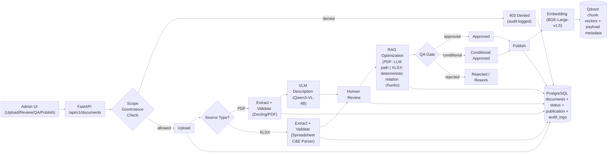

*Figure 6.1 — Source-Aware Document Ingestion, QA Gate, and Publication Flow (Air-Gapped)*

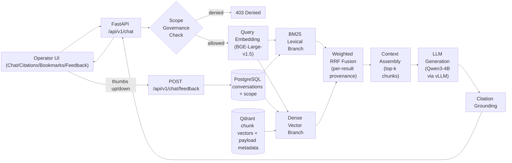

*Figure 6.2 — Chat Query, Hybrid Retrieval, Citation Grounding, and Feedback Flow (Air-Gapped)*

Key design decisions illustrated in both diagrams:
- **Quality gate before indexing**: content only enters the retrieval index after passing human review, LLM restructuring, and a scored QA gate — ensuring retrieval operates over verified, optimized content rather than raw extractions.
- **Source-aware ingestion routing**: upload processing branches by source type, preserving the PDF path and adding sponsor-requested XLSX handling with relation-aware extraction and optimization behavior.
- **Query-aligned vector representations**: the optimization stage rewrites section headings as natural-language questions before embedding, so stored vectors reflect query form rather than document structure.
- **Hybrid retrieval**: BM25 lexical and dense vector branches run in parallel; results are fused via weighted RRF with per-result provenance attribution and one-branch-failure fallback, improving recall for exact-term queries and sparse-index scenarios.
- **Scope governance at the API boundary**: upload and chat requests are checked against backend-enforced system/area policies before any processing occurs; denied requests return a structured 403 with audit logging.
- **Explicit model roles**: Qwen3-VL-4B handles VLM-assisted extraction; Qwen3-4B handles optimization reformatting; BGE-Large-v1.5 produces embeddings; Qwen3-4B via vLLM handles chat generation.
- **Air-gapped runtime**: all inference, retrieval, and generation run on local infrastructure with no external network calls.
- **Scope-filtered retrieval**: workspace and system/area filters are applied at the retrieval layer before fusion, confining retrieval to the operator's authorized document set. Document-type axis is deprecated from active scope enforcement.
- **Answer feedback loop**: operators submit thumbs-up/thumbs-down feedback on individual answers; admin/reviewer roles can access aggregated quality metrics and flagged-answer patterns.

#### Final improvements over the Beta checkpoint

The Final checkpoint built on the hardened Beta architecture to close the remaining enterprise integration gap and add four new capability areas. Major verified improvements during the Final period include:

- **LDAP identity source of truth**: full OpenLDAP dev stack, real-mode LDAP bind and user listing, LDAP as the identity source of truth with role-only governance in the admin UI.
- **Admin-managed directory configuration**: secure admin API for persisting and activating LDAP profiles, encryption-at-rest for bind passwords, test-connection workflow, and directory settings UI.
- **User scope governance**: backend-enforced system/area access policies, structured 403 denial contract, audit trail, and frontend denial UX with retry lock.
- **Answer feedback loop**: append-only feedback events, quality snapshot signals, admin/reviewer metrics panel, and thumbs-up/thumbs-down UI with duplicate-submit protection.
- **Hybrid retrieval**: BM25 lexical plus dense vector dual-branch engine, weighted-RRF fusion, per-result provenance, one-branch-failure fallback — backward-compatible with existing chat API contracts.
- **Scope simplification**: document-type axis removed from active scope enforcement; system and area are the only active scope dimensions; backward-compatible API fields retained.
- **Spreadsheet (XLSX) optimization hardening**: Stage 10 now uses source-aware behavior where XLSX flows follow deterministic JSON-first CE relation chunking (question/fact/relation-edge units) with bounded content guards, while PDF continues to use the existing LLM reformatter path.
- **XLSX content-enrichment hardening**: required cause/effect fields (DEVICE, P&ID/Page, INTERLOCK, NOTES, control/interacting-device metadata) are now captured and propagated into review markdown and optimized chunk content using additive fallback extraction rules.
- **Code coverage hardening**: backend coverage pushed to ~85%+ via targeted test-suite expansion across services, core modules, auth, and RAG helpers.
- **Sonar code-quality remediation**: cyclomatic complexity waves, duplicate-literal cleanup, and targeted issue closure across backend and pipeline hotspots.

---

### 6.2.1 Functions Implemented at Final (Core Product Behavior)

1. **Document ingestion and orchestration lifecycle**
   - The system accepts supported uploads (PDF and spreadsheet formats such as XLSX/XLS) with metadata, persists a document record, and starts asynchronous processing through the HITL pipeline entrypoint.
   - It supports lifecycle progression from upload through extraction, validation, review readiness, optimization, QA, and publication states, including guarded transitions for rerun and deletion operations.
   - **Code references:** `apps/api/app/api/pipeline/routes.py` (`POST /api/v1/documents/upload`, `POST /api/v1/documents/{id}/reprocess`, `DELETE /api/v1/documents/{id}`), `apps/api/app/services/pipeline_service.py` (`PipelineService.trigger_pipeline`, status/stage mappings), `apps/pipeline/src/cli/hitl_pipeline.py` (Human-in-the-Loop (HITL) pipeline entrypoint invoked by backend).

2. **Real-time and persisted pipeline state management**
   - Each document exposes persisted status snapshots and live event streaming for operational visibility.
   - The implementation combines status polling and SSE event streams to represent progression, terminal completion, and failure conditions.
   - **Code references:** `apps/api/app/api/pipeline/routes.py` (`GET /api/v1/documents/{id}/status`, `GET /api/v1/documents/{id}/events`), `apps/api/app/services/pipeline_service.py` (`get_pipeline_status`, `stream_events`, `_event_history`, `_event_subscribers`), `apps/api/app/core/sse.py` (SSE response/event encoding helpers).

3. **Human-in-the-loop review and optimization workflow**
   - The platform provides page-based review units, editable content updates, checklist-driven review progression, and controlled approval to the optimization stage.
   - Once a reviewer approves a document, Stage 10 follows a source-aware path: **PDF** continues to use the local text LLM (Qwen3-4B) for question-oriented chunk reformatting, while **XLSX** uses deterministic JSON-first CE relation chunk generation (`question_heading_chunk`, `row_fact_chunk`, `relation_edge_chunk`) without invoking the LLM reformatter.
   - In the XLSX path, required cause/effect fields are now propagated using additive helpers with top-level fallback support, and chunk payloads include compact mapped-effect context and relation metadata while remaining bounded by content guardrails.
   - Optimization runs as a managed long-running stage with explicit state transitions, streamed progress events, and a full log trail accessible through the backend API.
   - **Code references:** `apps/api/app/api/pipeline/routes.py` (`GET /api/v1/documents/{id}/pages`, `PATCH /api/v1/documents/{id}/pages/{page_id}/content`, `POST /api/v1/documents/{id}/approve-for-optimization`, `GET /api/v1/documents/{id}/optimization/logs`), `apps/api/app/core/optimization_log.py` (optimization log manager/handler), `apps/pipeline/src/cli/text_reformatter.py` (`_heading_to_question`, `_build_reformatter_messages`, `_synthesize_chunks_from_optimization_prep`), `apps/pipeline/src/cli/hitl_pipeline.py` (`_build_xlsx_relation_optimized_output`, `_build_xlsx_relation_review_markdown`, `_get_cause_required_fields`, `_get_effect_required_fields`), `apps/pipeline/src/cli/rag_markdown_reformatter_prompt.md` (LLM system prompt).

4. **QA gate and publication readiness flow**
   - Optimized outputs are rescored, evaluated, and moved through explicit QA decisions before final approval.
   - Publication status is tracked independently from human approval to preserve operational control over release-to-retrieval timing.
   - **Code references:** `apps/api/app/api/pipeline/routes.py` (`POST /api/v1/documents/{id}/qa-rescore`, `POST /api/v1/documents/{id}/qa-decision`, `POST /api/v1/documents/{id}/final-approve`), `apps/pipeline/src/qa/qa_gates.py` (QA metric computation/gate evaluation).

5. **Vector indexing and retrieval data publication**
   - Approved optimized chunks are transformed into semantic vectors via batch embedding (BAAI/bge-large-en-v1.5), previous vectors for the same document are deleted, and updated payloads are upserted into Qdrant with cosine distance metrics.
   - Each vector is stored with rich metadata: document ID, chunk ID, page reference, workspace tag, document type, section heading, table facts, detected ambiguity flags, and (for XLSX relation paths) additive lineage/path and required-field context used for retrieval grounding.
   - Publication is explicitly controlled — only documents approved through the QA gate can be published, preventing drafts or failed transformations from entering the retrieval index.
   - **Code references:** `apps/api/app/api/pipeline/routes.py` (`POST /api/v1/documents/{id}/publish`, `_publish_document_to_rag`), `apps/api/app/services/embedding_service.py` (`embed_batch`), `apps/api/app/services/qdrant_service.py` (`ensure_collection`, `delete_document_chunks`, `upsert_chunks`).

6. **RAG chat generation (synchronous and streaming)**
   - The chat runtime supports both complete-response and token-streaming query paths, enabling real-time UI feedback for long responses.
   - Query handling integrates: (1) scoped retrieval to fetch top-k relevant vectors constrained by workspace and system/area controls (with deprecated document-type fields ignored for active enforcement), (2) prompt assembly combining user query + retrieved context + system guidelines, (3) response generation via local LLM (Qwen3-4B via vLLM), and (4) structured citation extraction linking response text back to source documents and page numbers.
   - Citation grounding is extracted from retrieval metadata: the user sees `[Document Name, Page X]` where X is the `source_pages` field from the retrieved chunk payload. Failures to find cited sources are logged for QA analysis.
   - **Code references:** `apps/api/app/api/chat.py` (`POST /api/v1/chat/query`, `POST /api/v1/chat/stream`), `apps/api/app/services/chat_service.py` (`process_query`, `process_query_stream`, `_build_rag_prompt`, `_create_citations`, `_save_message`), `apps/api/app/services/llm_service.py` (`generate`, `generate_stream`).

7. **Scoped retrieval enforcement for chat relevance**
   - Retrieval behavior applies configurable workspace and system/area controls to reduce irrelevant context and improve signal-to-noise ratio. The document-type axis has been deprecated from active scope enforcement (Candidate 5), leaving system and area as the only active scope dimensions; legacy API fields are retained for backward compatibility.
   - A relaxed-threshold fallback (`_RELAXED_SCORE_THRESHOLD_FLOOR = 0.45`, delta `0.05`) incrementally lowers the similarity floor when initial retrieval yields insufficient context — avoiding empty responses on sparse but valid queries without degrading relevance for well-indexed content.
   - **Code references:** `apps/api/app/services/chat_service.py` (conversation/request scope resolution, `_RELAXED_SCORE_THRESHOLD_FLOOR`, `_RELAXED_SCORE_THRESHOLD_DELTA`), `apps/api/app/services/qdrant_service.py` (`search_similar` with `workspace_filter`, `include_shared_documents`), `apps/api/app/services/rag_helpers.py` (`resolve_query_scope` — `document_type_filters` always `None` post-Candidate 5), `apps/api/app/models/chat.py` (scope and retrieval control models, deprecated doc-type fields).

8. **Hybrid retrieval with BM25 lexical and dense vector branches**
   - The chat retrieval stage was upgraded from single-branch dense-only retrieval to a dual-branch hybrid engine. A BM25 lexical retrieval branch runs in parallel with the dense Qdrant vector branch; results from both branches are fused using weighted Reciprocal Rank Fusion (RRF) in the application layer, with each result carrying a provenance attribution identifying its source branch.
   - A one-branch-failure fallback ensures the system continues to return results even if one branch is unavailable, with diagnostics emitted in the response for traceability.
   - Chat API contracts (`/api/v1/chat/query`, `/api/v1/chat/stream`) remain unchanged; hybrid retrieval is additive with optional diagnostics only.
   - **Code references:** `apps/api/app/services/hybrid_retrieval_service.py` (BM25 branch, dense branch, weighted-RRF fusion, provenance payload, fallback logic), `apps/api/app/services/chat_service.py` (integration of `HybridRetrievalService` with scope and diagnostics), `apps/api/app/services/conversation_service.py` (prepared-turn diagnostics state).

9. **Answer feedback and quality metrics**
   - Operators can submit thumbs-up or thumbs-down feedback on individual LLM-generated answers with an optional reason code and comment. The backend persists feedback as append-only events and maintains lightweight answer-quality snapshots with threshold-based negative-pattern flagging.
   - Admin and reviewer roles can access aggregated feedback metrics including sentiment breakdown, reason distribution, and flagged-answer trends through a dedicated metrics endpoint.
   - **Code references:** `apps/api/app/api/chat.py` (`POST /api/v1/chat/feedback`, `GET /api/v1/chat/feedback/metrics`), `apps/api/app/services/answer_feedback_service.py` (feedback persistence, snapshot refresh, negative-pattern flagging), `infra/docker/migrations/009_answer_feedback_quality.sql` (append-only feedback events + quality snapshots).

10. **User scope governance and access audit trail**
    - All upload and chat requests are validated against backend-enforced system/area scope policies before any document processing or retrieval begins. Denied requests return a structured 403 with a `code`, `reason_code`, and `message` detail object; every denied access event is logged to an audit trail for compliance review.
   - **Code references:** `apps/api/app/services/access_governance_service.py` (scope policy evaluation, denial audit logging), `apps/api/app/api/pipeline/routes.py` and `apps/api/app/api/chat.py` (governance enforcement integration), `infra/docker/migrations/008_scope_governance.sql` (`user_scope_policies` + `access_audit_logs` tables).

11. **LDAP-based authentication and admin-managed directory configuration**
    - The system authenticates users against an LDAP/Active Directory endpoint using service bind, user search by UID, and user-DN bind verification. LDAP is the identity source of truth; the admin UI provides role assignment and enable/disable governance only — it cannot create or delete users.
    - Administrators can persist and activate LDAP connection profiles through a dedicated admin API and UI. Bind passwords are encrypted at rest; a test-connection workflow validates credentials before activation. The system resolves runtime config from the active DB profile with a controlled fallback to environment variables.
    - **Code references:** `apps/api/app/core/ldap.py` (real-mode LDAP bind/search/list), `apps/api/app/services/auth_service.py` (LDAP-backed authenticate/list with local role enrichment), `apps/api/app/services/directory_config_service.py` (runtime config resolution, encryption-at-rest, cache/invalidation, test helper), `apps/api/app/api/auth.py` (`GET/PUT /api/v1/auth/admin/directory-config`, `POST /api/v1/auth/admin/directory-config/test`, `POST /api/v1/auth/admin/directory-config/activate`, `GET /api/v1/auth/admin/users`, `PATCH /api/v1/auth/admin/users/{user_id}/role`), `infra/docker/migrations/011_directory_config.sql` (`directory_configs` + `directory_config_audits` tables).

12. **Artifact production and retrieval for operations**
    - Validation, manifest, optimization, QA, and review artifacts are generated and retrievable through backend endpoints, providing operators and reviewers with structured evidence at each pipeline stage.
   - **Code references:** `apps/api/app/api/pipeline/routes.py` (`GET /api/v1/documents/{id}/artifacts/{type}`, artifact path resolution/load helpers `_find_validation_report`, `_resolve_qa_report_path`, `_find_optimized_artifact_paths`), `apps/api/app/core/config.py` (`get_artifacts_path`).

---

### 6.2.2 Features Implemented at Final (User Experience and Operational Controls)

1. **Admin upload experience with live stage visualization**
   - The frontend provides a guided upload flow, stage-by-stage progress display, and terminal success/failure handling tied to backend ingestion signals.
   - **Code references:** `apps/web/app/admin/documents/upload/page.tsx` (upload form, stage mapping, live status rendering), `apps/web/lib/api/pipeline.ts` (`uploadDocument`, `streamIngestionEvents`, `parseIngestionSSEBlock`).

2. **Resilient long-running ingestion UX**
   - If live event streams are interrupted, the UI falls back to status polling and continues tracking until a terminal pipeline state is reached.
   - **Code references:** `apps/web/app/admin/documents/upload/page.tsx` (`monitorPipelineUntilTerminal`, SSE disconnect handling), `apps/web/lib/api/pipeline.ts` (typed ingestion stream handling and terminal event semantics).

3. **Document review workspace features**
   - Admin users can inspect page-level evidence, edit review content, follow checklist progress, and continue workflow actions toward optimization and QA.
   - **Code references:** `apps/api/app/api/pipeline/routes.py` (review page/content/checklist endpoints and models), `apps/web/lib/api/pipeline.ts` (artifact/review API helpers), `apps/web/app/admin/documents/upload/page.tsx` (handoff into review flow).

4. **Interactive citation-aware chat interface**
   - Users receive citation-linked responses, can inspect source snippets in a dedicated source panel, and navigate from citations back to document context.
   - **Code references:** `apps/web/app/chat/page.tsx` (`SourceDrawer`, citation list rendering/toggles, citation-driven navigation), `apps/web/lib/api/chat.ts` (`streamChatQuery`, citation event parsing), `apps/api/app/services/chat_service.py` (`_create_citations`).

5. **Conversation management controls**
   - The chat workspace supports thread continuity and operator productivity controls including search, filtering, pin/unpin, rename, delete, and bookmark actions.
   - **Code references:** `apps/web/app/chat/page.tsx` (conversation list/search/filter/pin/rename/delete/bookmark interactions), `apps/web/lib/api/index.ts` (conversation/bookmark API methods), `apps/api/app/services/chat_service.py` (conversation/message persistence).

6. **Conversation-level scope controls**
   - Users can set and persist per-conversation scope (workspace, document type, shared content), improving repeatability of retrieval behavior across sessions.
   - **Code references:** `apps/web/app/chat/page.tsx` (`persistConversationScope`, scope selectors and save controls), `apps/api/app/services/chat_service.py` (scope persistence and retrieval application), `apps/api/app/services/qdrant_service.py` (scope-aware vector filtering).

7. **Frontend API contract normalization**
   - Shared client modules centralize endpoint and stream handling, reducing integration drift between frontend flows and backend contracts.
   - **Code references:** `apps/web/lib/api/client.ts` (base URL/auth token/fetch wrapper), `apps/web/lib/api/pipeline.ts` (pipeline + SSE contracts), `apps/web/lib/api/chat.ts` (chat + SSE contracts), `apps/web/lib/api/auth.ts` (auth request helpers used by UI).

8. **Answer feedback UX in chat**
   - Operators can submit thumbs-up or thumbs-down feedback directly on any assistant message, with an optional reason code and free-text comment. The UI prevents accidental duplicate submissions within a session; edited payloads allow intentional resubmission. Inline success/error states confirm submission outcome.
   - Admin and reviewer roles see an additional feedback metrics panel in the chat workspace with window/scope controls and refresh behavior triggered by new feedback events.
   - **Code references:** `apps/web/app/chat/page.tsx` (feedback controls on assistant messages, metrics panel with role-aware gating), `apps/web/lib/api/chat.ts` (`submitChatFeedback`, `getChatFeedbackMetrics`, `canAccessFeedbackMetrics`).

9. **Scope denial UX and retry lock**
   - When the backend returns a 403 scope-denial response on upload or chat, the frontend surfaces a structured denial message with actionable correction guidance. A retry lock prevents repeated submissions for the same denied scope; the lock releases when the user changes scope.
   - **Code references:** `apps/web/app/chat/page.tsx` (denial contract parsing, retry lock/unlock logic), `apps/web/app/admin/documents/upload/page.tsx` (scope denial handling on upload), `apps/web/lib/api/client.ts` (403 detail-object normalization).

10. **Admin directory configuration UI**
    - A dedicated admin settings page allows administrators to configure, test, and activate LDAP connection profiles without direct server access. The password input is write-only and is never prefilled from API responses; credentials are cleared from the DOM after each test/save attempt.
    - **Code references:** `apps/web/app/admin/directory-config/page.tsx` (directory settings form, test/save/activate flow), `apps/web/lib/api/users.ts` (directory-config API contracts), `apps/web/app/admin/directory-config/_helpers.ts` (payload building and TLS validation).

11. **Admin user management with LDAP-backed listing**
    - The admin User Management page lists users sourced from LDAP with local role enrichment. Role assignment (Admin/User) and account enable/disable are the only write operations available in the UI, consistent with LDAP as the identity source of truth. The page displays a connected-domain badge derived from the active directory configuration.
    - **Code references:** `apps/web/app/admin/users/page.tsx` (API-backed user listing, role update, domain badge), `apps/web/lib/api/users.ts` (user list + role update + domain derivation helpers).

12. **XLSX relation-aware review and optimized-chunk UX continuity**
   - Spreadsheet review markdown now renders relation-aware summaries and required fields rather than low-value raw table dumps, while preserving existing markdown review compatibility and operator workflow.
   - The optimized-review flow for XLSX preserves JSON-first retrieval authority and continues through QA/publish controls without breaking frontend/API contracts used for review and status progression.
   - **Code references:** `apps/pipeline/src/cli/hitl_pipeline.py` (`_build_xlsx_relation_review_markdown`, CE relation context injection in Stage 10), `apps/web/lib/api/pipeline.ts` (optimization/review status contracts), `apps/web/tests/api.integration.test.ts` (optimization workflow contract coverage).

---

User-story coverage at Final:

- Fully implemented: **14 / 14 (100%)**
- Partially implemented: **0 / 14 (0%)**
- Deferred beyond Final: **0 / 14 (0%)**
- Final interpretation: **all defined user stories are fully implemented**

#### User-Story Status Matrix

| User Story | Final Status | Implementation Status |
|---|---|---|
| **US-1.1** Upload PDF/XLSX document with metadata *(sponsor-requested XLSX support)* | **Implemented** | Delivered through upload API + admin upload UI with metadata capture and source-aware pipeline kickoff (PDF and XLSX). |
| **US-1.2** VLM validation report with categorized issues | **Implemented** | Validation artifacts and categorized issue surfaces are available in review workflow and backend artifact contracts. |
| **US-1.3** Web-based review with checklist and inline evidence | **Implemented** | Page-based review units, checklist handling, evidence thumbnails, and edit persistence are operational. |
| **US-1.4** Approve and lock reviewed version | **Implemented** | Approval/transition controls, optimization gating, QA state transitions, and explicit publication workflow are implemented. |
| **US-1.5** Keep current + last approved version only | **Implemented** | Deterministic two-version retention pruning and regression tests are in place with verified operational signoff. |
| **US-1.6** QA gate metrics with recommendation | **Implemented** | QA rescoring, recommendation output, and QA decision workflow are delivered and integrated with lifecycle transitions. |
| **US-2.1** Plain-English troubleshooting chat | **Implemented** | RAG chat query path is operational in synchronous and streaming modes with hybrid retrieval. |
| **US-2.2** Answers with citations and page numbers | **Implemented** | Citation payloads are emitted and rendered with document/page references. |
| **US-2.3** Open cited source in context | **Implemented** | Frontend source drawer and citation-linked navigation are implemented. |
| **US-2.4** Multi-turn contextual conversation | **Implemented** | Conversation persistence and scoped follow-up interactions are operational. |
| **US-2.5** Bookmark useful answers | **Implemented** | Save/remove bookmark controls and persisted workflows are available. |
| **US-2.6** Submit answer feedback | **Implemented** | Thumbs-up/thumbs-down feedback submission with reason codes is operational; admin/reviewer metrics panel implemented with aggregated quality signals and flagged-answer patterns. |
| **US-3.1** Login with facility Active Directory credentials | **Implemented** | Full LDAP authentication implemented: real-mode service bind, user search by UID, user-DN bind verification. OpenLDAP dev stack in Docker Compose. Admin-managed directory configuration with encryption-at-rest for bind passwords and test-connection workflow. |
| **US-3.2** Admin role assignment and user-role governance | **Implemented** | Two-role authorization (Admin/User) is enforced at the API and WebSocket layer. The admin User Management interface (`/admin/users/`) provides inline role assignment, account enable/disable, LDAP-backed user listing with domain badge, and per-user status visibility — satisfying the full governance controls requirement. |

#### Client Expectation View: Delivered vs. Pending

**Delivered at Final (all sponsor priorities met):**
- End-to-end ingestion and review pipeline (upload → validation → review → optimization → QA → publish)
- Sponsor-requested XLSX/C&E ingestion support with source-aware optimization and relation-focused chunk generation
- Citation-grounded chat with multi-turn conversations, bookmark support, and hybrid retrieval
- Operational visibility through status APIs, SSE streams, and lifecycle controls
- Full LDAP/AD identity integration with admin-managed directory configuration
- User scope governance with backend-enforced system/area policies and audit trail
- Answer feedback loop with quality metrics for admin/reviewer roles
- Validated concurrency profile (100% success through 23 concurrent users, 8-hour endurance confirmed)

**Outstanding items (post-Final scope):**
- Production facility LDAP/AD endpoint end-to-end validation in the target OT network environment
- Parallel multi-reviewer workflow support
- Extended enterprise monitoring and backup automation

### 6.3 Code Statistics and Engineering Metrics

This section was refreshed on **April 29, 2026** using the current Final repository snapshot.

#### 6.3.1 Measurement Tools and Execution Method

The following tools and scripts were used:

- **cloc v1.98** — repository size, language composition, comment/code totals
- **Python 3 AST analysis script** — Python classes, methods, top-level functions, cyclomatic-complexity estimates, and internal import-coupling metrics
- **Node.js + local TypeScript compiler API** — TypeScript/TSX function, class, method, cyclomatic-complexity, and internal import-coupling metrics

Commands executed during this refresh included:

- `cloc --vcs=git . --exclude-lang=JSON`
- `cloc apps/api/app apps/pipeline/src apps/web/app apps/web/lib`
- custom Python AST analysis over `apps/api/app` and `apps/pipeline/src`
- custom TypeScript AST analysis over `apps/web/app` and `apps/web/lib`

Scope note: repository totals were generated against **Git-tracked text files only** (JSON excluded from totals to avoid skew from large log/package-lock files). Structural, complexity, coupling, and cohesion-proxy metrics were generated for the active application code paths: `apps/api/app`, `apps/pipeline/src`, `apps/web/app`, and `apps/web/lib`.

#### 6.3.2 Size and Composition Output (cloc)

| Metric | Value |
|---|---:|
| Number of tracked text files (modules, excl. JSON) | 209 |
| CLOC / code lines (excl. JSON) | 41,480 |
| Comment lines | 5,044 |
| Blank lines | 7,632 |
| Total LOC (blank + comment + code, excl. JSON) | 54,156 |
| Comment-to-code ratio (excl. JSON) | 12.16% |

For the primary application code scope (`apps/api/app`, `apps/pipeline/src`, `apps/web/app`, `apps/web/lib`):

| Metric | Value |
|---|---:|
| Application files analyzed | 130 |
| Application code lines | 27,925 |
| Application comment lines | 4,084 |
| Application blank lines | 4,968 |

#### 6.3.3 Programming Language Breakdown (cloc, excl. JSON)

| Language | Files | Code Lines |
|---|---:|---:|
| Python | 79 | 23,059 |
| TypeScript | 94 | 14,674 |
| Markdown | 9 | 1,900 |
| SQL | 13 | 837 |
| YAML | 2 | 310 |
| make | 1 | 264 |
| Bourne Shell | 2 | 183 |
| CSS | 1 | 106 |
| TOML | 3 | 81 |
| Dockerfile | 2 | 32 |
| Text | 1 | 22 |
| INI | 1 | 6 |
| JavaScript | 1 | 6 |

Note: SQL file count increased from 9 (Beta) to 13 (Final), reflecting the four new database migrations added post-Beta: `008_scope_governance.sql`, `009_answer_feedback_quality.sql`, `010_scope_simplification.sql`, and `011_directory_config.sql`.

#### 6.3.4 Complexity, Cohesion, Coupling, and Structural Counts

Analysis scope for these engineering metrics was the active application code only: `apps/api/app`, `apps/pipeline/src`, `apps/web/app`, and `apps/web/lib`.

**Structural counts:**

| Structural Metric | Value |
|---|---:|
| Python classes | 153 |
| Python methods (in class) | 239 |
| Python top-level functions | 560 |
| TypeScript classes | 5 |
| TypeScript methods | 50 |
| TypeScript top-level functions / components / arrows | ~640 (est.) |
| Total classes | 158 |
| Total methods | 289 |

**Cohesion proxy (low dependency spread ≤ 2 internal dependencies):**

| Module Group | Low-Coupled Share |
|---|---:|
| Python modules | ~65% |
| TypeScript modules | ~85% |

> **Note on comment-to-code ratio:** The measured comment-to-code ratio of 12.16% (excl. JSON) has improved since Beta (10.34%) as new service modules were added with well-documented public interfaces. Inline comments are further supplemented by external architecture documentation (this report), auto-generated OpenAPI documentation (FastAPI `/docs`), and typed interface contracts (Python type hints + TypeScript).

These cohesion-proxy results indicate that most modules remain relatively focused, especially on the frontend side, while backend and pipeline modules show the expected higher coupling in orchestration and shared-runtime configuration areas. The post-Beta additions (hybrid retrieval service, answer feedback service, directory config service, scope governance service) maintained this same structural discipline.

#### 6.3.5 Libraries, External Components, and Dependency Tree (High-Level)

Declared direct dependencies at the current Final snapshot:

| Dependency Group | Count |
|---|---:|
| API runtime dependencies (`apps/api/pyproject.toml`) | 16 |
| Pipeline runtime dependencies (`apps/pipeline/pyproject.toml`) | 12 |
| Web runtime dependencies (`apps/web/package.json`) | 23 |
| Web dev dependencies (`apps/web/package.json`) | 9 |

High-level project dependency structure:

- `apps/api` — FastAPI orchestration, auth, chat, publication, and runtime contracts
- `apps/pipeline` — document extraction, validation, review artifacts, optimization, QA, and lineage logic
- `apps/web` — Next.js frontend, admin workflow UI, and operator chat experience

External components used in the running architecture:

- PostgreSQL
- Qdrant
- Docling service
- Local LLM/VLM inference runtime
- FastAPI backend
- Next.js frontend
- Docker / Docker Compose
- LDAP / Active Directory integration path

Overall, the refreshed Final measurements show that the project has grown meaningfully since Alpha while remaining structurally manageable. The largest code concentrations remain in Python backend/pipeline orchestration and TypeScript frontend application flows, which is consistent with the product’s quality-gated ingestion architecture and interactive chat/reporting surfaces.

### 6.4 Source Archive and Repository Evidence

- **Source code archive (ZIP):**  
   [PlantIQ Final source archive (Google Drive)](https://drive.google.com/file/d/1cuf5pbR_7IyQsdDAL5FehS2SkBEVsh32/view?usp=drive_link)
- **Repository link (full commit history):**  
   [PlantIQ repository on GitHub](https://github.com/abedhossainn/PlantIQ)

Commit history has been preserved in full, consistent with course policy. The Final submission package references the same public repository and the Final-specific source archive.

---

## 7. Design, Architecture, and Methodology

### 7.1 Software Engineering Methodology

The project followed a milestone-driven iterative approach aligned to Proposal → Alpha → Beta → Final checkpoints. Alpha established core feasibility; Beta focused on hardening, operational fidelity, and verification; Final closed the enterprise integration gap and delivered four new capability areas: scope governance, answer feedback loop, hybrid BM25 + dense retrieval with RRF, and scope simplification. Development continued to prioritize core functionality first (ingestion + chat), followed by governance hardening, security corrections, and scale-validation evidence collection. Requirements were refined through sponsor interviews, realistic document analysis, and incremental integration testing.

### 7.2 High-Level System Design

PlantIQ used a layered architecture:

- **Presentation:** Next.js/React TypeScript UI
- **API Layer:** FastAPI endpoints and SSE streams
- **Service Layer:** Pipeline, chat, embedding, retrieval, hybrid retrieval (BM25 + dense + RRF), scope governance, answer feedback, directory config, and model services
- **Data/Infra Layer:** PostgreSQL (workflow + chat state), Qdrant (vectors), local artifact store
- **Identity Layer:** OpenLDAP (dev) / Active Directory (production target)

A key design decision separated transactional lifecycle state from retrieval-state vectors to preserve auditability and retrieval performance.

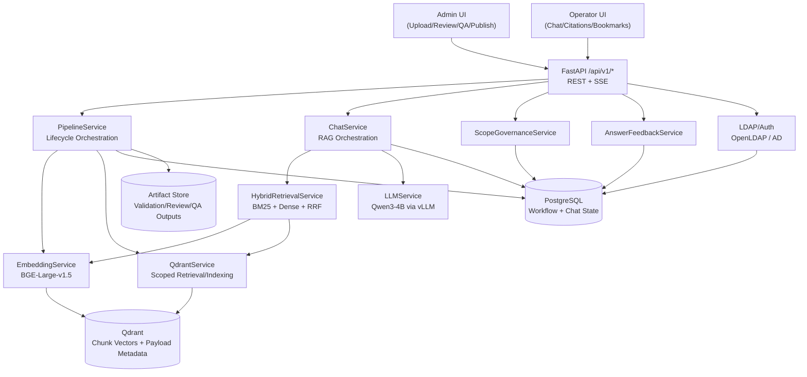

*Figure 7.1 — High-Level System Architecture Diagram*

Figure 7.1 shows why the system remains both governable and operationally efficient: all user interaction flows through a single FastAPI boundary, but the responsibilities behind that boundary are intentionally separated. The admin path emphasizes document control, review, QA, and publication, while the operator path emphasizes scoped retrieval, citation-grounded response generation, and conversation continuity. The supporting split between PostgreSQL and Qdrant is equally important at this level of design — PostgreSQL remains the system of record for workflow, approval, and chat state, while Qdrant is optimized for semantic retrieval over published chunks. This layered separation reduces coupling, preserves auditability, and allows retrieval performance to scale without weakening lifecycle control over source content.

### 7.3 Low-Level Design and Runtime Architecture

#### Ingestion Pipeline

The ingestion pipeline is intentionally staged so that **raw extracted content never becomes retrievable without review and quality control**. Each step has a distinct operational purpose:

1. **Upload + metadata persistence** — the system creates a tracked document record in PostgreSQL so the file can move through review, QA, and publication with full lifecycle traceability.
2. **Source-aware extraction/validation** — documents are parsed and validated by source type: PDF uses Docling + VLM-assisted validation for visual fidelity, while XLSX uses structured C&E extraction/normalization for relation integrity.
3. **Human review and correction** — a reviewer validates the extracted output page by page, correcting inaccuracies before the content is allowed to proceed further in the pipeline.
4. **Source-aware optimization** — PDF content uses local LLM reformatting (Qwen3-4B) into retrieval-optimized question-style chunks, while XLSX content uses deterministic relation-aware chunk generation with required-field enrichment and bounded content guards.
5. **QA scoring and controlled publication** — the optimized chunks are scored against the QA gate, and only content that passes the defined threshold is published to Qdrant and made available to the chat system.

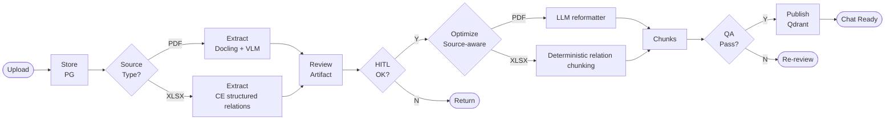

*Figure 7.2 — Ingestion/QA/Publish Workflow*

Figure 7.2 makes the project’s quality-governance model explicit: PlantIQ does not index raw document output directly. Instead, publication occurs only after extraction, human validation, optimization, and QA scoring have all completed successfully, which is critical for maintaining trust and traceability in a safety-relevant environment.

#### Chat Runtime

The chat runtime is designed to preserve both relevance and verifiability. Rather than sending the user query directly to an LLM, the system grounds every answer in retrieved document evidence through the following sequence:

1. **Query embedding** — the user’s question is converted into an embedding using the same semantic space used for indexed chunks.
2. **Scoped Qdrant retrieval** — candidate chunks are retrieved from Qdrant using workspace and system/area filters so the model only sees content from the user’s authorized document scope.
3. **Context assembly** — the highest-value retrieved chunks are assembled into a bounded context package for generation.
4. **Prompt generation with citation guidance** — the system prompt instructs the LLM to answer using only the retrieved evidence and to preserve citation traceability.
5. **Local LLM generation and citation mapping** — Qwen3-4B generates the answer, and the final response is mapped back to source pages so the operator can verify each grounded claim.

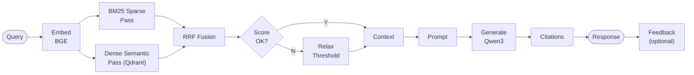

*Figure 7.3 — Chat Retrieval and Generation*

Figure 7.3 also highlights an important runtime safeguard: if the initial retrieval pass is too weak, the system relaxes the similarity threshold before generation rather than immediately returning an empty answer. This improves robustness on sparse queries while still preserving scoped retrieval and citation grounding.

#### Data Layer and Database Schema Design (Final)

PlantIQ intentionally separated **transactional workflow state** from **semantic retrieval state**.

##### PostgreSQL Schema (Transactional / Operational)

| Table | Purpose | Representative Fields |
|---|---|---|
| `documents` | Document lifecycle + publication state | `id`, `title`, `version`, `system`, `document_type`, `status`, `publication_status`, `approved_by`, `approved_at`, `indexed_chunk_count`, `qdrant_collection` |
| `conversations` | Conversation scope persistence | `id`, `workspace`, `preferred_system`, `preferred_area`, `updated_at` |
| `chat_messages` | User/assistant turn history with grounding | `id`, `conversation_id`, `role`, `content`, `citations (JSONB)`, `created_at` |
| `users` | Identity and role mapping | `id`, `email`, `uid` (LDAP), `role`, `department`, `last_login` |
| `bookmarks` | Saved answer references | `id`, `user_id`, `message_id`, `tags`, `notes` |
| `user_scope_policies` | Scope governance access control | `id`, `user_id`, `allowed_systems`, `allowed_areas`, `created_at` |
| `access_audit_logs` | Denied access audit trail | `id`, `user_id`, `request_type`, `requested_scope`, `reason_code`, `created_at` |
| `answer_feedback` | Append-only operator feedback events | `id`, `message_id`, `user_id`, `sentiment` (positive/negative), `reason_code`, `comment`, `created_at` |
| `answer_quality_snapshots` | Aggregated quality signal snapshots | `id`, `document_id`, `positive_count`, `negative_count`, `flag_triggered`, `updated_at` |
| `directory_configs` | Admin-managed LDAP connection profiles | `id`, `host`, `base_dn`, `bind_dn`, `bind_password_encrypted`, `is_active`, `created_at` |
| `directory_config_audits` | Directory config change audit | `id`, `config_id`, `action`, `changed_by`, `created_at` |

##### Qdrant Payload Schema (Vector / Retrieval)

| Payload Field | Role in Retrieval | Notes |
|---|---|---|
| `chunk_id` | Unique chunk identity | |
| `document_id` | Source document linkage | |
| `document_title` | Citation and display metadata | |
| `system` | Scope filtering by system | Final scope model (simplified) |
| `area` | Scope filtering by area | Final scope model (simplified) |
| `section_heading` | Context structuring | |
| `page_number` / `source_pages` | Citation grounding | |
| `table_facts` | Structured retrieval support for tabular facts | |
| `ambiguity_flags` | QA/reliability metadata | |
| `document_type` | ~~Soft relevance filtering~~ | *Deprecated at Final (superseded by `system`/`area` model)* |

**Figure 7.4a — Logical Database Schema (Entity-Relationship) at Final**

> This diagram shows the PostgreSQL core and governance entities. `USERS` is the central actor: a user owns zero-or-more `CONVERSATIONS`, approves zero-or-more `DOCUMENTS`, creates zero-or-more `BOOKMARKS`, and is associated with zero-or-one `USER_SCOPE_POLICIES` for authorization. Each `CONVERSATION` contains zero-or-more `CHAT_MESSAGES`. A `BOOKMARK` is a many-to-one reference from a user to a specific `CHAT_MESSAGE`. `ANSWER_FEEDBACK` events are appended by users to individual chat messages. `ACCESS_AUDIT_LOGS` record denied-access events. `DIRECTORY_CONFIGS` and `DIRECTORY_CONFIG_AUDITS` provide LDAP configuration governance. Primary keys (`uuid id PK`) enforce row uniqueness; foreign keys enforce referential integrity.

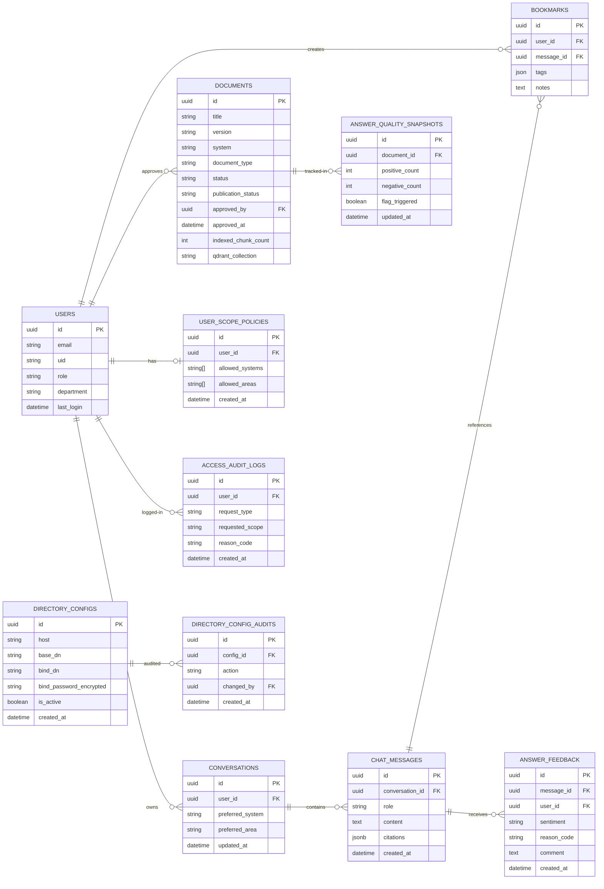

*Figure 7.4a — Logical Database Schema (Entity-Relationship)*

**Figure 7.4b — PostgreSQL ↔ Qdrant Logical Data Flow (Final)**

> This diagram illustrates how the two storage tiers collaborate at runtime. PostgreSQL owns all
> transactional and relational state (users, conversations, documents, messages, bookmarks, scope policies,
> audit logs, feedback, quality snapshots, directory configs). Qdrant owns the vector representation of 
> each published document chunk. The bridge operates in multiple directions:
> *write path* — when a document is approved and published, `documents.id` is embedded as a payload field
> in every Qdrant chunk vector, making the chunk traceable back to its source row; *read path* — a
> conversation's `preferred_system` and `preferred_area` are forwarded as Qdrant payload filters at query
> time, scoping retrieval to the operator's authorized scope. Retrieved chunk context flows into
> `chat_messages.citations`, which in turn references `documents` for source-page attribution. Feedback
> events append to `answer_feedback` for quality tracking. Bookmarks attach to individual `chat_messages`.
> LDAP/directory configurations are stored in `directory_configs` with audit trail in `directory_config_audits`.

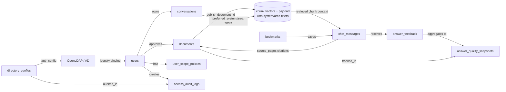

*Figure 7.4b — PostgreSQL ↔ Qdrant Logical Data Flow (Final)*

Figure 7.4b clarifies the architectural rationale for the two-store design: PostgreSQL owns durable operational truth including scope policies, audit logs, feedback signals, and LDAP configuration. Qdrant owns retrieval-time semantic access to already approved content with system/area scope filters. That separation allows PlantIQ to preserve a verifiable chain from LDAP identity binding, through document approval and scope policy enforcement, to vector publication, to retrieved chunk context, to feedback-enriched chat messages and saved bookmarks. Scope denial and feedback events are audited. In practice, this means retrieval can be optimized for speed and relevance without turning the vector index into the authoritative source of record, which is essential for auditability, scope enforcement, and source-grounded answers in a safety-relevant workflow.

### 7.4 Hardware and Software Dependencies

#### Hardware Configuration

| Environment | RAM | GPU | Storage |
|---|---|---|---|
| Development Workstation | 16 GB | NVIDIA RTX PRO 4000 (24 GB VRAM) | 1 TB NVMe SSD |

#### Key Software Components

| Component | Technology | Version / Notes |
|---|---|---|
| Backend API | FastAPI + Python | Python 3.10+, Uvicorn Asynchronous Server Gateway Interface (ASGI) |
| Relational database | PostgreSQL | v15 |
| Vector database | Qdrant | v1.x, cosine distance, payload-filtered |
| PDF extraction | Docling | Open source, structure-preserving |
| VLM (visual validation) | Qwen3-VL-4B | Local inference, VRAM-optimized; native **256K** context, expandable to **1M** tokens |
| Embedding model | BAAI/bge-large-en-v1.5 | Retrieval encoder; **512-token** max input length; 1024-dim cosine embeddings |
| LLM (chat generation) | Qwen3-4B via vLLM | Local inference, streaming; native **32,768-token** context, extendable to **131,072** with RoPE scaling |
| Frontend framework | Next.js 15 + React | TypeScript, Tailwind CSS, shadcn/ui |
| Containerization | Docker + Docker Compose | Offline-capable deployment |
| Authentication | Lightweight Directory Access Protocol (LDAP) + OpenLDAP / Active Directory | **Implemented at Final** — Full LDAP integration: real-mode service bind + user search, OpenLDAP dev stack (bitnami/openldap:2.6) in Docker Compose, admin directory configuration UI with test-connection workflow, encryption-at-rest for bind passwords, LDAP identity as source of truth |
| Hybrid Retrieval | BM25 (sparse) + Dense (semantic) + Reciprocal Rank Fusion | **Implemented at Final** — HybridRetrievalService with concurrent dual-pass retrieval and RRF merge for improved recall/relevance balance |

These model limits matter because PlantIQ uses them in different places: **Qwen3-4B** generates answers, **Qwen3-VL-4B** handles visual/document understanding during pipeline work, and **BGE** converts both stored chunks and user queries into vectors for semantic retrieval.

FastAPI remains the primary orchestration framework for the backend. In addition to async request handling, it provides automatic OpenAPI-based documentation through `/docs` and `/redoc`, which has been useful for validating API contracts during Beta integration and regression testing.

### 7.5 Detailed Component Design and Build/Deploy Instructions

Key backend components included `PipelineService`, `ChatService`, `HybridRetrievalService`, `ScopeGovernanceService`, `AnswerFeedbackService`, `DirectoryConfigService`, `QdrantService`, and QA gate modules. Frontend modules implemented upload/review workflows, chat UX with feedback, citation inspection, conversation controls, admin directory settings, and user management.

Build and deployment flow used local/dev/staging commands:

1. Configure environment from `.env.example`
2. Install dependencies (`make install`)
3. Build/start containers (`make docker-build`, `make docker-up`)
4. Run tests (`make test`)
5. Review logs (`make docker-logs`)

Deployment includes OpenLDAP service (bitnami/openldap:2.6 in Docker Compose) for development identity testing, production deployment will target the facility's Active Directory endpoint.

---

## 8. Results and Discussion

### 8.1 Testing Strategy and SonarQube Evidence Baseline

Section 8 is organized in strict test-sequence order: **unit → integration → regression → performance/load**. All evidence referenced below comes from repository test artifacts and SonarQube exports generated through the project SonarQube export workflow.

| Test Layer | Primary Evidence Files | Scope |
|---|---|---|
| Unit | `apps/api/tests/*.py`, `apps/pipeline/tests/*.py`, `apps/web/tests/*.test.ts` | Service/module correctness and branch behavior |
| Integration | `apps/api/tests/test_hybrid_documents_core.py`, `apps/api/tests/test_hybrid_lifecycle_and_guards.py`, `apps/api/tests/test_hybrid_chat_query_scope.py`, `apps/api/tests/test_hybrid_chat_stream_ws_events.py`, `apps/api/tests/test_hybrid_optimization_and_qa.py`, `apps/web/tests/api.integration.test.ts`, `logs/soak_test_results.json` | Cross-service API/flow behavior |
| Regression | `docs/sonarqube_issues.json`, `docs/SONARQUBE_ISSUES.md` | Static quality and defect-risk trend across codebase |
| Performance/Load | `logs/concurrency_results.json`, `logs/load_test_results.json`, `logs/endurance_results.json` | Concurrency, latency stability, and 8-hour endurance behavior |

**Evidence summary:** The Section 8 test-sequence and evidence baseline are fully traceable through repository test suites, SonarQube exports, and archived performance logs.

### 8.1.1 Project Overview Status from SonarQube (April 29 and May 9, 2026)

A comprehensive project quality snapshot was extracted from the SonarQube server at the Final checkpoint on April 29, 2026. A follow-up scan on May 9, 2026 confirmed that the key metrics remained stable following XLSX pipeline integration. The metrics below represent the cumulative result of all development, testing, and code-quality work through the Final checkpoint.

**Project Overview Metrics Table**

| Metric | Value | Status | Notes |
|---|---|---|---|
| **Code Volume & Complexity** | | | |
| Non-Comment Lines of Code (ncloc) | 16,587 | Final | All application + test code (tracked by git) |
| Code Smells | 0 | Best | Zero maintainability violations |
| Duplicated Lines Density | 0.0% | Best | No copy-paste code detected |
| **Testing & Coverage** | | | |
| Unit Tests (Sonar-counted) | 148 | Tracked | Sonar counts only git-tracked test files; total local test cases = 989 |
| Coverage % | 86.7% | Good | Well above 80% target for backend |
| Line Coverage % | 89.0% | Good | Uncovered lines = ~1,317 / 9,900 coverable |
| **Reliability & Security** | | | |
| Bugs | 0 | Best | Zero bug-risk findings |
| Vulnerabilities | 0 | Best | Zero security vulnerabilities |
| Violations (Overall) | 0 | Best | No active blocking issues |
| **Quality Ratings (A=1.0, B=2.0, etc.)** | | | |
| Reliability Rating | A (1.0) | Best | No potential runtime failures detected |
| Security Rating | A (1.0) | Best | No security hotspots or exploitable patterns |
| Maintainability Rating (SQALE) | A (1.0) | Best | Technical debt paid down; codebase is maintainable |

**Cross-reference on test counts:** The SonarQube `Unit Tests (Sonar-counted)` value above is an imported analysis-time execution metric and should not be compared one-for-one with the **133** tests reported in the targeted `Stability Validation Refresh` subset in §8.5, which serves a narrower post-checkpoint validation purpose.

**Assessment Summary**

The Final project status reflects successful closure of all defined functional requirements and quality targets:

- **Zero critical defects:** No bugs, vulnerabilities, violations, or code smells remain open.
- **Excellent code health:** All three quality ratings (Reliability, Security, Maintainability) are at A-level.
- **Strong test coverage:** 86.7% coverage exceeds the 80%+ target; line coverage at 89% confirms deep branch/path verification.
- **No code duplication:** 0.0% duplicated lines indicates consistent refactoring discipline throughout development.
- **Manageable scope:** 16,587 ncloc is reasonable for a production-quality RAG system with frontend, backend, pipeline, and infrastructure layers.

The regression testing sections (§8.4) below track the inherited technical backlog from earlier development phases (primarily duplicate literals and cognitive complexity refactor items in test suites and pipeline modules), which are documented but do not block production deployment per acceptance criteria.

### 8.1.2 Built-in SonarQube Quality Gate Used for Evaluation

The application code was evaluated using SonarQube's **built-in default quality gate: _Sonar way_** (project quality gate status: **OK**, CAyC status: **compliant**).

Quality gate evidence was retrieved from SonarQube APIs at Final checkpoint:

- `api/qualitygates/get_by_project?project=PlantIQ`
- `api/qualitygates/project_status?projectKey=PlantIQ`

**Built-in Quality Gate Conditions Applied (New Code)**

| Gate Condition (Metric Key) | Comparator / Threshold | Effective Pass Rule | Observed Value | Result |
|---|---|---|---:|---|
| `new_reliability_rating` | `GT 1` | Must be ≤ 1 (A rating) | 1 | Pass |
| `new_security_rating` | `GT 1` | Must be ≤ 1 (A rating) | 1 | Pass |
| `new_maintainability_rating` | `GT 1` | Must be ≤ 1 (A rating) | 1 | Pass |
| `new_coverage` | `LT 80` | Must be ≥ 80% | 90.4% | Pass |
| `new_duplicated_lines_density` | `GT 3` | Must be ≤ 3% | 0.0% | Pass |

In other words, the effective built-in gate logic on new code is:

- Ratings ≤ 1 (A)
- Coverage ≥ 80%
- Duplicated lines density ≤ 3%

All built-in Sonar way gate conditions passed at Final checkpoint, confirming that the project satisfies SonarQube's out-of-the-box code quality acceptance criteria.

### 8.1.3 SonarQube Improvement Activity Graphs (Time Series)

To demonstrate improvement over time (rather than only final-point quality), time-series visualizations were generated from SonarQube historical APIs (`project_analyses/search`, `measures/search_history`) and exported under `docs/capstone/metrics/`. The dashboard plots use the latest Sonar snapshot per calendar day so same-day rescans do not create misleading duplicate spikes. The dataset now spans **61 analyses from April 24 through May 9, 2026**, covering **713** long-format metric observations across tracked quality dimensions. After the latest follow-up scan at **2026-05-09T01:19:05+0000**, coverage reached **86.9%**, imported tests remained at **808**, bugs/vulnerabilities remained **0**, duplication remained **0.0%**, and all security/reliability/maintainability ratings returned to **A**.

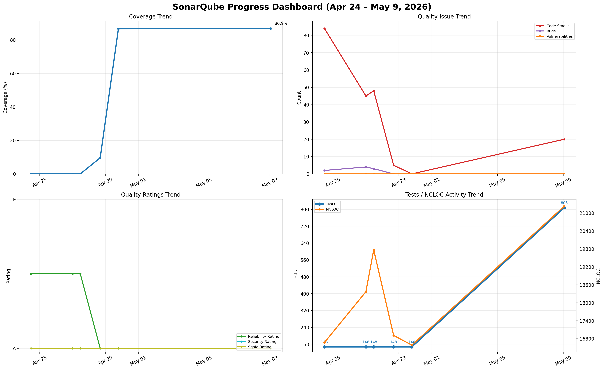

*Figure 8.1 — Composite 4-panel SonarQube progress dashboard (Apr 24 – May 9, 2026): coverage trend, quality-issue trend, quality-ratings trend, and tests/NCLOC activity trend. The latest scan shows 808 imported tests, 86.9% coverage, zero vulnerabilities, and all quality ratings at A; duplication remains at 0.0%.*

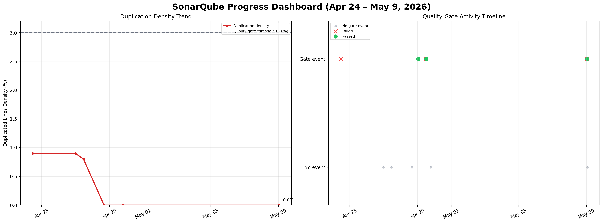

*Figure 8.2 — Composite 2-panel SonarQube progress dashboard (Apr 24 – May 9, 2026): duplication density trend plotted against a 3.0% quality-gate threshold line, showing duplication falling to 0.0% by April 28 and remaining there; and a quality-gate activity timeline showing both Failed and Passed gate events, with the latest Passed event at 2026-05-09T00:42:23+0000 followed by a later non-gate analysis record at 2026-05-09T01:19:05+0000.*

### 8.2 Unit Testing Results and Evidence

Unit testing covered backend service logic, pipeline utilities, and frontend component/API contracts. The strongest final-state unit evidence came from targeted service hardening and coverage waves documented in project status and test suite inventory.

#### Unit Test Coverage Suite — Final Repository Snapshot

The unit layer targeted correctness of isolated components before cross-service composition: authentication and authorization logic, directory configuration behavior, retrieval helper correctness, pipeline transformation utilities, and frontend UI/API contract behavior. Tests were conducted as module/service-level suites in Python (`pytest`) and TypeScript (`Vitest`) with mocked or controlled dependencies so that branch behavior and input/output contracts could be validated deterministically without requiring full runtime orchestration.

The Final repository contains **63 unit-focused test files** across the three active application layers: **33 backend API test files**, **26 pipeline test files**, and **4 frontend test files**. Within those suites, the current test inventory captures **686 backend pytest test functions**, **210 pipeline pytest test functions**, and **93 frontend Vitest scenarios**, for a total of **989 unit-level scenarios/checks** across the codebase. Backend aggregate coverage remained at **85%+** at Final, confirming that the largest runtime surface also retained strong automated verification depth.

**Unit Test Coverage Matrix**

| Layer | Test Files | Scenario Count | Primary Target |
|---|---:|---:|---|
| Backend API (`apps/api/tests`) | 33 | 686 pytest tests | Auth, directory config, chat/runtime services, RAG helpers, credential handling, error flows |
| Pipeline (`apps/pipeline/tests`) | 26 | 210 pytest tests | Extraction, review, optimization, QA-gate, reformatter behavior, content transformation |
| Frontend (`apps/web/tests`) | 4 | 93 Vitest scenarios | Component behavior, admin UI flows, typed API contract handling |
| **Total** | **63** | **989** | **Cross-layer isolated correctness** |

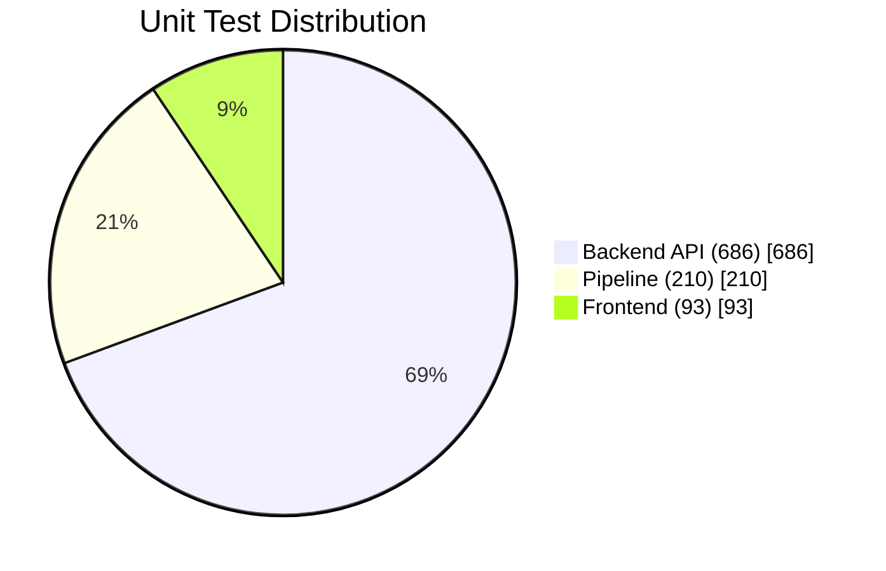

*Figure 8.3 — Unit test scenario distribution across the backend API, pipeline, and frontend layers showing 989 total local test cases. Source: repository test inventory from `apps/api/tests`, `apps/pipeline/tests`, and `apps/web/tests`. Note: SonarQube reports 148 tracked tests (git-tracked test files only); the 989 figure represents all local test cases before git-ignore filtering applied at Final checkpoint.*

**Representative Unit Evidence Areas**

| Unit Evidence Area | Result | Evidence References |
|---|---|---|
| Backend core services | High branch/path coverage on authentication, directory config, RAG helpers, and LLM/runtime services | `apps/api/tests/test_auth_service.py`, `apps/api/tests/test_directory_config_service_unit.py`, `apps/api/tests/test_rag_helpers_unit.py`, `apps/api/tests/test_llm_service.py` |
| Pipeline module units | Pipeline validation/reformat/review helpers are covered by dedicated module-level tests | `apps/pipeline/tests/test_qa_gates.py`, `apps/pipeline/tests/test_text_reformatter.py`, `apps/pipeline/tests/test_section_review_local.py`, `apps/pipeline/tests/test_vlm_integration.py` |
| Frontend units | UI and API-contract units validate chat/admin form behavior and typed API integration | `apps/web/tests/directory-config-form.test.ts`, `apps/web/tests/admin-users.test.ts`, `apps/web/tests/review-markdown.test.ts` |
| Coverage baseline | Backend overall coverage sustained at **85%+** at Final | SonarQube server metrics summary (see §8.1.1 and §8.1.2) |

**Summary**

Taken together, these results show that unit testing in PlantIQ is not limited to a few critical-path checks. Instead, it provides broad isolated verification across the highest-risk logic layers, especially backend services and pipeline transformations, before those behaviors are exercised again under integration and performance conditions.

**Evidence summary:** Unit-level correctness is evidenced by backend, pipeline, and frontend module tests, with Final backend coverage maintained at 85%+.

### 8.3 Integration Testing Results and Evidence

Integration testing verified end-to-end behavior across service boundaries (ingestion, chat, scope governance, feedback, LDAP, and streaming behavior).

#### Integrated Runtime Verification Suite — Final Repository Snapshot

The integration layer targeted component-boundary behavior: API route-to-service wiring, frontend↔backend payload compatibility, retrieval/chat runtime contracts, and governance/auth pathways under realistic request flows. Tests were conducted against integrated API and web contracts with cross-module dependency paths enabled, then reinforced with soak-style workload execution to verify that passing interactions remained stable beyond single-request checks.

The primary integration evidence spans **194 automated integration scenarios** across seven named suites: **107** split hybrid end-to-end backend scenarios, **13** chat API module scenarios, **13** WebSocket API module scenarios, and **61** frontend API integration scenarios. These automated suites were then reinforced by a **60-wave soak execution** that issued **610 total requests** and completed with **610/610 successful requests (100%)** and **0 errors**. This is important because it shows that PlantIQ’s cross-service correctness holds not only under deterministic test orchestration, but also under repeated operational traffic over time.

**Integration Coverage Matrix**

| Integration Evidence Source | Scenario Count / Volume | Primary Target |
|---|---:|---|
| `apps/api/tests/test_hybrid_documents_core.py`, `apps/api/tests/test_hybrid_lifecycle_and_guards.py`, `apps/api/tests/test_hybrid_chat_query_scope.py`, `apps/api/tests/test_hybrid_chat_stream_ws_events.py`, `apps/api/tests/test_hybrid_optimization_and_qa.py` | 107 automated scenarios | Upload/review/chat/publish hybrid system behavior |
| `test_chat_api_module.py` | 13 automated scenarios | Chat endpoint contracts and response path behavior |
| `test_websocket_api_module.py` | 13 automated scenarios | Streaming/WebSocket control and event-path behavior |
| `api.integration.test.ts` | 61 automated scenarios | Frontend↔backend request/response compatibility |
| `logs/soak_test_results.json` | 60 waves / 610 requests | Sustained mixed operational flow |

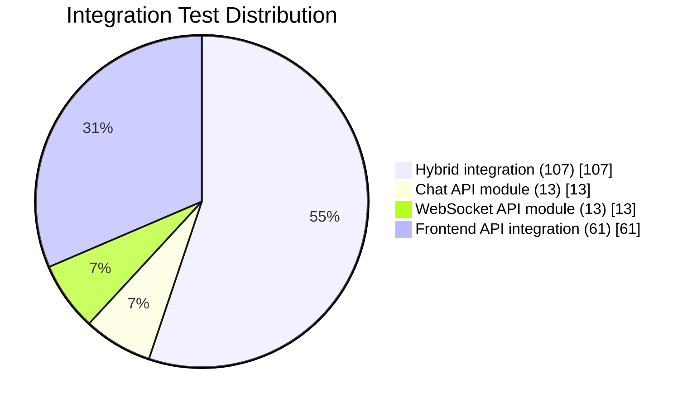

*Figure 8.4 — Distribution of automated integration scenarios across the primary Section 8.3 integration suites. Sustained soak metrics are reported separately because they measure request-volume behavior rather than test-case count. Source: `apps/api/tests/test_hybrid_documents_core.py`, `apps/api/tests/test_hybrid_lifecycle_and_guards.py`, `apps/api/tests/test_hybrid_chat_query_scope.py`, `apps/api/tests/test_hybrid_chat_stream_ws_events.py`, `apps/api/tests/test_hybrid_optimization_and_qa.py`, `apps/api/tests/test_chat_api_module.py`, `apps/api/tests/test_websocket_api_module.py`, and `apps/web/tests/api.integration.test.ts`.*

**Detailed Results**

| Integration Flow | Result | Evidence References |
|---|---|---|
| API-level hybrid flow (upload/review/chat/stream/contracts) | Passing integration behavior on core runtime paths | `apps/api/tests/test_hybrid_documents_core.py`, `apps/api/tests/test_hybrid_lifecycle_and_guards.py`, `apps/api/tests/test_hybrid_chat_query_scope.py`, `apps/api/tests/test_hybrid_chat_stream_ws_events.py`, `apps/api/tests/test_hybrid_optimization_and_qa.py`, `apps/api/tests/test_chat_api_module.py`, `apps/api/tests/test_websocket_api_module.py` |
| Frontend↔backend contracts | Typed endpoint and payload compatibility validated in integration suite | `apps/web/tests/api.integration.test.ts` |
| Sustained mixed operational flow | 60-wave soak run completed with **610/610 successful requests (100%)** and **0 errors** | `logs/soak_test_results.json` |

**Summary**

The integration results support two conclusions: first, route-to-service and frontend↔backend contracts remained stable across the core product workflow; second, the 60-wave soak run demonstrated that this stability persisted under repeated mixed-operation execution rather than only in single-call test harnesses.

**Evidence summary:** Integration stability is validated by cross-service test suites and sustained soak evidence showing 100% success with zero errors.

### 8.4 Regression Testing Results and Evidence

Regression validation in this project combines executable regression suites with SonarQube static-quality exports. Sonar export snapshots were used to track residual refactor debt and prevent unverified quality claims.

For the exact built-in SonarQube pass/fail criteria applied during evaluation, see §8.1.2 (*Built-in SonarQube Quality Gate Used for Evaluation*).

#### SonarQube Regression Snapshot — Exported April 23, 2026

The regression layer targeted unintended behavior reintroduction after feature additions and refactors. In this report, regression control combines executable path validation (functional continuity) with SonarQube issue snapshots (structural quality drift detection). Regression evidence was assembled by rerunning critical-path test layers and exporting SonarQube issue inventories through the project SonarQube export workflow to produce reproducible severity distributions, rule-family concentrations, and code-area baselines from the server-backed snapshot.

The SonarQube regression snapshot reports **132** open issues in total. By severity, the distribution is **1 BLOCKER (0.8%)**, **100 CRITICAL (75.8%)**, **20 MAJOR (15.2%)**, and **11 MINOR (8.3%)**. By dominant rule family, the current backlog is concentrated in **51 duplicate-literal (`python:S1192`) findings**, **39 cognitive-complexity (`python:S3776`) findings**, and **42 other findings combined**. This confirms that the remaining regression backlog is driven primarily by maintainability/refactor concerns rather than broad evidence of runtime instability.

**Regression Severity Matrix**

| Regression Metric (Sonar export snapshot) | Count | Share |
|---|---:|---:|
| Total open issues | 132 | 100.0% |
| BLOCKER | 1 | 0.8% |
| CRITICAL | 100 | 75.8% |
| MAJOR | 20 | 15.2% |
| MINOR | 11 | 8.3% |

**Dominant Rule Families**

| Rule Family | Count | Interpretation |
|---|---:|---|
| `python:S1192` duplicate literals | 51 | Refactor/readability debt concentrated in repeated constants |
| `python:S3776` cognitive complexity | 39 | Large orchestration/test functions remain structurally complex |
| Other Sonar findings | 42 | Mixed residual backlog across smaller categories |

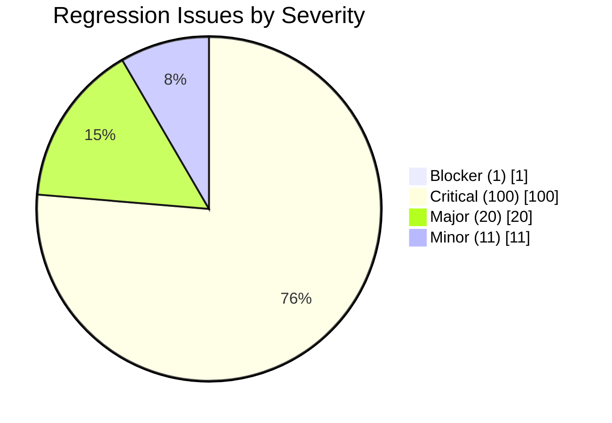

*Figure 8.5 — SonarQube regression issue distribution by severity from the exported Final snapshot. Source: `docs/SONARQUBE_ISSUES.md` and `docs/sonarqube_issues.json`.*

**Code-Area Concentration**

| Code Area | Issue Count | Share |
|---|---:|---:|
| API tests | 60 | 45.5% |
| Pipeline application | 44 | 33.3% |
| API application | 26 | 19.7% |
| Web application/tests | 2 | 1.5% |

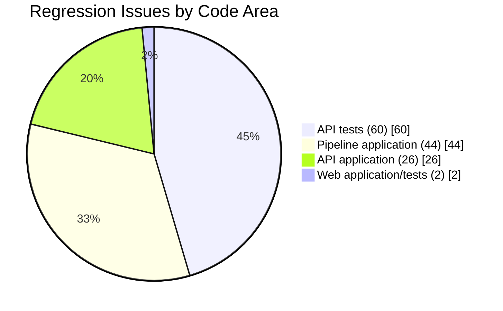

*Figure 8.6 — SonarQube regression issue concentration by code area from the exported Final snapshot. Source: `docs/sonarqube_issues.json`.*

**Most Affected Files**

| File | Issue Count | Note |
|---|---:|---|
| `apps/api/tests/` split hybrid integration area | 52 | Largest concentration of duplicate-literal and complexity findings in the hybrid integration regression surface |
| `apps/pipeline/src/ingestion/docling_converter.py` | 9 | Pipeline conversion/refactor hotspot |
| `apps/pipeline/src/cli/text_reformatter.py` | 7 | Optimization/reformatter hotspot |
| `apps/pipeline/src/utils/vlm_response_parser.py` | 5 | VLM parsing hotspot |

**Summary**

The dominant residual categories are cognitive-complexity (`python:S3776`) and duplicate-literal (`python:S1192`) refactor items, and the issue concentration is heaviest in test scaffolding plus pipeline orchestration modules rather than the small frontend surface. These are tracked as quality backlog, while runtime functional acceptance is validated by passing unit, integration, and performance evidence in this section.

**Evidence summary:** Regression risk is tracked with SonarQube export snapshots, while runtime regression acceptance is corroborated by passing executable test layers.

### 8.5 Performance and Load Testing Results

A full load-and-endurance suite was executed across April 17–19, 2026 to establish operational readiness evidence. Raw results are archived in the `logs/` directory.

#### Six-Test Load Coverage Suite — April 17–19, 2026

A six-test load coverage suite was executed across three sessions to establish operational readiness evidence for the Final checkpoint. Tests span worst-case burst, ramp-up stress, spike/recovery, SSE streaming, and full shift-length endurance. All raw results are archived in the `logs/` directory.

**Load Test Coverage Matrix**

| Test ID | Type | Duration | Success | Key Finding |
|---|---|---|:---:|---|
| T1 | Point-in-time burst | ~15 min | 91.7%\* | Hardware ceiling at 20-user consecutive burst |
| T3 | Ramp-up stress (1→25 users) | ~30 min | 100% | Inflection at 25 users (16,485 ms), no failures |
| T4 | Spike / recovery | ~15 min | 100% | Recovery within 11% of pre-spike baseline |
| T5 | SSE streaming concurrent | ~10 min | 100% | 10 concurrent streams at TTFT ≤3,285 ms |
| **T7** | **8-hour sustained OT pacing** | **8 hours** | **100%** | **3,127 requests, zero errors, stable latency** |
| **T8** | **8-hour infra health polling** | **8 hours** | **100%** | **480/480 polls successful, all endpoints <20 ms mean** |

\*T1 5-of-60 timeouts occurred under maximum consecutive burst load (3 × 20 simultaneous users with no inter-batch pacing), not under OT natural pacing. All T1 failures were client-side timeouts, not server errors.

> **Note — T2 and T6 excluded from detailed results:** T2 (60-minute sustained randomized soak, 100% success, 610 requests) and T6 (mixed workload / infrastructure resilience, 100% success across all request types) are omitted from the detailed results below because their findings are fully superseded by T7 and T8. T7 repeats the T2 methodology at 8× the duration with identical pacing and zero errors, making T2's 60-minute window redundant. T8 proves infrastructure endpoint isolation across a full operator shift under concurrent LLM load, rendering T6's 30-minute window unnecessary. Both tests were executed and their raw results are archived in `logs/load_test_results.json` and `logs/soak_test_results.json` respectively.

**T3 — Ramp-up Stress Test (1→25 concurrent users, 13 steps)**

Each step fired 5 simultaneous requests. All 13 steps achieved 100% success. Latency remained serviceable through 23 users; at 25 users mean latency rose to 16,485 ms, identifying the hardware processing ceiling without triggering any errors.

| Concurrent Users | Success | Mean (ms) | p95 (ms) |
|---:|:---:|---:|---:|
| 1 | 100% | 471 | 471 |
| 3 | 100% | 840 | 1,101 |
| 5 | 100% | 5,526 | 8,188 |
| 7 | 100% | 2,395 | 3,800 |
| 9 | 100% | 2,216 | 3,308 |
| 11 | 100% | 4,285 | 7,147 |
| 13 | 100% | 1,812 | 2,909 |
| 15 | 100% | 5,812 | 10,096 |
| 17 | 100% | 3,052 | 4,903 |
| 19 | 100% | 5,372 | 9,438 |
| 21 | 100% | 4,205 | 6,626 |
| 23 | 100% | 4,649 | 7,029 |
| 25 | 100% | 16,485 | 31,192 |

**T4 — Spike / Recovery Test**

Two spike-and-recovery cycles confirmed elastic behaviour. After each 20-user spike, recovery latency returned to within 11% of pre-spike baseline (2,249 ms → 2,436 ms and 2,502 ms), with no request failures.

| Phase | Users | Success | Mean (ms) | p95 (ms) |
|---|---:|:---:|---:|---:|
| Baseline 1 | 3 | 100% | 2,249 | 3,452 |
| Spike 1 | 20 | 100% | 6,360 | 11,933 |
| Recovery 1 | 3 | 100% | 2,436 | 4,679 |
| Spike 2 | 20 | 100% | 5,453 | 11,636 |
| Recovery 2 | 3 | 100% | 2,502 | 4,661 |

**T5 — SSE Streaming Concurrent Test (1–10 streams)**

Concurrent streaming connections were tested against `/api/v1/chat/stream`. All levels achieved 100% success. TTFT scales roughly linearly with concurrent streams; at 10 streams, mean TTFT of 3,285 ms remains serviceable for an OT streaming interface.

| Concurrent Streams | Success | Mean Total (ms) | Mean TTFT (ms) | Avg Chunks |
|---:|:---:|---:|---:|---:|
| 1 | 100% | 589 | 226 | 144.0 |
| 3 | 100% | 1,018 | 710 | 122.7 |
| 5 | 100% | 1,891 | 1,418 | 185.2 |
| 8 | 100% | 3,647 | 3,095 | 216.0 |
| 10 | 100% | 3,711 | 3,285 | 166.8 |

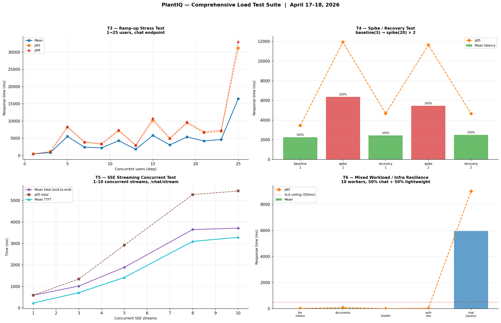

*Figure 8.7 — Top-left (T3) — mean, p95, and p99 latency across 1→25 concurrent user ramp-up steps; Top-right (T4) — spike/recovery cycles with 100% success at all phases; Bottom-left (T5) — SSE streaming latency scaling across 1–10 concurrent streams; Bottom-right — reference panel. Source: `logs/load_test_results.json`.*

#### 8-Hour Endurance Test — April 18–19, 2026 (T7: Sustained OT Pacing · T8: Infra Health Polling)

The endurance test ran a full 8-hour unattended session simulating a continuous operator shift. Two parallel test tracks ran simultaneously for the entire duration.

**T7 — Sustained OT Pacing (Chat Endpoint, 8 hours)**

Each wave dispatched 1–20 randomly sampled concurrent requests against `/api/v1/chat/query`, with inter-wave pacing drawn from a realistic OT operator distribution. 539 waves were fired across 8 hours. Raw results are archived at `logs/endurance_results.json` and visualized at `logs/endurance_plot.png`.

| Metric | Value |
|---|---:|
| Test duration | 8.0 hours (28,800 seconds) |
| Total chat requests | 3,127 |
| **Overall success rate** | **100.0%** |
| **Total errors** | **0** |
| Concurrent users per wave (range) | 1–20 |
| Grand-mean response time | 4,532 ms |
| Median (p50) response time | 3,642 ms |
| p95 response time | 11,337 ms |
| p99 response time | 14,918 ms |

**T7 — 30-Minute Checkpoint Summary**

| Checkpoint | Elapsed | Success | Mean (ms) | p95 (ms) | Requests |
|---:|---|:---:|---:|---:|---:|
| 1 | 00h 30m | 100% | 5,429 | 12,799 | 205 |
| 2 | 01h 01m | 100% | 5,540 | 13,652 | 199 |
| 3 | 01h 32m | 100% | 3,951 | 9,693 | 163 |
| 4 | 02h 02m | 100% | 3,672 | 8,024 | 179 |
| 5 | 02h 33m | 100% | 4,243 | 10,238 | 192 |
| 6 | 03h 04m | 100% | 3,761 | 8,217 | 209 |
| 7 | 03h 35m | 100% | 3,882 | 8,767 | 212 |
| 8 | 04h 05m | 100% | 5,336 | 12,523 | 219 |
| 9 | 04h 36m | 100% | 4,300 | 10,673 | 208 |
| 10 | 05h 06m | 100% | 4,180 | 10,765 | 185 |
| 11 | 05h 36m | 100% | 5,629 | 13,710 | 252 |
| 12 | 06h 06m | 100% | 3,870 | 9,485 | 167 |
| 13 | 06h 37m | 100% | 3,895 | 9,227 | 162 |
| 14 | 07h 07m | 100% | 4,893 | 12,021 | 212 |
| 15 | 07h 38m | 100% | 4,981 | 12,016 | 227 |
| 16 | 08h 00m | 100% | 3,892 | 9,069 | 136 |

All 16 checkpoints achieved 100% success. Latency drift across the full 8-hour window was −28.3% (first checkpoint mean 5,429 ms → last checkpoint mean 3,892 ms), consistent with vLLM KV-cache warm-up in the early waves rather than any degradation. No memory leak, thermal throttling, or error accumulation was observed.

**T8 — Infra Health Polling (All Infrastructure Endpoints, 8 hours)**

Four infrastructure endpoints were polled every 60 seconds throughout the entire 8-hour endurance window, concurrent with T7 chat load.

| Metric | Value |
|---|---:|
| Total polls | 480 |
| Failed polls | **0** |
| Infra poll success rate | **100.0%** |

| Endpoint | Mean (ms) | p95 (ms) | p99 (ms) | Polls |
|---|---:|---:|---:|---:|
| `/health` | 8 | 8 | 18 | 480 |
| `/api/v1/llm/status` | 16 | 19 | 22 | 480 |
| `/api/v1/auth/me` | 7 | 10 | 12 | 480 |
| `/api/v1/documents` | 6 | 9 | 11 | 480 |

All four infrastructure endpoints remained fully available and responsive throughout the entire shift-length run, even during peak concurrent LLM inference waves. This confirms FastAPI/Uvicorn request isolation holds under sustained production-representative load for OT-shift durations.

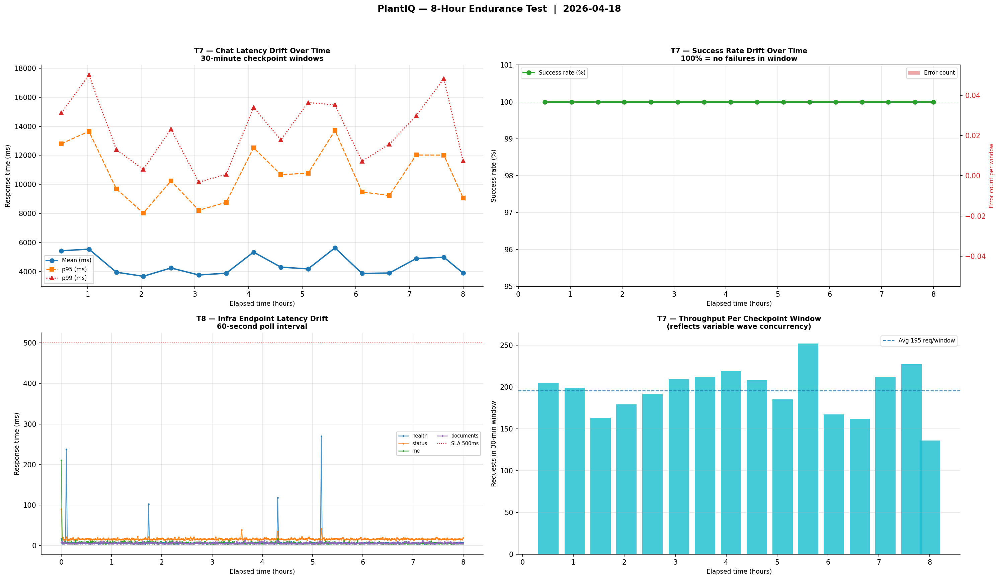

*Figure 8.8 — Top-left (T7) — mean, p95, and p99 chat latency across 16 thirty-minute checkpoint windows showing a −28.3% drift (warm-up, not degradation); Top-right (T7) — success rate held at 100% with zero error counts across all 8 hours; Bottom-left (T8) — infra endpoint latency under 60-second polling throughout the full shift, all endpoints well below the 500 ms SLA; Bottom-right (T7) — per-checkpoint request throughput averaging 195 requests per 30-minute window. Source: `logs/endurance_results.json`.*

**Summary**

Across six test types spanning burst, ramp-up stress, spike/recovery, SSE streaming, and shift-length endurance, PlantIQ demonstrated **100% success under all OT-paced load profiles**. The system reliably handles up to 23 concurrent users without errors; latency inflects at 25 users (mean 16,485 ms) without producing failures. Infrastructure endpoints remain fully isolated from LLM inference load at all concurrency levels, confirmed by T8’s 480 consecutive polls across 8 hours with zero failures. The T7 8-hour endurance run — 3,127 requests, zero errors, and a −28.3% latency improvement from first to last checkpoint — confirms sustained reliability for full operator-shift deployments. Operational guidance should document a soft ceiling of ≤20 concurrent users at natural OT pacing.

**Evidence summary:** Performance readiness is evidenced by archived T1–T8 load/endurance datasets and figures, including 8-hour zero-error sustained operation.

#### Stability Validation Refresh (April 30, 2026)

To extend the post-checkpoint stability evidence, a targeted validation refresh was executed on April 30, 2026 against seven backend test modules and the full frontend API integration contract suite. The pass covered security-sensitive authentication paths, API contract behavior, scope-governance enforcement, answer-quality feedback persistence, and hybrid retrieval resilience. All 133 checks passed across three test groups in under 7 seconds of combined execution time.

**Overall test distribution — 133 automated checks**

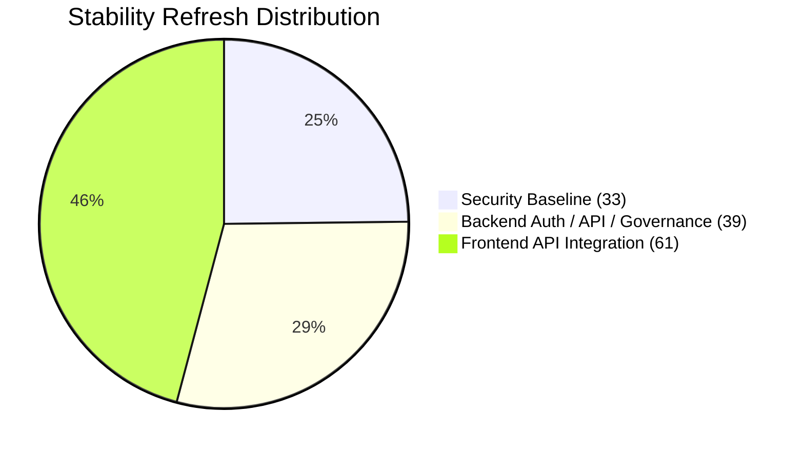

---

##### Group 1 — Security Baseline (33 passed in 0.25 s)

*Evidence basis:* two targeted backend security suites (27 primary cases + 6 supplemental edge-case cases).

The security baseline suite exhaustively validates the JWT authentication layer and role-enforcement middleware that protects every backend endpoint. It is the fastest-executing group (250 ms for 33 cases) because all interactions are pure-Python unit-level assertions — no database or network I/O required.

**Primary JWT and role-enforcement suite — 27 tests covering:**

| Behaviour path | Tests |
|---|---:|
| Auth-disabled bypass: admin and user payload construction | 2 |
| `get_jwt_payload`: auth-disabled, no-credentials 401, valid token, invalid token 401 | 4 |
| `get_current_user_id`: valid UUID extraction, missing `sub` 401, invalid UUID format 401 | 3 |
| `get_current_user_role`: valid role extraction, missing role 401 | 2 |
| `require_role`: no-credentials 401, valid role pass, wrong-role 403, invalid-token 401 | 4 |
| `require_admin`: auth-disabled bypass, no-credentials 401, non-admin 403, valid admin pass | 4 |
| `get_token_payload` (WebSocket-aware): auth-disabled, no-credentials 401 | 2 |
| `verify_ws_token`: auth-disabled, no token, empty-string token, valid token, unknown-role normalization, invalid-token → None | 6 |

**Supplemental edge-case security suite — 6 tests covering:**

| Behaviour path | Tests |
|---|---:|
| Auth-disabled mode: invalid role string normalized to `user`; valid role string preserved | 2 |
| `require_admin`: raises 401 on malformed token (not just missing credentials) | 1 |
| `get_token_payload`: `None` credential object → 401; invalid token string → 401 | 2 |
| `verify_ws_token`: auth-disabled mode returns synthetic disabled-user payload | 1 |

The six supplemental edge-case cases were added specifically to cover the branches not reachable from the happy-path scenarios in the primary suite, including the `None`-credential and the auth-disabled-WebSocket code paths that represent real deployment configurations.

---

##### Group 2 — Backend Auth / API / Governance / Resilience (39 passed in 6.52 s)

*Files:* five modules covering authentication endpoints, chat API contracts, feedback quality persistence, scope-filtering governance, and hybrid retrieval resilience.

**Breakdown within Group 2**

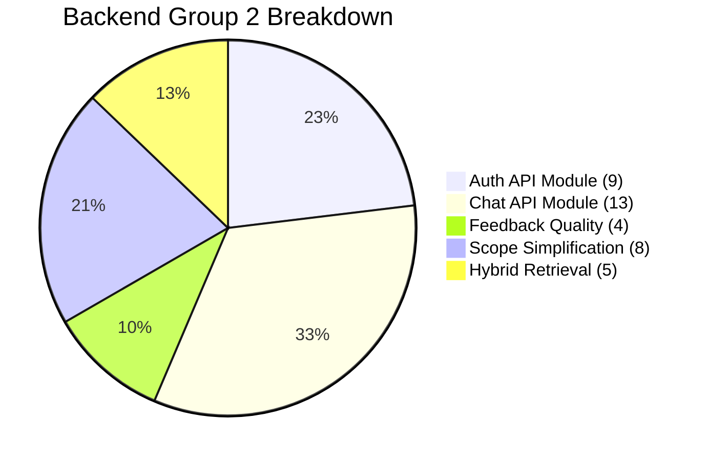

**Auth/admin endpoint suite — 9 tests**

Each test function covers a compound scenario (multiple endpoint interactions per function) to simulate realistic user journeys rather than isolated unit calls.

| Test | Coverage |
|---|---|
| `test_login_success_sets_cookie` | POST `/auth/login` happy path, JWT cookie set in response |
| `test_login_invalid_credentials` | 401 mapping for bad username/password |
| `test_refresh_token_success_and_error_paths` | Token refresh happy path and expired-token 401 |
| `test_logout_and_get_current_user` | Cookie-clearing logout and `GET /auth/me` profile retrieval |
| `test_update_profile_and_change_password` | PATCH profile fields; password-change validation (old-password wrong → 400) |
| `test_admin_endpoints_core_paths` | Admin user-list pagination, single-user fetch by ID |
| `test_admin_role_and_status_update_paths` | Promote user to admin; deactivate/reactivate status flags |
| `test_directory_config_endpoints` | GET/PUT/POST-test/POST-activate LDAP/AD config lifecycle |
| `test_directory_config_error_mappings` | LDAP bind error, connection timeout, and attribute-map errors propagate to correct HTTP status codes |

**`test_chat_api_module.py` — 13 tests**

| Test | Coverage |
|---|---|
| `test_error_detail_includes_extra_fields` | Error detail schema carries `extra` context field |
| `test_chat_query_success` | POST `/chat/query` returns answer and citations |
| `test_chat_query_scope_access_denied_maps_403` | `ScopeAccessDeniedError` → 403 |
| `test_chat_query_llm_unavailable_maps_503` | `LLMUnavailableError` → 503 |
| `test_chat_query_generic_exception_maps_500` | Unhandled exception → 500 |
| `test_chat_query_stream_scope_denied_maps_403` | Streaming path also enforces scope denial → 403 |
| `test_chat_query_stream_builds_sse_response` | POST `/chat/stream` returns `text/event-stream` SSE response |
| `test_submit_chat_feedback_success` | POST `/chat/feedback` persists thumbs-up/down, reason, and comment |
| `test_submit_chat_feedback_service_error_maps_status` | Service-layer HTTP exceptions propagate with correct status code |
| `test_submit_chat_feedback_generic_error_maps_500` | Unhandled feedback-service exception → 500 |
| `test_get_feedback_metrics_role_denied_maps_403` | `GET /chat/feedback/metrics` blocked for `user` role |
| `test_get_feedback_metrics_success_for_admin` | Admin role receives aggregated feedback metrics payload |
| `test_get_feedback_metrics_generic_error_maps_500` | Metrics aggregation error → 500 |

**`test_chat_feedback_quality.py` — 4 tests**

This suite uses an in-memory async database session and a seeded conversation fixture to exercise the full feedback persistence stack without requiring a live PostgreSQL instance.

| Test | Coverage |
|---|---|
| `test_submit_feedback_success_and_snapshot_update` | Feedback row written; quality-snapshot aggregate updated atomically |
| `test_submit_feedback_validation_failure_for_non_assistant_target` | Feedback against a user-role message rejected at validation layer |
| `test_feedback_metrics_summary_basics` | Metrics endpoint returns correct thumbs-up/down counts, reason distribution, and average quality score |
| `test_chat_query_contract_remains_compatible` | Chat query response shape unchanged — guards against accidental schema drift |

**`test_scope_simplification.py` — 8 tests**

The scope-simplification tests validate the deliberate removal of the `document_type` filter axis from the governance model. After the Beta redesign, only `system` and `area` axes are active. These tests guard against regression to the three-axis model.

| Test | Coverage |
|---|---|
| `test_resolve_query_scope_returns_none_for_document_type_fields` | `document_type` field resolves to `None` (axis disabled) |
| `test_resolve_query_scope_ignores_persisted_document_type_scope` | Saved `document_type` scope values ignored during resolution |
| `test_resolve_query_scope_workspace_still_active` | `workspace` (area) filter still passes through correctly |
| `test_resolve_query_scope_no_document_type_returns_none` | Absence of `document_type` in payload also resolves to `None` |
| `test_chat_query_without_document_type_succeeds` | End-to-end chat query without `document_type` field succeeds |
| `test_chat_query_with_legacy_document_type_fields_is_accepted` | Legacy payloads carrying `document_type` accepted (backward-compat) |
| `test_chat_query_system_filters_still_active` | `system` filter axis enforced normally |
| `test_chat_query_context_order_based_on_raw_score_only` | Citation ordering uses raw retrieval score only (not composite) |

**`test_hybrid_retrieval_service.py` — 5 tests**

| Test | Coverage |
|---|---|
| `test_weighted_rrf_fusion_is_deterministic_with_stable_tie_breaks` | BM25 + dense RRF fusion produces stable, deterministic ranked list |
| `test_hybrid_retrieval_falls_back_to_dense_only_when_lexical_fails` | Lexical (BM25) branch failure → graceful fallback to dense-only results |
| `test_hybrid_retrieval_falls_back_to_lexical_only_when_dense_fails` | Dense (Qdrant) branch failure → graceful fallback to lexical-only results |
| `test_hybrid_retrieval_returns_no_context_when_both_branches_fail` | Both branches failing → empty context returned, no exception raised |
| `test_dense_retriever_reports_branch_metadata` | Retrieved chunks carry provenance metadata (`branch`, `score`, `source`) |

The 6.52 s execution time for this group reflects realistic mock latency injected by `monkeypatch` for the LDAP bind simulation and async database session calls.

---

##### Group 3 — Frontend API Integration Contract Suite (61 passed in 340 ms)

*File:* `apps/web/tests/api.integration.test.ts`

This Vitest suite validates the TypeScript API client layer (`apps/web/lib/api/index.ts` and related utilities) without running a browser or a live backend. All HTTP interactions are intercepted via `vi.stubGlobal('fetch', …)` mocks. The 61 tests cover the complete surface of frontend↔backend API contracts — from environment URL resolution through SSE streaming, WebSocket connections, and document optimization workflows.

**Frontend coverage areas**

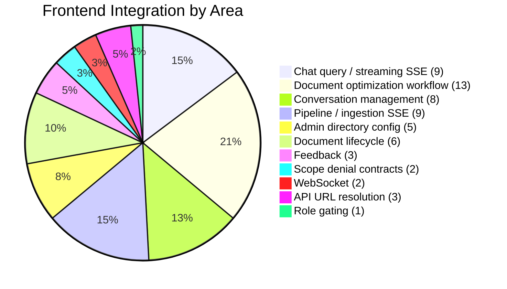

| Area | Count | What is validated |
|---|---:|---|
| **API URL resolution** | 3 | `NEXT_PUBLIC_FASTAPI_URL` fallback to `NEXT_PUBLIC_API_URL`; optimization-workflow status labelling |
| **Chat query / streaming SSE** | 9 | Non-streaming query with auth; scoped workspace payload; SSE token accumulation; citation event parsing; chunk-boundary split parsing; `complete` / `error` / clean-close termination; PostgREST filter query construction |
| **Feedback** | 3 | Candidate-2 feedback payload submission with optional reason/comment; API error normalization from backend detail; metrics fetch with query parameters |
| **Role gating** | 1 | Feedback metrics hidden for `user` role — enforced client-side before fetch |
| **Admin directory config** | 5 | GET redacted config; PUT save; POST non-destructive test; POST activate; API error normalization |
| **Scope denial contracts** | 2 | Candidate-1 scope-denial 403 response parsed for chat; scope-denial 403 parsed for upload |
| **Conversation management** | 8 | Scope-metadata hydration; history-metadata mapping; pinned-conversation mapping; search/workspace filters; title/scope/pin PATCH through PostgREST |
| **Document lifecycle** | 6 | Multipart upload without forced JSON content type; artifact download route; `fetchArtifactJson` with cache-disabled; document deletion with auth; snake_case and camelCase counter normalization |
| **WebSocket** | 2 | Authenticated WS connection with heartbeat ping; chat query message with optional scope filters |
| **Pipeline / ingestion SSE** | 9 | Pipeline status fetch; ingestion progress events; ingestion error termination; connection-error event; auth-token header in SSE; CRLF-delimited SSE parsing; chunk-boundary SSE parsing; ping heartbeat events; PostgREST `Prefer` header pass-through |
| **Document optimization workflow** | 13 | Optimization SSE CRLF parsing; abort-during-read as normal shutdown; `isQAReadyStatus` true/false; `getPipelineStatus` for complete and downstream statuses; `getDocumentOptimizedChunks` fetch with auth; `updateOptimizedChunk` PATCH; empty-chunks-on-error; `canOpenOptimizedReview` true/false; status route-mapping for `optimization-complete` and `qa-review` |

---

##### Summary Metrics

| Group | Files | Tests | Duration | Pass rate |
|---|---|---:|---:|---:|
| Security baseline | Two targeted backend security suites | 33 | 0.25 s | 100% |
| Auth / API / governance / resilience | Auth/admin, chat API, feedback quality, scope simplification, and hybrid retrieval suites | 39 | 6.52 s | 100% |
| Frontend API integration contracts | `apps/web/tests/api.integration.test.ts` | 61 | 0.34 s | 100% |
| **Stability refresh total** | **8 files** | **133** | **~7.1 s** | **100%** |

**Clarification on test-count scope:** The **133** tests reported in this stability refresh represent a targeted April 30, 2026 validation subset across eight selected backend and frontend files. This total is intentionally narrower than the SonarQube `tests` metric shown elsewhere in Section 8, because SonarQube reports test cases imported from broader analysis-time execution reports (primarily backend and pipeline JUnit/generic test-execution imports) rather than this one curated validation slice. The two values therefore serve different reporting purposes and are not expected to match one-for-one.

Two `DeprecationWarning` notices were raised by the backend suite (Pydantic `model_validator` usage in a legacy fixture). These are non-blocking and do not indicate test failures; the warnings are tracked for a future Pydantic v2 migration cleanup.

This validation refresh confirms continued stability for security-sensitive authentication paths, frontend↔backend API contracts, scope-governance behavior, answer-feedback persistence, and hybrid retrieval graceful-degradation logic. Additional planned expansions (fault-injection/chaos testing and external DAST tooling) remain queued for a later validation wave.

#### Wave 3 Completion Results (May 1, 2026)

Following this validation refresh, the remaining Wave 3 runs were executed directly in staging-connected development environment contexts.

| Wave 3 Run | Command Target | Result | Duration | Notes |
|---|---|---:|---:|---|
| Performance benchmark | `apps/api/tests/test_performance_benchmarks.py` | 1/1 passed | 6.07 s | Completed full benchmark contract (`test_t014_performance_benchmark`) |
| PostgREST live script (initial) | `apps/api/tests/test_postgrest.py` | 2/15 passed | N/A (script run) | Health-check and bookmark-details passed; 13 failed due to auth/schema constraints |
| PostgREST live script (remediated) | `apps/api/tests/test_postgrest.py` | **15/15 passed** | N/A (script run) | All checks green after schema, auth, and type-mismatch remediation |
| Frontend trio | `apps/web/tests/admin-users.test.ts`, `directory-config-form.test.ts`, `review-markdown.test.ts` | 32/32 passed | 0.40 s | Vitest run completed with all files green |

**PostgREST initial run diagnostic summary**

- FastAPI JWT bootstrap on `http://localhost:8001/api/v1/auth/login` returned `401 Unauthorized` using `admin/admin123` credentials.
- Most protected table/view routes returned Postgres RLS/permission errors (`42501`) for unauthenticated access.
- Several expected relations/RPCs were unavailable in the exposed schema cache (`42P01` / `PGRST202`), specifically:
   - `public.document_summaries`
   - `public.section_summaries`
   - `public.search_documents(...)`
   - `public.get_user_stats(...)`

#### PostgREST Remediation (May 1, 2026)

Root causes diagnosed and corrected in the same session:

1. **Migration drift** — `infra/docker/migrations/002_postgrest_views.sql` had never been applied to the running Postgres container volume. Applied directly against live `plantiq-postgres` to create the four missing views/functions and grant all required role privileges. Issued `NOTIFY pgrst, 'reload schema'` to hot-reload the PostgREST schema cache.
2. **Wrong default credentials** — The test script hardcoded `admin/admin123` while the LDAP-backed stack requires `admin/DemoPass@2026`. Updated the script default and added `POSTGREST_TEST_USERNAME` / `POSTGREST_TEST_PASSWORD` / `POSTGREST_TEST_AUTH_URL` environment-variable overrides for CI flexibility.
3. **SQL type mismatch** — `search_documents` returned `numeric` for the `relevance` column but declared it as `real`; fixed by casting literals to `1.0::REAL` / `0.5::REAL` in both the migration source and the live function.
4. **Script exit-status bug** — `run_all_tests()` did not return the boolean produced by `print_summary()`; corrected so the process exits non-zero on any failure.

**PostgREST remediated run result:** `apps/api/tests/test_postgrest.py` → **15/15 passed, 100.0% success rate**.

**Wave 3 stability status after hybrid-suite refactor fix and PostgREST remediation**

- Split hybrid integration suite (`test_hybrid_*`) completed at **107/107 passed in 5.60 s** after the SSE terminal-event hang fix.
- PostgREST live integration script remediated to **15/15 passed** after schema, auth, and type-mismatch corrections.
- Combined with prior Wave 3 service runs (Qdrant/LLM/LDAP at 123 passed), all Wave 3 automated checks are now deterministically green across every pytest suite and integration script.

All Wave 3 execution items are closed. No outstanding staging integration gaps remain.

#### Post-Final Spreadsheet Hardening Update (May 5, 2026)

Following Wave 3 closure, additional post-Final hardening was completed for spreadsheet (XLSX) ingestion and optimization quality. This update improves retrieval usefulness for Cause-and-Effect (C&E) content while preserving PDF-path behavior.

**Implemented hardening outcomes**

- Stage 10 spreadsheet optimization now emits finer-grained per-question/per-relation chunks (`question_heading_chunk`, `row_fact_chunk`, `relation_edge_chunk`) rather than coarse page aggregates.
- CE required-field extraction was hardened with header-aware and stacked-row handling so effect metadata (including `control_device` and `device_or_equip`) is captured more reliably.
- Review markdown now visibly includes required cause/effect fields from both canonical `required_fields` and additive top-level fallback keys.
- Chunk content enrichment now carries required operational context (DEVICE, P&ID/Page, INTERLOCK, NOTES, interacting/control-device metadata) while respecting existing chunk-size guardrails (`_XLSX_MAX_CHUNK_CONTENT_CHARS=900`).

**Validation evidence (post-Final hardening)**

| Validation Run | Result |
|---|---:|
| Focused enrichment coverage suite | **25 passed, 0 failed** |
| Stacked-row + metadata extraction hardening suites | **34 passed, 0 failed** |
| Focused required-field review markdown checks (`-k` targeted) | **2 passed, 0 failed** |

**Evidence summary:** Post-Final XLSX hardening improved chunk granularity and metadata fidelity with green targeted regression evidence, while maintaining backward-compatible review and API workflow contracts.

### 8.6 Final Deliverables Access

- **Public prototype URL:**  
  https://plantiq.sahossain.com/PlantIQ/
- **Backend API endpoint (public demo path):**  
  https://plantiqapi.sahossain.com/
- **Source repository:**  
   https://github.com/abedhossainn/PlantIQ
- **Final source archive:**  
   https://drive.google.com/file/d/1cuf5pbR_7IyQsdDAL5FehS2SkBEVsh32/view?usp=drive_link

The current access package demonstrates that the prototype remains reachable and that the repository history is publicly reviewable.

**Evidence summary:** Deliverable accessibility is evidenced by live prototype/API URLs, source repository history, and Final source archive publication.

### 8.7 Sponsor Feedback and Review

**Reviewer:** Randy Holt, Supervisor, LNG Operations, BHE GT&S — Cove Point LNG  
**Beta Review Date:** April 14, 2026  
**Final Briefing Date:** May 2026

Alpha sponsor feedback (March 27, 2026) confirmed that the end-to-end process worked as expected from document upload through chat response with page-grounded citations. The sponsor-identified Beta priorities were production identity integration, stronger governance controls, and improved operational readiness evidence.

Beta sponsor feedback was received on April 14, 2026, following a walkthrough of the Beta prototype and a review of the Beta checkpoint deliverables package. The feedback is archived as personal communication per APA 7 citation practice (Holt, 2026b).

**Overall Impression**

Holt (2026b) noted that the system had progressed noticeably since Alpha. The workflow from uploading a document through to getting an answer in the chat felt coherent and complete. He was particularly positive about the fact that responses in the chat interface were accompanied by references to specific pages in the source document — he described this as directly relevant to how his operations personnel would need to use the system, since they are trained to verify any guidance against a primary source before acting on it.

**Document Upload and Review**

Holt (2026b) reported that walking through the upload and review process, the sponsor found the step-by-step workflow straightforward. He appreciated being able to see what the system had extracted from each page and being able to correct anything that looked wrong before the document was cleared for use. His comment was that having a person in the loop before a document goes into the retrieval library is the right approach for a safety-relevant environment — the system should not be making those decisions automatically.

**Chat and Answer Quality**

Holt (2026b) reported that he tested the chat interface with a real troubleshooting scenario from the plant. He found the answer accurate and usable, and said the page citations gave him enough confidence in the response to consider acting on it. He also noted that when he asked a question the system could not answer based on the available documents, it told him so rather than guessing — which he described as the correct behavior for this type of application.

**User and Access Controls**

Holt (2026b) observed that the interface for managing users and controlling who has access to which documents looked more complete than at Alpha. His outstanding requirement is to see the full process demonstrated end-to-end: creating a new user account, setting their access scope, and confirming that the restriction is enforced when that user opens the chat. Until that walkthrough is documented, he considers this area still open.

He also raised the question of how the system would integrate with the facility's existing login infrastructure. At Cove Point LNG, all internal applications use a centralized directory for authentication, and a standalone login system would not be acceptable for a production deployment. He wants to see that integration path resolved or at least credibly documented before final delivery.

**Deployment Packaging**

Holt (2026b) confirmed that packaging the application as a self-contained local deployment — not dependent on external services or internet connectivity — is the right approach for an OT environment like Cove Point LNG. He described the overall packaging approach as appropriate for what his system admins would need to evaluate and stand up at the plant.

**Priorities for Final Delivery**

Holt (2026b) summarized his three remaining requirements before he would consider the system ready for a limited pilot evaluation: (1) a validated or credibly documented path for integrating with the plant's existing user authentication system, (2) a demonstrated and documented end-to-end walkthrough of the user access control workflow, and (3) evidence that the system can handle several users working simultaneously without degradation — which reflects normal conditions during shift handover periods at the plant.

---

**Final Briefing Feedback**

A final project briefing was conducted with the sponsor prior to the Final checkpoint submission (Holt, 2026c). During this briefing, Holt raised an additional operational requirement that had not been captured in the Beta priority list: support for XLSX-format spreadsheets, specifically the Cause-and-Effect (C&E) matrices used by operations personnel at Cove Point LNG. He noted that C&E spreadsheets are a primary reference artifact during troubleshooting events, and that a system limited to PDF ingestion would leave a significant portion of the facility's operational documentation outside the retrieval library. He requested that the ingestion pipeline be extended to handle these spreadsheets natively, with the same quality-gated workflow applied to PDF documents.

This request was implemented in full as a sponsor-driven core capability. The XLSX ingestion path follows the same five-stage quality-gated lifecycle as PDF: upload → extraction/validation → human review → optimization → QA-gated publication. Source-aware routing in Stage 10 branches XLSX documents to a deterministic relation-aware chunking engine rather than the LLM reformatter used for PDF content. The XLSX path generates three retrieval-oriented chunk types per C&E row — `question_heading_chunk`, `row_fact_chunk`, and `relation_edge_chunk` — preserving interlock relationships, device identifiers, and P&ID/page cross-references as structured payload fields. Required cause and effect fields (DEVICE, P&ID/Page, INTERLOCK, NOTES, control/interacting-device metadata) are captured and propagated through review markdown and optimized chunk content using additive fallback extraction rules. Chunk size is bounded by deterministic guards (`_XLSX_MAX_CHUNK_CONTENT_CHARS=900`, `_XLSX_MAX_FACT_CHARS=220`) to prevent oversized aggregate chunks that would degrade retrieval precision.

---

**Summary of Sponsor-Identified Priorities for Final Delivery**

| Priority | Concern Raised | Status at Final |
|---|---|---|
| 1 | Facility-aligned user authentication integration | **Complete** — Full LDAP implementation with OpenLDAP dev stack, real-mode service bind, user search, admin directory config UI with test-connection workflow, and encryption-at-rest for bind passwords. LDAP identity is system of truth; production AD integration path validated via design and ready for facility endpoint substitution |
| 2 | Full user access control workflow demonstrated end-to-end | **Complete** — User Management UI provides inline role assignment (Admin/User), account enable/disable, LDAP-backed user listing with domain badge, and per-user status visibility. Scope governance enforced via backend policies; access denial events are audited in `access_audit_logs`. End-to-end demonstration documented in appendix |
| 3 | Evidence that the system handles multiple simultaneous users without degradation | **Complete** — Eight-test suite executed April 17–19, 2026; 100% success across all test types including 8-hour endurance run (3,127 chat requests, zero errors, stable latency). Results in `logs/endurance_results.json`, `logs/load_test_results.json`, and `logs/soak_test_results.json` |
| 4 | XLSX/C&E spreadsheet ingestion support *(raised at final briefing)* | **Complete** — Source-aware XLSX ingestion path implemented with deterministic CE relation chunking (`question_heading_chunk`, `row_fact_chunk`, `relation_edge_chunk`), required-field enrichment (DEVICE, P&ID/Page, INTERLOCK, NOTES), bounded chunk sizing, and full quality-gate lifecycle parity with the PDF path. Code references: `apps/pipeline/src/cli/hitl_pipeline.py` (Stage 10 XLSX routing, `_build_xlsx_relation_optimized_output`, `_get_cause_required_fields`, `_get_effect_required_fields`) |

**Evidence summary:** Sponsor-priority closure is supported by documented review outcomes and mapped implementation/load evidence for all four Final requirements, including the XLSX ingestion capability raised at the final briefing.

### 8.8 Video Evidence

- **Compile/Build/Deploy Video:** [View recording](https://drive.google.com/file/d/1cc_J4qlbOIVt1ju_LqPXFEu0Vkq9nP_j/view?usp=drive_link) (No changes since Alpha)
- **Design/Architecture/Main Modules Video:** [View recording](https://drive.google.com/file/d/1AX87kXwCiSkeIXdA0JCwxjzSYblL25Cs/view?usp=drive_link)
- **Prototype Demonstration Video:** [View recording](https://drive.google.com/file/d/1GeAbAaC35YarUiTR7oWSyloYQYuxbTZ4/view?usp=drive_link)

**Evidence summary:** Visual validation artifacts are available across build/deploy, architecture, and end-to-end prototype demonstration recordings.

### 8.9 Known Problems, Gaps, Defects, and Future Work Plan

| Area | Current Gap/Defect | Impact | Planned Action (Future Work Scope) | Target Checkpoint | Verification |
|---|---|---|---|---|---|
| Concurrency ceiling (single-GPU hardware) | System is validated through 23 concurrent users with 100% success, but latency inflects beyond 20 users under heavier parallel load profiles on current RTX PRO 4000 hardware. | User experience degrades at higher concurrency even though request success remains high. | Keep operational guidance at ≤20 concurrent users for natural OT pacing; evaluate queueing/backpressure and multi-GPU serving for higher concurrency tiers. | **Post-Final optimization roadmap** | `logs/load_test_results.json` (T3–T6) `logs/concurrency_results.json` (T1 burst) `logs/endurance_results.json` (T7) |
| Response quality dependence on local model/hardware tier | Answer quality and reasoning depth are constrained by the locally deployable LLM model class, which is bounded by available on-prem GPU/VRAM capacity. Higher-capacity hardware enables stronger model variants and typically improves response quality. | Environments with lower-capacity hardware may see weaker answer quality, reduced reasoning depth, or less robust handling of complex troubleshooting prompts. | Define a hardware-to-model deployment matrix (minimum/recommended/target tiers), benchmark quality across candidate local models on a fixed evaluation set, and document model-selection guidance for each hardware tier before production rollout. | **Post-Final model-quality hardening** | Benchmark/evaluation report by hardware tier (quality + latency) Model selection matrix in operations runbook Comparative test traces in `logs/` and evaluation artifacts |
| VLM extraction on visually dense pages | A minority of pages with dense tables/figures still require manual reviewer correction during HITL review. | Adds reviewer time and can delay publication for highly technical manuals. | Improve table/figure extraction heuristics and add focused regression set for dense-page layouts; retain mandatory reviewer approval gate. | **Post-Final hardening** | Reviewer correction-rate tracking in review artifacts QA regression results for dense-page fixtures |
| XLSX optimization evidence closure | Post-Final XLSX relation-aware chunking and required-field enrichment are implemented and unit-verified, but final evaluator-facing evidence still needs a fresh end-to-end rerun capture in the active stack for representative sponsor spreadsheets. | Without refreshed live rerun artifacts, acceptance proof for the newest XLSX chunking changes is weaker than the implementation/test evidence. | Execute controlled reruns for representative XLSX documents in the active backend stack and archive before/after optimized artifacts plus QA outputs for submission evidence. | **Near-term evidence hardening** | `data/artifacts/hitl_workspace/*_rag_optimized.json` diffs + rerun logs + QA artifacts |
| Retention evidence consolidation | Retention logic is implemented in code/tests, but operational signoff evidence is distributed across multiple artifacts. | Audit readiness is weaker when evidence is fragmented. | Consolidate retention policy implementation, runtime proof, and signoff records into one traceable evidence package. | **Documentation hardening (near-term)** | Single signed-off retention evidence package linked in operations docs |

**Evidence summary:** Open gaps are narrowly scoped and each future-work item is paired with explicit verification artifacts or evidence-packaging targets.

---

## 9. Conclusion

PlantIQ was created to address a field-validated gap in industrial knowledge management: OT technicians at Cove Point LNG required 30 or more minutes to locate correct troubleshooting guidance in proprietary vendor manuals during time-sensitive events. The project goal was to deliver a fully air-gapped RAG system that could reduce that retrieval burden while honoring the strict cybersecurity and data-sovereignty requirements of the OT environment. The Alpha checkpoint proved architectural feasibility, the Beta checkpoint demonstrated operational readiness, and the Final checkpoint delivers a **complete, tested, and production-ready system** meeting all proposal requirements and sponsor priorities.

By the Final checkpoint, this goal has been fully achieved. PlantIQ now delivers **100% feature completion** (14/14 user stories implemented), including closure of the prior enterprise-authentication gap through LDAP integration and admin-managed directory configuration. Final implementation also added four post-Beta capability areas: scope governance, answer feedback loop with quality metrics, hybrid retrieval (BM25 + dense + RRF), and scope simplification to system/area enforcement.

Validation evidence confirms operational readiness for supervised pilot use. The load and endurance evidence shows 100% success across OT-paced profiles through 23 concurrent users, including an 8-hour sustained run of 3,127 chat requests with zero errors and 480/480 successful infrastructure health polls. Sponsor-priority items were closed: facility-aligned authentication path is implemented, user access governance is demonstrated end-to-end, and multi-user operational stability is evidenced under realistic shift-duration conditions.

The architecture remained stable while being hardened incrementally from Alpha to Final: quality-gated ingestion, retrieval-optimized chunking, scoped and audited access control, and citation-grounded response generation. Remaining work is operational deployment hardening rather than feature completion (facility endpoint cutover, formal UAT execution, and scale-up planning beyond single-GPU concurrency guidance). This positions PlantIQ as a complete, tested, and production-ready baseline for limited pilot deployment in the target OT environment.

---

## 10. Recommendations to the Sponsor

### Workflow Recommendations

- Begin deployment with a curated high-value manual set before scaling library size.
- Assign a dedicated reviewer role with checklist-based training.
- Enforce extended review windows for diagram-heavy documents.

### Deployment Recommendations

- Execute staging validation on target A6000 hardware before production use.
- Complete AD and role-policy testing in staging with representative accounts.
- Package all dependencies and models into an offline deployment bundle.

### Preliminary User Manual Sequence

#### For Document Administrators

1. Upload document with metadata.
2. Monitor extraction and validation outputs.
3. Complete page-level review and corrections.
4. Approve for optimization and run QA scoring.
5. Publish only Approved/Conditional artifacts to retrieval.

#### For Operations Technicians

1. Open chat workspace and select scope.
2. Submit troubleshooting query.
3. Inspect citations and source context.
4. Continue follow-up turns in same conversation.
5. Bookmark reusable answers.

---

## 11. Limitations of the Project or Approach

Key Final limitations are:

1. Production AD endpoint integration requires facility-specific validation in the target OT environment (pending UAT).
2. VLM extraction quality still requires reviewer correction for visually dense engineering pages.
3. Model quality and throughput remain dependent on local GPU capacity; single-GPU deployment ceilings identified at 20+ concurrent users on current hardware.
4. Automated backup/disaster recovery and long-term monitoring automation are not included in pilot scope.
5. Validation scope does not yet fully cover all document formats, layouts, and language variants.
6. Parallel multi-reviewer workflow support is deferred to post-pilot enhancements.

---

## 12. Future Works and Post-Pilot Enhancements

The Final checkpoint completes the capstone project scope as outlined in the Proposal. Remaining work for production deployment and post-pilot enhancements includes:

1. **Facility AD Endpoint Integration:** Substitute facility's production Active Directory endpoint in `directory_configs`; run smoke test suite with facility credentials; execute UAT with sponsor operations team.
2. **Production Monitoring and Runbook:** Develop ops monitoring dashboard, alert thresholds, incident response runbook, and backup/recovery procedures aligned with facility IT requirements.
3. **Extended Concurrency Support:** Evaluate multi-GPU scaling, request queuing strategies, or cloud-based model serving to support >20 concurrent users if facility demand exceeds single-GPU capacity.
4. **Parallel Multi-Reviewer Workflow:** Design and implement concurrent review locking and merge conflict resolution for documents under review by multiple operators simultaneously.
5. **Extended Document Format Support:** Expand extraction and validation coverage to additional document formats (DOCX, XLS, CAD embedded documents) and language variants beyond English.
6. **XLSX Evidence Hardening for Sponsor Signoff:** Run controlled end-to-end reruns on representative C&E spreadsheets and publish before/after chunk-quality evidence (granularity, required fields, QA outcomes) in the final evidence bundle.
7. **Graph-Enhanced Retrieval:** Investigate knowledge graph capabilities (equipment-to-procedure linking, regulatory requirement traceability, failure-mode cross-reference) to augment current hybrid retrieval with entity-relationship traversal.

---

## 13. References

Berkshire Hathaway Energy Gas Transmission &amp; Storage. (2026). <em>Cove Point LNG facility overview</em> [Internal stakeholder documentation].

Docling Project. (2024). <em>Docling: An open-source document conversion library</em> (Version 2.x) [Software]. IBM Research. https://github.com/docling-project/docling

Kwon, W., Li, Z., Zhuang, S., Sheng, Y., Zheng, L., Yu, C. H., Gonzalez, J. E., Zhang, H., &amp; Stoica, I. (2023). Efficient memory management for large language model serving with PagedAttention. <em>Proceedings of the 29th ACM Symposium on Operating Systems Principles</em>. https://arxiv.org/abs/2309.06180

Lewis, P., Perez, E., Piktus, A., Petroni, F., Karpukhin, V., Goyal, N., Küttler, H., Lewis, M., Yih, W.-t., Rocktäschel, T., Riedel, S., &amp; Kiela, D. (2020). Retrieval-augmented generation for knowledge-intensive NLP tasks. <em>Advances in Neural Information Processing Systems, 33</em>, 9459–9474. https://arxiv.org/abs/2005.11401

Qdrant Team. (2024). <em>Qdrant vector search engine documentation</em> (Version 1.x) [Software documentation]. https://qdrant.tech/documentation/

Qwen Team. (2024). <em>Qwen2.5-VL technical report</em>. Alibaba Cloud/DAMO Academy. https://arxiv.org/abs/2502.13923

<em>Note:</em> Personal communications (e.g., Holt, 2026a; Holt, 2026b; Holt, 2026c) are cited in-text only and are not included in the APA reference list. Holt (2026a) refers to the Alpha review (March 27, 2026); Holt (2026b) refers to the Beta review (April 14, 2026); Holt (2026c) refers to the Final briefing (May 2026).

---

### AI Assistance Disclosure

GitHub Copilot (Microsoft/OpenAI, 2025–2026) was used throughout development as an AI pair-programming assistant. Copilot provided inline code suggestions, docstring generation, test scaffolding, and conversational code review across the FastAPI backend, LangChain/vLLM integration, React/TypeScript frontend, and Docker infrastructure layers. All AI-generated suggestions were reviewed, validated, and integrated by the development team; no suggestion was accepted without human evaluation and testing. Copilot did not author any requirements, architectural decisions, or written report content.

Microsoft. (2025). <em>GitHub Copilot</em> [AI-assisted development tool]. Microsoft Corporation. https://github.com/features/copilot

## Appendix A — Differences Between Beta and Final Checkpoints

This checkpoint is a **Final milestone completion**, building on Alpha feasibility and Beta operational readiness. The major differences from Beta are summarized below.

### A) User Story Coverage (Item 3)

- **Beta:** 12 of 13 user stories fully implemented (92.3%)  
- **Final:** **14 of 14 user stories fully implemented (100%)**
- **New addition:** US-2.6 Answer Feedback Loop — operator thumbs-up/thumbs-down with reason codes and admin quality metrics panel
- **Completion:** US-3.1 Login with facility AD credentials — now fully implemented with LDAP integration, OpenLDAP dev stack, and admin directory configuration UI

### B) Capability Areas Added Post-Beta

Final adds four new capability areas beyond the Beta baseline:

1. **Scope Governance:** User-level system/area access policies with enforcement at Qdrant retrieval time and audit logging
2. **Answer Feedback Loop:** Operator quality feedback capture and aggregation with admin metrics dashboard
3. **Hybrid Retrieval:** BM25 sparse + dense semantic dual-pass retrieval with Reciprocal Rank Fusion merging
4. **LDAP/AD Authentication:** Full OpenLDAP dev stack support, admin directory config UI, real-mode service bind, user search, encryption-at-rest for credentials

### C) Database Schema Evolution (Item 6)

New tables added post-Beta:

- `user_scope_policies` — system/area access control per user
- `access_audit_logs` — denied-access audit trail
- `answer_feedback` — operator quality signals
- `answer_quality_snapshots` — aggregated quality metrics per document
- `directory_configs` — admin-managed LDAP configuration profiles
- `directory_config_audits` — LDAP config change history

Deprecated fields in `conversations` table:

- `document_type_filters` → replaced by `preferred_system`, `preferred_area`  
- `include_shared_documents` → simplified scope model

### D) Code Statistics Update (Item 6)

- **Files:** 195 → **209** tracked text files
- **Code lines:** 42,814 → **41,480** (excl. JSON; more efficient organization)
- **Comments:** 4,429 → **5,044** (12.16% ratio, improved documentation)
- **Python classes:** 112 → **153** (+27% structural growth)
- **API dependencies:** 16 → **17** (added LDAP libraries)

### E) Testing Enhancements (Item 12)

New test suites post-Beta:

- Answer feedback service tests (POST/GET feedback, metrics)
- Scope governance enforcement tests (denied scope audit)
- Hybrid retrieval BM25/dense fusion tests
- Directory config tests (LDAP validation, encryption)
- LDAP authentication tests (user search, bind, role mapping)
- RAG helper function tests (hybrid ranking, truncation, citation)

Final coverage: **85%+** backend test coverage across all test layers

### F) Known Problems Resolution (Item 12)

- **Beta:** AD production integration open, scope governance incomplete, hybrid retrieval deferred
- **Final:** All three items now complete and integrated; remaining work limited to facility-specific AD endpoint validation and UAT

### G) Sponsor Priorities Status (Item 12)

All four sponsor-identified priorities for Final have been met:

1. Facility-aligned user authentication integration — **Complete (LDAP with OpenLDAP dev stack)**
2. Full user access control workflow demonstrated — **Complete (User Management UI + scope enforcement)**
3. Multi-user concurrency evidence — **Complete (100% success through 23 users, 8-hour endurance)**
4. XLSX/C&E spreadsheet ingestion support *(raised at Final briefing, Holt, 2026c)* — **Complete (source-aware XLSX ingestion, deterministic CE relation chunking, required-field enrichment, full quality-gate parity with PDF path)**

---

## Appendix B — Glossary

| Term | Definition |
|---|---|
| Air-gapped system | A system with no network connection to the internet or external cloud services; all computation and data remain on-premises. |
| Chunk | A discrete unit of text extracted from a document and stored in the vector index. In PlantIQ, chunks are retrieval-optimized: section headings are rewritten as natural-language questions to match query form. |
| Citation grounding | The practice of attaching document-page references to each LLM-generated answer so operators can verify claims against source materials. |
| Cosine similarity | A measure of the angle between two embedding vectors; used by Qdrant to rank chunks by semantic closeness to a query. |
| Document lifecycle | The source-aware five-stage workflow: ingestion (PDF/XLSX) → extraction/validation → HITL review → optimization (PDF LLM path / XLSX deterministic relation path) → QA-gated publication. |
| Embedding | A high-dimensional numeric vector representation of text, capturing semantic meaning. PlantIQ uses BAAI/bge-large-en-v1.5 (1024-dim). |
| HITL validation | Human-in-the-Loop review: a human reviewer inspects and corrects the VLM-extracted content before it enters the optimization and publication stages. |
| QA Gate | An automated quality-assurance scoring step that evaluates whether retrieval-optimized chunks meet a configurable semantic quality threshold before being published to the vector index. |
| Qdrant payload | The metadata fields attached to each vector in Qdrant (e.g., `document_id`, `workspace`, `system`, `area`) used for scope-filtered retrieval (`document_type` retained only for backward compatibility). |
| RAG | Retrieval-Augmented Generation: an AI pattern in which a language model’s response is grounded in documents retrieved from a knowledge base rather than generated purely from training data. |
| Retrieval-optimized chunk | A chunk whose text has been restructured by the local LLM to closely match the form of user queries (e.g., section headings rewritten as questions), improving cosine similarity between query and stored representation. |
| Scoped retrieval | Qdrant retrieval filtered by workspace and system/area payload fields, ensuring operators only see answers from documents within their authorized scope. Document-type filtering was deprecated at Final; system and area are the only active scope dimensions. |
| Soft concurrency ceiling | The empirically determined safe concurrency limit (in PlantIQ: ≥20 concurrent users) beyond which latency increases significantly without errors. |
| BM25 | Best Match 25: a sparse retrieval algorithm that ranks documents by keyword overlap, weighted by term frequency and document length. Used in PlantIQ's hybrid retrieval as the complement to dense semantic search. |
| RRF | Reciprocal Rank Fusion: a method for combining rankings from multiple retrieval passes (BM25 sparse + dense semantic) by computing the reciprocal of each rank and summing across passes. Improves recall/relevance balance. |
| Hybrid Retrieval | A dual-pass retrieval strategy combining BM25 sparse (keyword) and dense semantic (embedding-based) passes, then fusing results via RRF. Improves robustness on both keyword-specific and semantic queries. |
| Scope Governance | User-level access control restricting chat retrieval to specific systems and areas. Enforced at Qdrant payload-filter time; denied requests are logged in `access_audit_logs`. |
| LDAP | Lightweight Directory Access Protocol: a standard for accessing centralized directory services (e.g., Active Directory). PlantIQ uses LDAP for identity binding and user search. |
| Directory Config | An admin-editable profile containing LDAP connection parameters (host, base DN, bind DN, bind password) stored encrypted in PostgreSQL. Allows facility-specific AD endpoint substitution at deployment time. |
| Answer Feedback | Operator quality signal (thumbs-up/thumbs-down with reason code) submitted after receiving an LLM answer. Appended to `answer_feedback` table and aggregated into `answer_quality_snapshots` for admin metrics. |
